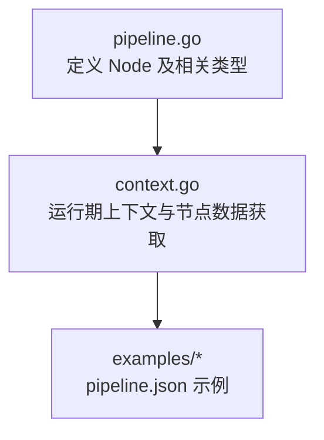
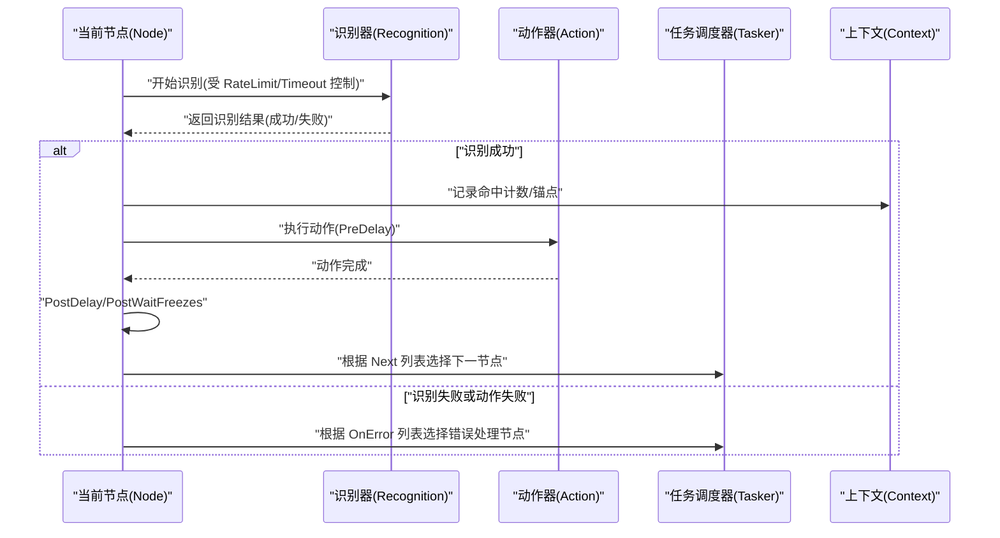
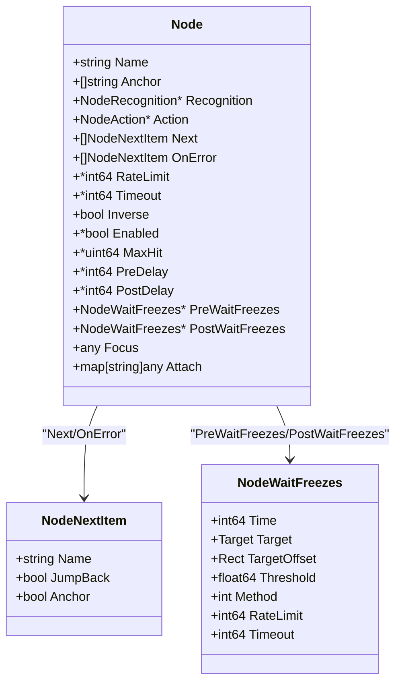

# 节点结构详解

<cite>
**本文引用的文件列表**
- [pipeline.go](file://pipeline.go)
- [context.go](file://context.go)
- [context_test.go](file://context_test.go)
- [quick-start/pipeline.json](file://examples/quick-start/resource/pipeline/pipeline.json)
- [custom-action/pipeline.json](file://examples/custom-action/resource/pipeline/pipeline.json)
- [custom-recognition/pipeline.json](file://examples/custom-recognition/resource/pipeline/pipeline.json)
</cite>

## 目录
1. [简介](#简介)
2. [项目结构与定位](#项目结构与定位)
3. [核心组件：Node 结构体](#核心组件node-结构体)
4. [架构总览：从识别到动作执行与流程跳转](#架构总览从识别到动作执行与流程跳转)
5. [详细组件分析](#详细组件分析)
6. [依赖关系分析](#依赖关系分析)
7. [性能与行为特性](#性能与行为特性)
8. [故障排查指南](#故障排查指南)
9. [结论](#结论)
10. [附录：示例与最佳实践](#附录示例与最佳实践)

## 简介
本文件面向希望深入理解并正确配置 MaaFramework Go 绑定中“节点（Node）”结构体的开发者与使用者。我们将系统梳理 Node 的全部字段，明确其数据类型、默认值、典型使用场景以及字段间的相互关系；并通过 examples 中的 pipeline.json 实例，展示如何用这些字段组合出复杂而稳健的任务流程；最后给出节点执行的完整生命周期，覆盖从识别、动作执行到流程跳转的关键步骤。

## 项目结构与定位
- Node 定义位于 pipeline.go，是任务流程的核心单元，承载识别、动作、跳转、错误处理、节流、超时、锚点等能力。
- Context 提供运行期接口，支持动态覆盖管道、获取节点数据、查询命中计数、设置/获取锚点等。
- examples 下的 pipeline.json 展示了不同场景下的最小化配置，可作为字段使用的参考样例。

图表来源
- [pipeline.go](file://pipeline.go#L36-L73)
- [context.go](file://context.go#L176-L195)
- [quick-start/pipeline.json](file://examples/quick-start/resource/pipeline/pipeline.json#L1-L5)

章节来源
- [pipeline.go](file://pipeline.go#L36-L73)
- [context.go](file://context.go#L176-L195)

## 核心组件：Node 结构体
Node 是一个任务节点的完整描述，包含识别、动作、跳转、错误处理、节流、超时、反向匹配、启用状态、最大命中次数、前后延时、前后稳定等待、自定义焦点与附加数据等字段。以下按字段逐一说明。

- 字段：Name
  - 类型：string
  - 默认值：无（由外部命名）
  - 用途：节点名称，用于在流程中被 next/on_error 引用或锚点标记
  - 关系：与 Pipeline 内部以名称索引的节点集合对应
  - 章节来源
    - [pipeline.go](file://pipeline.go#L36-L41)

- 字段：Anchor
  - 类型：[]string
  - 默认值：空切片
  - 用途：为节点设置一个或多个锚点名，可在 next/on_error 中通过 [Anchor] 引用
  - 关系：配合 NodeNextItem 的 Anchor 标志位实现“锚点引用”
  - 章节来源
    - [pipeline.go](file://pipeline.go#L40-L41)
    - [pipeline.go](file://pipeline.go#L300-L308)

- 字段：Recognition
  - 类型：*NodeRecognition
  - 默认值：nil
  - 用途：定义识别策略（模板匹配、特征匹配、颜色匹配、OCR、神经网络分类/检测、自定义等）
  - 关系：与 NodeRecognitionType/Param 配合，决定识别算法与参数
  - 章节来源
    - [pipeline.go](file://pipeline.go#L43-L46)
    - [pipeline.go](file://pipeline.go#L438-L504)

- 字段：Action
  - 类型：*NodeAction
  - 默认值：nil
  - 用途：定义成功识别后的动作（点击、长按、滑动、输入文本、启动/停止应用、滚动、命令执行、自定义动作等）
  - 关系：与 NodeActionType/Param 配合，决定动作类型与参数
  - 章节来源
    - [pipeline.go](file://pipeline.go#L45-L47)
    - [pipeline.go](file://pipeline.go#L1204-L1303)

- 字段：Next
  - 类型：[]NodeNextItem
  - 默认值：空切片
  - 用途：识别成功后可能的后续节点列表；支持 JumpBack 与 Anchor 标志位
  - 关系：与 NodeNextItem 的属性共同决定流程走向
  - 章节来源
    - [pipeline.go](file://pipeline.go#L47-L49)
    - [pipeline.go](file://pipeline.go#L300-L308)

- 字段：OnError
  - 类型：[]NodeNextItem
  - 默认值：空切片
  - 用途：识别超时或动作失败时的错误处理节点列表
  - 关系：与 Next 并行存在，用于兜底与重试
  - 章节来源
    - [pipeline.go](file://pipeline.go#L53-L54)
    - [pipeline.go](file://pipeline.go#L300-L308)

- 字段：RateLimit
  - 类型：*int64（毫秒）
  - 默认值：1000
  - 用途：识别尝试之间的最小间隔，避免频繁扫描
  - 关系：与 Timeout 协同控制识别节奏
  - 章节来源
    - [pipeline.go](file://pipeline.go#L49-L50)

- 字段：Timeout
  - 类型：*int64（毫秒）
  - 默认值：20000
  - 用途：识别等待的最大时间
  - 关系：与 RateLimit 协同控制识别节奏
  - 章节来源
    - [pipeline.go](file://pipeline.go#L51-L52)

- 字段：Inverse
  - 类型：bool
  - 默认值：false
  - 用途：是否反转识别结果（识别到即不匹配，未识别到即匹配）
  - 关系：常用于“不在某界面”或“未出现某提示”的条件判断
  - 章节来源
    - [pipeline.go](file://pipeline.go#L55-L56)

- 字段：Enabled
  - 类型：*bool
  - 默认值：true
  - 用途：是否启用该节点
  - 关系：可用于临时禁用某个节点而不删除其配置
  - 章节来源
    - [pipeline.go](file://pipeline.go#L57-L58)

- 字段：MaxHit
  - 类型：*uint64
  - 默认值：无（不限制）
  - 用途：节点的最大命中次数，超过则不再继续识别
  - 关系：与 Context 的命中计数查询/清零配合使用
  - 章节来源
    - [pipeline.go](file://pipeline.go#L59-L60)

- 字段：PreDelay
  - 类型：*int64（毫秒）
  - 默认值：200
  - 用途：动作执行前的延迟
  - 关系：与 PostDelay 共同保证动作前后的时间边界
  - 章节来源
    - [pipeline.go](file://pipeline.go#L61-L64)

- 字段：PostDelay
  - 类型：*int64（毫秒）
  - 默认值：200
  - 用途：动作执行后的延迟
  - 关系：与 PreDelay 共同保证动作前后的时间边界
  - 章节来源
    - [pipeline.go](file://pipeline.go#L61-L64)

- 字段：PreWaitFreezes
  - 类型：*NodeWaitFreezes
  - 默认值：nil
  - 用途：动作前等待屏幕稳定（基于模板匹配阈值与方法）
  - 关系：与 PostWaitFreezes 对称使用，确保动作前后画面稳定
  - 章节来源
    - [pipeline.go](file://pipeline.go#L65-L68)
    - [pipeline.go](file://pipeline.go#L2036-L2114)

- 字段：PostWaitFreezes
  - 类型：*NodeWaitFreezes
  - 默认值：nil
  - 用途：动作后等待屏幕稳定
  - 关系：与 PreWaitFreezes 对称使用
  - 章节来源
    - [pipeline.go](file://pipeline.go#L65-L68)
    - [pipeline.go](file://pipeline.go#L2036-L2114)

- 字段：Focus
  - 类型：any
  - 默认值：nil
  - 用途：自定义焦点数据，可用于日志、事件或回调中的上下文信息
  - 章节来源
    - [pipeline.go](file://pipeline.go#L69-L71)

- 字段：Attach
  - 类型：map[string]any
  - 默认值：nil
  - 用途：附加的自定义数据，便于扩展与跨层传递
  - 章节来源
    - [pipeline.go](file://pipeline.go#L71-L73)

字段默认值与行为验证（来自测试）：
- RateLimit 默认 1000 毫秒
- Timeout 默认 20000 毫秒
- PreDelay 默认 200 毫秒
- PostDelay 默认 200 毫秒
- Inverse 默认 false
- Enabled 默认 true
- MaxHit 默认无限制
- PreWaitFreezes/PostWaitFreezes 各项默认值见 WaitFreezes 配置

章节来源
- [pipeline.go](file://pipeline.go#L49-L64)
- [pipeline.go](file://pipeline.go#L2036-L2114)
- [context_test.go](file://context_test.go#L1183-L1218)

## 架构总览：从识别到动作执行与流程跳转
下图展示了典型的节点执行生命周期：识别 -> 动作 -> 延迟/稳定等待 -> 流程跳转（Next/OnError）。

图表来源
- [pipeline.go](file://pipeline.go#L49-L64)
- [pipeline.go](file://pipeline.go#L300-L308)
- [context.go](file://context.go#L176-L195)

## 详细组件分析

### NodeNextItem：流程跳转项
- 字段：Name
  - 类型：string
  - 用途：目标节点名称或锚点名
- 字段：JumpBack
  - 类型：bool
  - 用途：匹配后返回父节点，继续从 next 列表起始位置重新识别
- 字段：Anchor
  - 类型：bool
  - 用途：将 Name 视为锚点名并在运行时解析为最近一次设置该锚点的节点

章节来源
- [pipeline.go](file://pipeline.go#L300-L308)

### NodeWaitFreezes：稳定等待配置
- 字段：Time、Target、TargetOffset、Threshold、Method、RateLimit、Timeout
- 用途：等待屏幕稳定（无显著变化）的参数化控制
- 默认值：Time=1、Threshold=0.95、RateLimit=1000、Timeout=20000
- 使用建议：动作前后分别使用 PreWaitFreezes/PostWaitFreezes，确保 UI 状态收敛

章节来源
- [pipeline.go](file://pipeline.go#L2036-L2114)

### NodeRecognition 与 NodeAction：识别与动作类型
- Recognition 支持多种算法类型（直接命中、模板匹配、特征匹配、颜色匹配、OCR、神经网络分类/检测、自定义），每种类型有对应的参数结构
- Action 支持多种动作类型（点击、长按、滑动、多指滑动、触摸按下/移动/抬起、按键点击/长按/按下/抬起、输入文本、启动/停止应用、停止任务、滚动、命令执行、自定义动作），每种类型有对应的参数结构

章节来源
- [pipeline.go](file://pipeline.go#L438-L504)
- [pipeline.go](file://pipeline.go#L1204-L1303)

## 依赖关系分析
- Node 与 NodeNextItem：通过 Next/OnError 列表建立流程依赖
- Node 与 NodeWaitFreezes：通过 PreWaitFreezes/PostWaitFreezes 在动作前后进行稳定等待
- Node 与 Context：通过 Context.GetNodeData 获取节点配置，通过 Context.SetAnchor/GetAnchor 管理锚点，通过 Context.GetHitCount/ClearHitCount 管理命中计数
- Node 与 Pipeline：Pipeline 以节点名为键管理节点集合，NewNode/AddNode 构建流程

图表来源
- [pipeline.go](file://pipeline.go#L36-L73)
- [pipeline.go](file://pipeline.go#L300-L308)
- [pipeline.go](file://pipeline.go#L2036-L2114)

## 性能与行为特性
- 识别节流与超时：RateLimit 与 Timeout 共同约束识别频率与等待上限，避免过度扫描与卡死
- 命中计数：MaxHit 限制节点命中上限，结合 Context.GetHitCount/ClearHitCount 可实现“只做一次”或“最多 N 次”的语义
- 前后稳定等待：PreWaitFreezes/PostWaitFreezes 通过模板匹配阈值与方法检测画面变化，确保动作前后 UI 稳定
- 延迟边界：PreDelay/PostDelay 为动作前后提供时间边界，有助于系统响应与动画完成
- 错误兜底：OnError 与 Next 并存，识别失败或动作失败时自动切换到错误处理路径

章节来源
- [pipeline.go](file://pipeline.go#L49-L64)
- [pipeline.go](file://pipeline.go#L2036-L2114)
- [context.go](file://context.go#L229-L239)

## 故障排查指南
- 识别不触发或频繁失败
  - 检查 RateLimit 是否过大导致扫描过慢
  - 检查 Timeout 是否过短
  - 检查 Inverse 是否误设
  - 检查 Enabled 是否被关闭
- 动作执行后立即进入下一个节点
  - 检查 PostDelay/PostWaitFreezes 是否足够
  - 检查目标区域是否正确（Target/TargetOffset）
- 流程无法跳转或跳转异常
  - 检查 Next/OnError 中的 JumpBack/Anchor 标志位
  - 检查锚点是否正确设置与引用
- 命中次数异常
  - 使用 Context.GetHitCount/ClearHitCount 进行核对与重置
- 自定义识别/动作无效
  - 确认自定义注册名称与配置一致
  - 确认参数传入正确

章节来源
- [context.go](file://context.go#L216-L239)
- [context_test.go](file://context_test.go#L1183-L1218)

## 结论
Node 结构体提供了从识别到动作执行再到流程跳转的全链路能力。通过合理配置 RateLimit/Timeout、Inverse/Enabled、MaxHit、Pre/PostDelay、Pre/PostWaitFreezes、Next/OnError、Anchor/Focus/Attach 等字段，可以构建出健壮且可维护的自动化流程。examples 中的 pipeline.json 展示了最小可用配置，结合本文档的字段说明与最佳实践，可快速搭建复杂任务流程。

## 附录：示例与最佳实践

### 示例一：快速开始（启动应用）
- 配置要点：指定 action 为启动应用
- 适用场景：初始化任务入口
- 参考文件
  - [quick-start/pipeline.json](file://examples/quick-start/resource/pipeline/pipeline.json#L1-L5)

章节来源
- [quick-start/pipeline.json](file://examples/quick-start/resource/pipeline/pipeline.json#L1-L5)

### 示例二：自定义动作
- 配置要点：action 类型为 Custom，并指定自定义动作名
- 适用场景：集成业务逻辑或第三方脚本
- 参考文件
  - [custom-action/pipeline.json](file://examples/custom-action/resource/pipeline/pipeline.json#L1-L6)

章节来源
- [custom-action/pipeline.json](file://examples/custom-action/resource/pipeline/pipeline.json#L1-L6)

### 示例三：自定义识别
- 配置要点：recognition 类型为 Custom，并指定自定义识别名
- 适用场景：自定义图像/文本识别逻辑
- 参考文件
  - [custom-recognition/pipeline.json](file://examples/custom-recognition/resource/pipeline/pipeline.json#L1-L12)

章节来源
- [custom-recognition/pipeline.json](file://examples/custom-recognition/resource/pipeline/pipeline.json#L1-L12)

### 最佳实践清单
- 明确识别策略：优先使用更稳定的算法（如特征匹配、OCR），必要时再使用模板匹配
- 合理设置节流与超时：根据目标稳定性调整 RateLimit/Timeout
- 使用锚点与 JumpBack：在复杂分支中用锚点标记关键节点，用 JumpBack 回到父节点继续识别
- 前后稳定等待：动作前后均设置 PostWaitFreezes，确保 UI 稳定
- 命中次数控制：对重复性节点设置 MaxHit，避免无限循环
- 错误兜底：为关键节点配置 OnError，提升鲁棒性
- 参数化与可维护性：将关键参数放入 Attach/Focus，便于调试与扩展