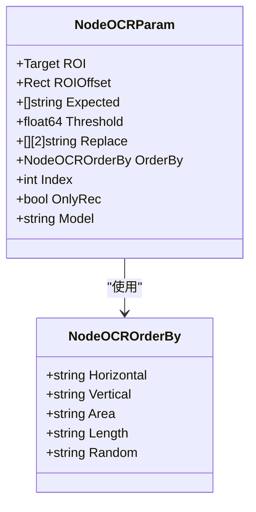
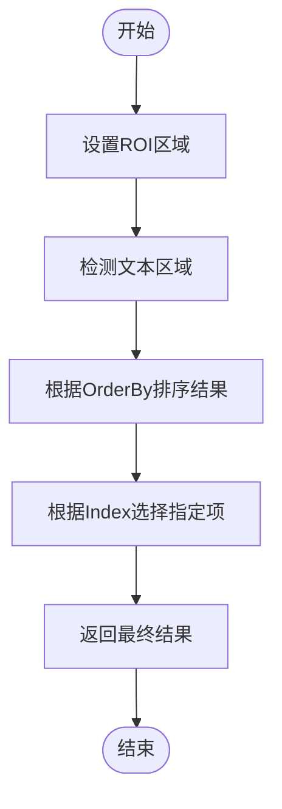
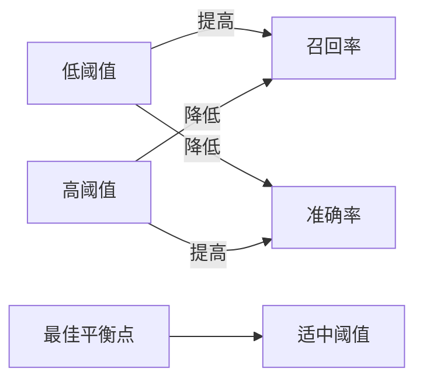

# OCR文字识别

<cite>
**本文档引用文件**   
- [pipeline.go](file://pipeline.go#L880-L977)
- [context_test.go](file://context_test.go#L544-L576)
- [custom_recognition.go](file://custom_recognition.go)
- [examples\custom-recognition\main.go](file://examples/custom-recognition/main.go)
</cite>

## 目录
1. [OCR识别模式实现机制](#ocr识别模式实现机制)
2. [NodeOCRParam参数详解](#nodeocrparam参数详解)
3. [多文本区域处理策略](#多文本区域处理策略)
4. [正则表达式匹配与阈值调整](#正则表达式匹配与阈值调整)
5. [ROI与ROIOffset应用技巧](#roi与roioffset应用技巧)
6. [不同场景下的性能表现与优化](#不同场景下的性能表现与优化)

## OCR识别模式实现机制

OCR文字识别在MAA框架中通过`NodeRecognitionTypeOCR`类型实现，其核心参数结构为`NodeOCRParam`。该机制基于图像识别技术，首先在指定区域内检测文本区域，然后使用OCR模型进行文字识别。系统支持通过`RecOCR`函数创建OCR识别节点，该函数接受预期文本模式和配置选项作为参数。

OCR识别流程包含两个主要阶段：文本检测和文字识别。当`OnlyRec`参数为`false`时，系统会先进行文本区域检测，再对检测到的区域进行识别；当`OnlyRec`为`true`时，则直接在预设的精确ROI区域内进行识别，跳过检测阶段以提高效率。

**Section sources**
- [pipeline.go](file://pipeline.go#L963-L977)

## NodeOCRParam参数详解

`NodeOCRParam`结构体定义了OCR识别的所有配置参数，各字段具体作用如下：

- **ROI**：指定识别的兴趣区域，通过`WithOCRROI`函数设置
- **ROIOffset**：应用于ROI的偏移量，通过`WithOCRROIOffset`函数设置
- **Expected**：预期的文本结果，支持正则表达式匹配
- **Threshold**：模型置信度阈值[0-1.0]，默认值为0.3，通过`WithOCRThreshold`函数设置
- **Replace**：文本替换规则，用于纠正OCR识别错误
- **OrderBy**：结果排序方式，默认为水平排序
- **Index**：指定从结果中选择第几个匹配项
- **OnlyRec**：启用仅识别模式，无需检测（需要精确ROI）
- **Model**：指定模型文件夹路径，相对于model/ocr目录

**Diagram sources**
- [pipeline.go](file://pipeline.go#L880-L900)

**Section sources**
- [pipeline.go](file://pipeline.go#L880-L900)

## 多文本区域处理策略

当处理多个文本区域时，系统提供多种排序和选择策略。`OrderBy`参数定义了结果的排序方式，包括：

- **Horizontal**：按x坐标排序（默认）
- **Vertical**：按y坐标排序
- **Area**：按文本区域面积排序
- **Length**：按文本长度排序
- **Random**：随机排序

`Index`参数用于指定选择排序后结果中的第几个匹配项。索引从0开始，负数表示从末尾开始计数。例如，`Index: 0`选择第一个匹配项，`Index: -1`选择最后一个匹配项。

在实际应用中，可以通过组合`OrderBy`和`Index`参数实现复杂的文本选择逻辑。例如，在处理表格数据时，可以先按垂直方向排序，然后选择特定行的文本内容。

**Diagram sources**
- [pipeline.go](file://pipeline.go#L870-L878)
- [context_test.go](file://context_test.go#L544-L576)

**Section sources**
- [pipeline.go](file://pipeline.go#L870-L878)
- [context_test.go](file://context_test.go#L544-L576)

## 正则表达式匹配与阈值调整

OCR识别支持使用正则表达式进行动态文本内容匹配。`Expected`字段接受字符串数组，其中每个字符串都可以是正则表达式模式。这使得系统能够识别符合特定模式的动态文本内容，如日期、时间、编号等。

识别阈值`Threshold`是平衡准确率和召回率的关键参数。较低的阈值（如0.1-0.3）会提高召回率但可能增加误识别，适用于需要捕获所有可能文本的场景；较高的阈值（如0.6-0.8）会提高准确率但可能漏掉一些文本，适用于对准确性要求较高的场景。

在实际应用中，建议通过测试不同阈值来找到最佳平衡点。对于复杂背景或低质量图像，可以适当降低阈值；对于简单背景或高质量图像，可以适当提高阈值。

**Diagram sources**
- [pipeline.go](file://pipeline.go#L888-L889)
- [context_test.go](file://context_test.go#L552-L553)

**Section sources**
- [pipeline.go](file://pipeline.go#L888-L889)
- [context_test.go](file://context_test.go#L552-L553)

## ROI与ROIOffset应用技巧

ROI（感兴趣区域）和ROIOffset（ROI偏移）在定位文本区域中具有重要作用。ROI用于限定识别的区域范围，可以显著提高识别效率和准确性。ROIOffset则允许在基础ROI上进行动态偏移调整。

应用场景包括：
- 固定位置文本识别：直接设置精确ROI
- 动态位置文本识别：结合图像特征定位基础位置，再使用ROIOffset进行微调
- 多语言文本识别：为不同语言区域设置不同ROI
- 响应式界面识别：根据屏幕分辨率动态计算ROI

在自定义识别中，可以通过`OverridePipeline`方法动态修改ROI参数，实现灵活的文本识别策略。

**Section sources**
- [pipeline.go](file://pipeline.go#L883-L885)
- [examples/custom-recognition/main.go](file://examples/custom-recognition/main.go#L59-L64)

## 不同场景下的性能表现与优化

OCR识别在不同字体、字号和背景复杂度下的性能表现有所差异：

- **字体影响**：标准字体（如宋体、黑体）识别效果较好，艺术字体或手写体识别效果较差
- **字号影响**：过小（<8pt）或过大（>72pt）的字号可能影响识别准确率
- **背景复杂度**：纯色背景识别效果最佳，复杂图案或渐变背景可能降低识别效果

优化方案包括：
1. 针对特定场景训练专用OCR模型
2. 使用`Replace`参数纠正常见识别错误
3. 调整`Threshold`参数适应不同质量图像
4. 结合多种识别方式（如模板匹配+OCR）提高可靠性
5. 对图像进行预处理（如二值化、去噪）改善识别条件

在极端情况下，可以考虑使用神经网络分类器替代OCR识别，以提高特定文本模式的识别准确率。

**Section sources**
- [pipeline.go](file://pipeline.go#L891-L892)
- [context_test.go](file://context_test.go#L553-L554)