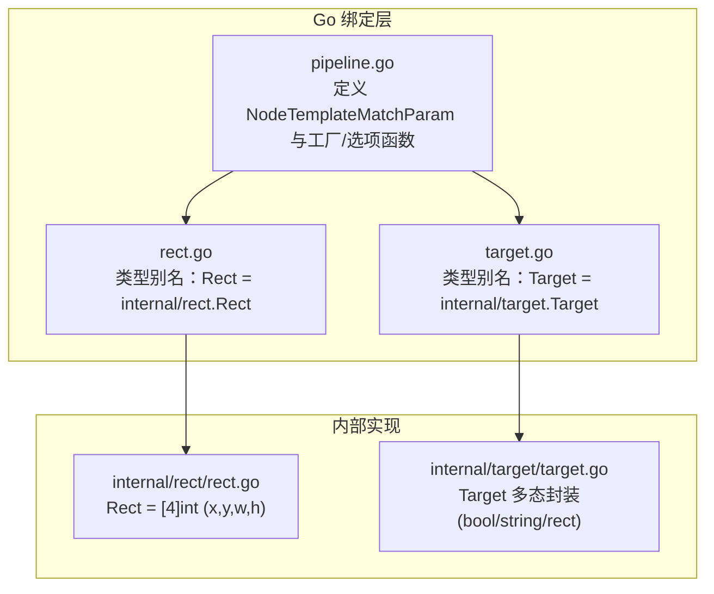
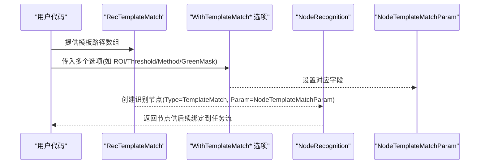
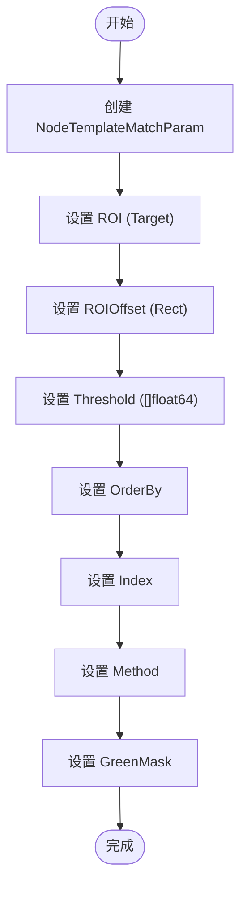
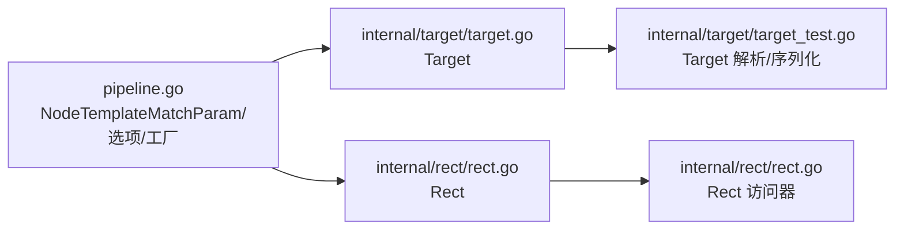

# 模板匹配识别

<cite>
**本文引用的文件列表**
- [pipeline.go](file://pipeline.go)
- [context_test.go](file://context_test.go)
- [rect.go](file://rect.go)
- [internal/rect/rect.go](file://internal/rect/rect.go)
- [target.go](file://target.go)
- [internal/target/target.go](file://internal/target/target.go)
- [internal/target/target_test.go](file://internal/target/target_test.go)
</cite>

## 目录
1. [简介](#简介)
2. [项目结构与定位](#项目结构与定位)
3. [核心组件：NodeTemplateMatchParam 及其字段](#核心组件nodetemplatematchparam-及其字段)
4. [架构总览](#架构总览)
5. [详细组件解析](#详细组件解析)
6. [依赖关系分析](#依赖关系分析)
7. [性能与算法特性](#性能与算法特性)
8. [实践指南与参数调优](#实践指南与参数调优)
9. [故障排查](#故障排查)
10. [结论](#结论)

## 简介
本篇文档围绕模板匹配识别能力展开，系统性解析 NodeTemplateMatchParam 结构体的字段语义与配置策略，重点说明 Template、Threshold、Method、GreenMask 等关键参数；并结合 WithTemplateMatch* 系列函数，演示如何使用函数式选项模式构建复杂模板匹配配置。同时对 ROI、ROIOffset 的区域控制进行说明，并对比 SQDIFF_NORMED、CCORR_NORMED、CCOEFF_NORMED 三种匹配算法的技术差异与性能特点，最后给出针对不同图像特征的参数选择建议，并分析 GreenMask 在处理透明 PNG 图像时的关键作用。

## 项目结构与定位
模板匹配识别能力位于 Go 绑定层的 pipeline.go 中，通过 NodeTemplateMatchParam 定义参数模型，并提供 RecTemplateMatch 工厂方法与 WithTemplateMatch* 选项函数，用于以声明式方式构建节点识别配置。ROI/ROIOffset 使用 Target/Rect 类型表达，分别来自 internal/target 与 internal/rect 包。



图表来源
- [pipeline.go](file://pipeline.go#L518-L740)
- [rect.go](file://rect.go#L1-L6)
- [internal/rect/rect.go](file://internal/rect/rect.go#L1-L21)
- [target.go](file://target.go#L1-L17)
- [internal/target/target.go](file://internal/target/target.go#L1-L121)

章节来源
- [pipeline.go](file://pipeline.go#L518-L740)
- [rect.go](file://rect.go#L1-L6)
- [internal/rect/rect.go](file://internal/rect/rect.go#L1-L21)
- [target.go](file://target.go#L1-L17)
- [internal/target/target.go](file://internal/target/target.go#L1-L121)

## 核心组件：NodeTemplateMatchParam 及其字段
NodeTemplateMatchParam 是模板匹配识别的核心参数载体，支持以下关键字段：

- ROI：识别区域（Region Of Interest），可为布尔、字符串或矩形区域。当为矩形时，通常与 ROIOffset 配合使用，形成最终裁剪窗口。
- ROIOffset：对 ROI 的偏移量，用于微调最终识别区域。
- Template：模板图像路径数组，至少提供一个模板。
- Threshold：匹配阈值数组，范围 [0,1]，越接近 1 越严格。
- OrderBy：结果排序策略，支持按水平、垂直、分数、随机等。
- Index：从多结果中选择第几个匹配。
- Method：模板匹配算法，支持 SQDIFF_NORMED、CCORR_NORMED、CCOEFF_NORMED。
- GreenMask：启用绿色遮罩，用于透明 PNG 的透明区域处理。

```mermaid
classDiagram
class NodeTemplateMatchParam {
+ROI : Target
+ROIOffset : Rect
+Template : []string
+Threshold : []float64
+OrderBy : NodeTemplateMatchOrderBy
+Index : int
+Method : NodeTemplateMatchMethod
+GreenMask : bool
}
class NodeTemplateMatchOrderBy {
<<enumeration>>
"Horizontal"
"Vertical"
"Score"
"Random"
}
class NodeTemplateMatchMethod {
<<enumeration>>
"SQDIFF_NORMED"
"CCORR_NORMED"
"CCOEFF_NORMED"
}
class Target
class Rect
NodeTemplateMatchParam --> NodeTemplateMatchOrderBy : "排序策略"
NodeTemplateMatchParam --> NodeTemplateMatchMethod : "匹配算法"
NodeTemplateMatchParam --> Target : "区域"
NodeTemplateMatchParam --> Rect : "偏移"
```

图表来源
- [pipeline.go](file://pipeline.go#L525-L562)
- [pipeline.go](file://pipeline.go#L535-L542)
- [pipeline.go](file://pipeline.go#L544-L562)
- [target.go](file://target.go#L1-L17)
- [internal/target/target.go](file://internal/target/target.go#L1-L121)
- [rect.go](file://rect.go#L1-L6)
- [internal/rect/rect.go](file://internal/rect/rect.go#L1-L21)

章节来源
- [pipeline.go](file://pipeline.go#L525-L562)
- [pipeline.go](file://pipeline.go#L535-L542)
- [pipeline.go](file://pipeline.go#L544-L562)
- [target.go](file://target.go#L1-L17)
- [internal/target/target.go](file://internal/target/target.go#L1-L121)
- [rect.go](file://rect.go#L1-L6)
- [internal/rect/rect.go](file://internal/rect/rect.go#L1-L21)

## 架构总览
模板匹配识别的调用链路如下：
- 业务侧通过 RecTemplateMatch(template, opts...) 构建识别节点；
- WithTemplateMatch* 选项函数以函数式方式设置 ROI、ROIOffset、Threshold、OrderBy、Index、Method、GreenMask；
- NodeRecognition.Type 指向 TemplateMatch，Param 为 NodeTemplateMatchParam；
- 运行时根据参数执行模板匹配逻辑（由底层框架实现）。



图表来源
- [pipeline.go](file://pipeline.go#L618-L632)
- [pipeline.go](file://pipeline.go#L566-L617)

章节来源
- [pipeline.go](file://pipeline.go#L566-L632)

## 详细组件解析

### 函数式选项模式：WithTemplateMatch*
WithTemplateMatch* 系列函数采用函数式选项模式，逐项设置 NodeTemplateMatchParam 字段，便于组合与扩展。典型选项包括：
- WithTemplateMatchROI：设置识别区域（Target）
- WithTemplateMatchROIOffset：设置 ROI 偏移（Rect）
- WithTemplateMatchThreshold：设置阈值数组（[]float64）
- WithTemplateMatchOrderBy：设置排序策略（NodeTemplateMatchOrderBy）
- WithTemplateMatchIndex：设置索引（int）
- WithTemplateMatchMethod：设置匹配算法（NodeTemplateMatchMethod）
- WithTemplateMatchGreenMask：启用绿色遮罩（bool）



图表来源
- [pipeline.go](file://pipeline.go#L566-L617)

章节来源
- [pipeline.go](file://pipeline.go#L566-L617)

### ROI 与 ROIOffset 的区域控制
- ROI 支持三种形式：布尔（恒真/恒假）、字符串（可能代表动态标识）、矩形（x,y,w,h）。在测试用例中可见 ROI 以整数数组形式传入，最终被解析为 Target。
- ROIOffset 为 Rect，用于对 ROI 进一步偏移，常用于微调识别窗口位置。
- 测试用例展示了 ROI 与 ROIOffset 的联合使用，验证了参数解析与生效。

章节来源
- [context_test.go](file://context_test.go#L442-L475)
- [internal/target/target.go](file://internal/target/target.go#L1-L121)
- [internal/target/target_test.go](file://internal/target/target_test.go#L1-L88)
- [internal/rect/rect.go](file://internal/rect/rect.go#L1-L21)

### Template、Threshold、Method、GreenMask 的语义与策略
- Template：模板图像路径数组，至少提供一个模板；可提供多个模板以提升鲁棒性。
- Threshold：阈值数组，越接近 1 越严格；可根据图像噪声与相似度分布调整。
- Method：匹配算法枚举，分别对应 SQDIFF_NORMED、CCORR_NORMED、CCOEFF_NORMED；默认 CCOEFF_NORMED。
- GreenMask：启用绿色遮罩，用于透明 PNG 的透明区域处理，避免背景干扰。

章节来源
- [pipeline.go](file://pipeline.go#L544-L562)
- [context_test.go](file://context_test.go#L442-L475)

## 依赖关系分析
- NodeTemplateMatchParam 依赖 Target 与 Rect：
  - Target 来自 internal/target，支持 bool/string/rect 三态封装；
  - Rect 来自 internal/rect，为 [4]int(x,y,w,h)。
- 选项函数与工厂函数均位于 pipeline.go，形成清晰的参数模型与构建流程。



图表来源
- [pipeline.go](file://pipeline.go#L518-L740)
- [internal/target/target.go](file://internal/target/target.go#L1-L121)
- [internal/target/target_test.go](file://internal/target/target_test.go#L1-L88)
- [internal/rect/rect.go](file://internal/rect/rect.go#L1-L21)

章节来源
- [pipeline.go](file://pipeline.go#L518-L740)
- [internal/target/target.go](file://internal/target/target.go#L1-L121)
- [internal/target/target_test.go](file://internal/target/target_test.go#L1-L88)
- [internal/rect/rect.go](file://internal/rect/rect.go#L1-L21)

## 性能与算法特性
- SQDIFF_NORMED：归一化平方差，越小越匹配。适合亮度/对比度变化较小且噪声较弱的场景，计算相对简单。
- CCORR_NORMED：归一化交叉相关，值越大越匹配。对亮度变化更稳健，适合光照变化较大但纹理一致的场景。
- CCOEFF_NORMED：归一化相关系数，值越大越匹配，默认推荐。对尺度、旋转、噪声具有较好鲁棒性，综合性能最佳。

注意：以上为基于算法命名与常见理解的总结；具体性能表现受图像质量、模板设计、阈值设置等因素影响。

章节来源
- [pipeline.go](file://pipeline.go#L535-L542)

## 实践指南与参数调优
- 模板选择
  - 对于高对比度、边缘清晰的图标，优先使用 CCOEFF_NORMED；
  - 对于光照变化大但纹理稳定的场景，可尝试 CCORR_NORMED；
  - 对噪声较多的场景，适当提高 Threshold 并结合多模板。
- 阈值设置
  - 初次调试建议从较低阈值起步，逐步提高以减少误检；
  - 多模板时可为每个模板设置独立阈值，或统一阈值后通过 OrderBy/Score 排序筛选。
- 区域控制
  - ROI 限定识别范围，ROIOffset 微调窗口，二者配合可显著降低误检与提升速度；
  - 对移动元素，建议缩小 ROI 并固定 ROIOffset，避免全局扫描。
- 算法选择
  - 默认使用 CCOEFF_NORMED；
  - 若出现大量伪匹配或误检，尝试 CCORR_NORMED 或 SQDIFF_NORMED；
  - 对透视/缩放敏感的场景，考虑特征匹配（FeatureMatch）而非模板匹配。
- GreenMask
  - 当模板为透明 PNG 时，启用 GreenMask 可屏蔽绿色背景，避免背景颜色干扰匹配结果；
  - 对非透明模板无需启用。

章节来源
- [pipeline.go](file://pipeline.go#L544-L562)
- [context_test.go](file://context_test.go#L442-L475)

## 故障排查
- 参数未生效
  - 确认通过 WithTemplateMatch* 选项正确设置字段；
  - 检查 pipeline.json 中 param 的键名与类型是否与 NodeTemplateMatchParam 字段一致。
- ROI/ROIOffset 不生效
  - 确认 ROI 传入格式为整数数组（x,y,w,h），并在运行时被正确解析为 Target；
  - 检查 ROIOffset 是否与 ROI 合理叠加，避免超出屏幕边界。
- 匹配结果异常
  - 调整 Threshold，观察 Score 分布；
  - 更换 Method 或增加模板数量；
  - 对透明 PNG 启用 GreenMask。
- 多结果选择
  - 使用 OrderBy/Score/Random 控制排序；
  - 使用 Index 指定目标匹配。

章节来源
- [context_test.go](file://context_test.go#L442-L475)
- [internal/target/target.go](file://internal/target/target.go#L1-L121)
- [internal/target/target_test.go](file://internal/target/target_test.go#L1-L88)
- [internal/rect/rect.go](file://internal/rect/rect.go#L1-L21)

## 结论
NodeTemplateMatchParam 通过清晰的字段划分与 WithTemplateMatch* 选项模式，提供了灵活而强大的模板匹配配置能力。合理选择 Template、Threshold、Method，并结合 ROI/ROIOffset 的区域控制与 GreenMask 的透明 PNG 处理，可在不同图像特征下取得稳定可靠的匹配效果。对于更复杂的尺度、视角变化，可考虑特征匹配方案以获得更好的泛化能力。