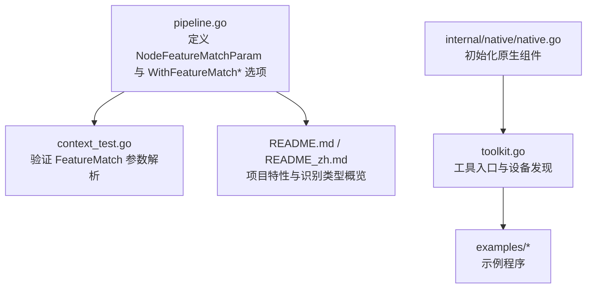
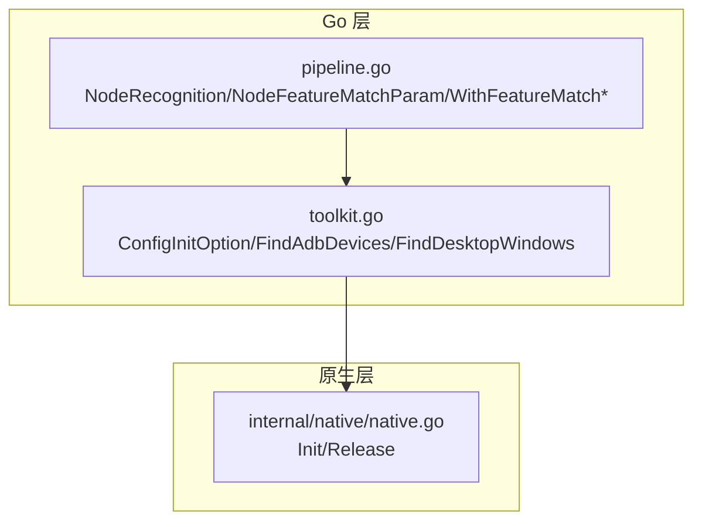
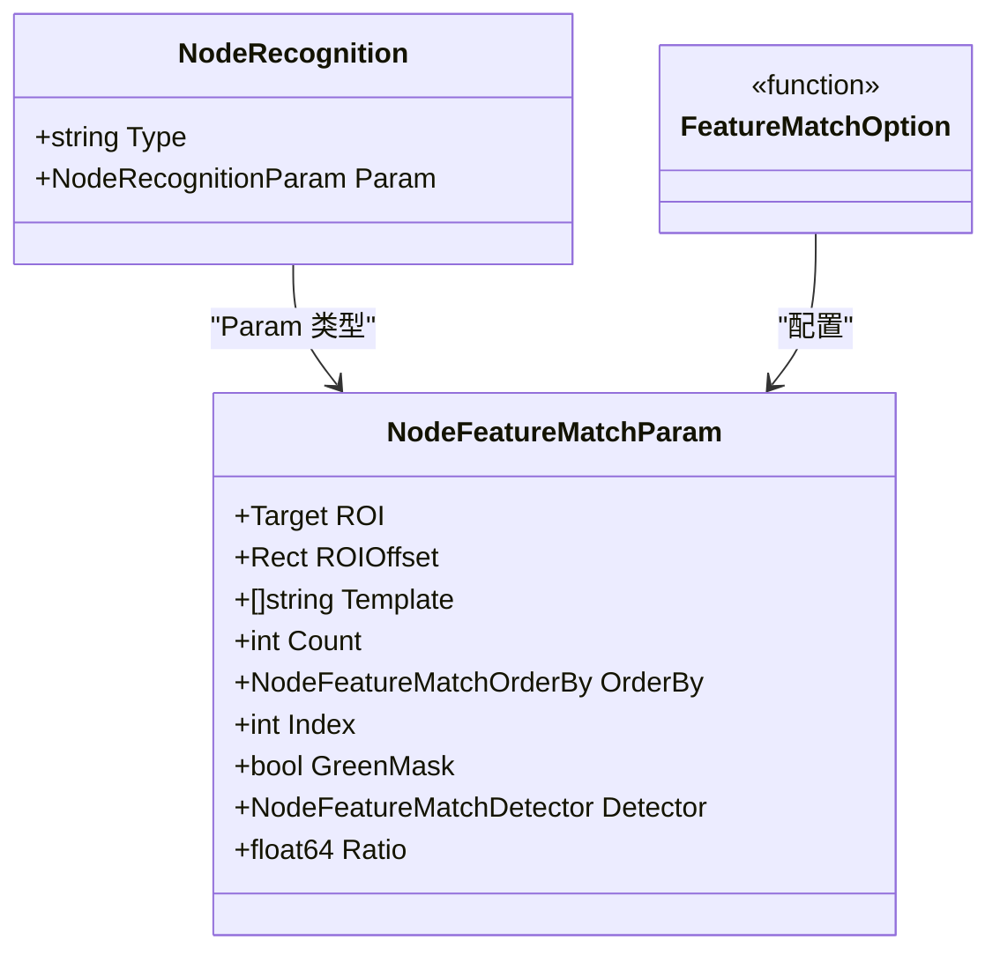
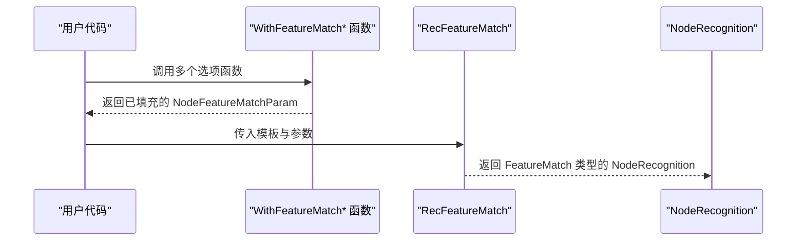
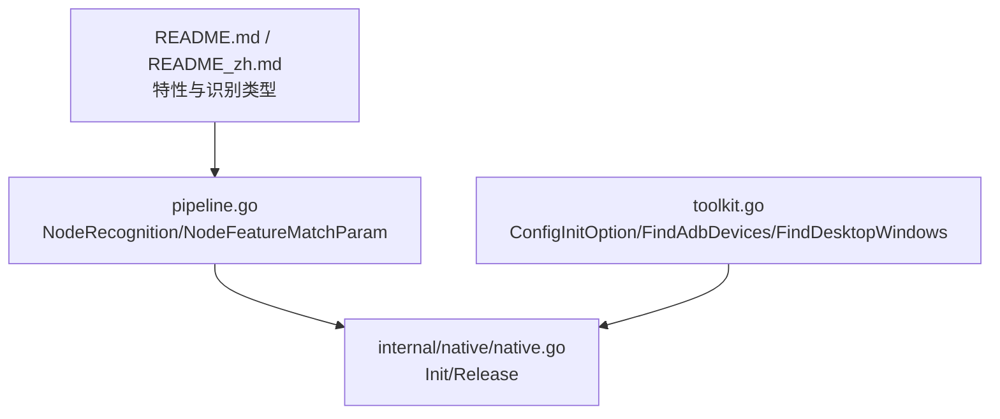

# 特征匹配识别

<cite>
**本文引用的文件**
- [pipeline.go](file://pipeline.go)
- [context_test.go](file://context_test.go)
- [README.md](file://README.md)
- [README_zh.md](file://README_zh.md)
- [internal/native/native.go](file://internal/native/native.go)
- [toolkit.go](file://toolkit.go)
</cite>

## 目录
1. [简介](#简介)
2. [项目结构](#项目结构)
3. [核心组件](#核心组件)
4. [架构总览](#架构总览)
5. [详细组件分析](#详细组件分析)
6. [依赖关系分析](#依赖关系分析)
7. [性能考量](#性能考量)
8. [故障排查指南](#故障排查指南)
9. [结论](#结论)
10. [附录](#附录)

## 简介
本文件围绕 NodeFeatureMatchParam 结构体进行系统化解析，阐述其设计理念与技术实现；对比 SIFT、KAZE、AKAZE、BRISK、ORB 等特征检测算法的特性与适用场景；详解 Count、Ratio、Detector 等参数对识别精度与性能的影响；结合 WithFeatureMatch* 系列配置函数，演示在不同环境条件（如光照变化、尺度变化）下如何调参；最后分析特征匹配相较模板匹配的优势，特别是在处理透视变换与旋转时的鲁棒性，并给出实用调优建议。

## 项目结构
该仓库为 MaaFramework 的 Go 绑定，提供跨平台自动化能力，其中图像识别包含多种识别类型，特征匹配是其中之一。NodeFeatureMatchParam 位于管道协议定义文件中，作为特征匹配识别节点的参数载体，配合 WithFeatureMatch* 选项函数完成参数配置。

图表来源
- [pipeline.go](file://pipeline.go#L483-L775)
- [context_test.go](file://context_test.go#L477-L509)
- [README.md](file://README.md#L31-L40)
- [README_zh.md](file://README_zh.md#L31-L40)
- [internal/native/native.go](file://internal/native/native.go#L1-L41)
- [toolkit.go](file://toolkit.go#L1-L92)

章节来源
- [pipeline.go](file://pipeline.go#L483-L775)
- [context_test.go](file://context_test.go#L477-L509)
- [README.md](file://README.md#L31-L40)
- [README_zh.md](file://README_zh.md#L31-L40)
- [internal/native/native.go](file://internal/native/native.go#L1-L41)
- [toolkit.go](file://toolkit.go#L1-L92)

## 核心组件
- NodeFeatureMatchParam：特征匹配识别的参数结构体，包含 ROI、ROIOffset、Template、Count、OrderBy、Index、GreenMask、Detector、Ratio 等字段。
- NodeFeatureMatchDetector：特征检测算法枚举，支持 SIFT、KAZE、AKAZE、BRISK、ORB。
- NodeFeatureMatchOrderBy：结果排序策略，支持按横坐标、纵坐标、匹配分数、包围盒面积、随机。
- WithFeatureMatch* 系列选项函数：用于链式配置 NodeFeatureMatchParam 的各项参数。

章节来源
- [pipeline.go](file://pipeline.go#L634-L775)

## 架构总览
特征匹配识别在 Go 层通过 NodeRecognition 与 NodeFeatureMatchParam 进行声明式配置，在底层由 MaaFramework 原生组件执行具体算法。初始化流程包括加载原生库、配置工具入口、设备发现与绑定等步骤。

图表来源
- [pipeline.go](file://pipeline.go#L483-L775)
- [toolkit.go](file://toolkit.go#L1-L92)
- [internal/native/native.go](file://internal/native/native.go#L1-L41)

## 详细组件分析

### NodeFeatureMatchParam 结构体设计
- 字段职责清晰：
  - ROI/ROIOffset：限定识别区域，便于在大图中聚焦目标。
  - Template：模板图像路径列表，支持多模板。
  - Count：最小匹配点数阈值，控制识别稳健性。
  - OrderBy/Index：结果排序与选择策略，便于稳定输出。
  - GreenMask：对透明区域启用绿色掩码，提升特定场景识别效果。
  - Detector：特征检测算法选择。
  - Ratio：KNN 匹配距离比阈值，用于剔除误匹配。
- 默认值与约束：
  - Count 默认值为 4，Ratio 默认值为 0.6。
  - Detector 默认为 SIFT，兼顾准确度与鲁棒性。
- 与 NodeRecognition 的关系：
  - RecFeatureMatch 返回 NodeRecognition，Type 为 FeatureMatch，Param 为 NodeFeatureMatchParam。

图表来源
- [pipeline.go](file://pipeline.go#L483-L775)

章节来源
- [pipeline.go](file://pipeline.go#L634-L775)

### WithFeatureMatch* 系列配置函数
- WithFeatureMatchROI/WithFeatureMatchROIOffset：设置识别区域与偏移。
- WithFeatureMatchCount：设置最小匹配点数阈值。
- WithFeatureMatchOrderBy：设置结果排序策略。
- WithFeatureMatchIndex：设置结果索引。
- WithFeatureMatchGreenMask：启用绿色掩码。
- WithFeatureMatchDetector：设置特征检测算法。
- WithFeatureMatchRatio：设置 KNN 匹配距离比阈值。
- RecFeatureMatch：创建 FeatureMatch 类型的 NodeRecognition。

图表来源
- [pipeline.go](file://pipeline.go#L680-L754)

章节来源
- [pipeline.go](file://pipeline.go#L680-L754)

### 特征检测算法对比与适用场景
- SIFT（Scale-Invariant Feature Transform）
  - 特性：尺度不变、旋转不变、光照鲁棒，适合复杂场景与透视变化。
  - 适用：高精度要求、复杂背景、尺度变化显著。
- KAZE
  - 特性：适用于 2D/3D 图像，非线性扩散滤波，保留边缘细节。
  - 适用：纹理丰富、边缘重要的场景。
- AKAZE
  - 特性：加速版 KAZE，速度更快，保持相似稳定性。
  - 适用：实时性要求较高但仍需较好鲁棒性的场景。
- BRISK（Binary Robust Invariant Scalable Keypoints）
  - 特性：二进制描述子，速度快，内存占用低。
  - 适用：对速度敏感、资源受限的场景。
- ORB（Oriented FAST and Rotated BRIEF）
  - 特性：快速、无尺度不变性，适合简单场景与快速原型。
  - 适用：简单目标、快速检测、对尺度变化不敏感。

章节来源
- [pipeline.go](file://pipeline.go#L645-L654)

### 参数对精度与性能的影响
- Count（最小匹配点数）
  - 影响：提高阈值可降低误检，但可能漏检；过低则误检增多。
  - 建议：根据模板复杂度与背景噪声调整，一般从 4 开始尝试。
- Ratio（KNN 匹配距离比）
  - 影响：越小越严格，误匹配更少；过大可能导致漏检。
  - 建议：默认 0.6 可作为起点；复杂场景可适当降低。
- Detector（特征检测算法）
  - 影响：SIFT/KAZE/AKAZE 更稳健但较慢；BRISK/ORB 更快但鲁棒性略低。
  - 建议：优先 SIFT；对实时性敏感时考虑 BRISK/ORB。

章节来源
- [pipeline.go](file://pipeline.go#L656-L676)

### 针对不同环境条件的调参示例
- 光照变化
  - 建议：使用 SIFT 或 KAZE；适当提高 Count；适度降低 Ratio。
- 尺度变化
  - 建议：使用具备尺度不变性的算法（SIFT/KAZE/AKAZE）；增大 Count。
- 透视变换与旋转
  - 建议：使用 SIFT/KAZE/AKAZE；合理设置 Ratio；必要时增加模板数量。
- 透明区域
  - 建议：启用 GreenMask；确保模板与背景对比明显。

章节来源
- [pipeline.go](file://pipeline.go#L656-L676)
- [context_test.go](file://context_test.go#L477-L509)

### 特征匹配相较模板匹配的优势
- 透视变换与旋转鲁棒性：特征匹配通过关键点与描述子，对仿射变换与旋转具有更强的适应性。
- 尺度不变性：SIFT/KAZE/AKAZE 对尺度变化更稳健。
- 复杂背景与遮挡：特征匹配通常能更好地忽略背景干扰，提升识别稳定性。
- 性能权衡：BRISK/ORB 更快，SIFT/KAZE/AKAZE 更稳但计算量更大。

章节来源
- [pipeline.go](file://pipeline.go#L739-L741)

## 依赖关系分析
- Go 层通过 NodeRecognition 与 NodeFeatureMatchParam 描述识别行为。
- 初始化原生组件由 internal/native/native.go 承担，确保底层库可用。
- 工具入口（toolkit.go）提供配置与设备发现能力，支撑上层业务。
- README 展示了项目特性与识别类型，明确包含“图像识别（模板匹配、OCR、特征检测等）”。

图表来源
- [pipeline.go](file://pipeline.go#L483-L775)
- [internal/native/native.go](file://internal/native/native.go#L1-L41)
- [toolkit.go](file://toolkit.go#L1-L92)
- [README.md](file://README.md#L31-L40)
- [README_zh.md](file://README_zh.md#L31-L40)

章节来源
- [pipeline.go](file://pipeline.go#L483-L775)
- [internal/native/native.go](file://internal/native/native.go#L1-L41)
- [toolkit.go](file://toolkit.go#L1-L92)
- [README.md](file://README.md#L31-L40)
- [README_zh.md](file://README_zh.md#L31-L40)

## 性能考量
- 算法选择：SIFT/KAZE/AKAZE 计算开销较大，BRISK/ORB 更轻量。
- Count/Ratio：增大 Count 与减小 Ratio 可提升稳健性，但会增加误检风险与计算时间。
- ROI/ROIOffset：缩小识别范围可显著提升性能。
- 模板数量：模板越多，匹配越稳健，但计算成本越高。

## 故障排查指南
- 参数解析验证：通过单元测试验证 FeatureMatch 参数是否正确解析（如 Count、OrderBy、Detector、Ratio）。
- 初始化问题：确认原生库初始化成功，路径与环境变量配置正确。
- 设备与资源：确保设备连接正常、资源包加载成功。

章节来源
- [context_test.go](file://context_test.go#L477-L509)
- [internal/native/native.go](file://internal/native/native.go#L1-L41)
- [README.md](file://README.md#L62-L77)
- [README_zh.md](file://README_zh.md#L62-L77)

## 结论
NodeFeatureMatchParam 以清晰的字段划分与 WithFeatureMatch* 选项函数实现了特征匹配识别的灵活配置。在不同环境条件下，应综合考虑算法稳健性与性能，合理设置 Count、Ratio 与 Detector，并利用 ROI/ROIOffset 缩小搜索范围。特征匹配相较模板匹配在透视、旋转与尺度变化方面更具优势，是复杂场景下的优选方案。

## 附录
- 术语说明
  - ROI：感兴趣区域
  - KNN：K 最近邻
  - BRISK/ORB：二进制特征描述子
  - SIFT/KAZE/AKAZE：尺度不变特征