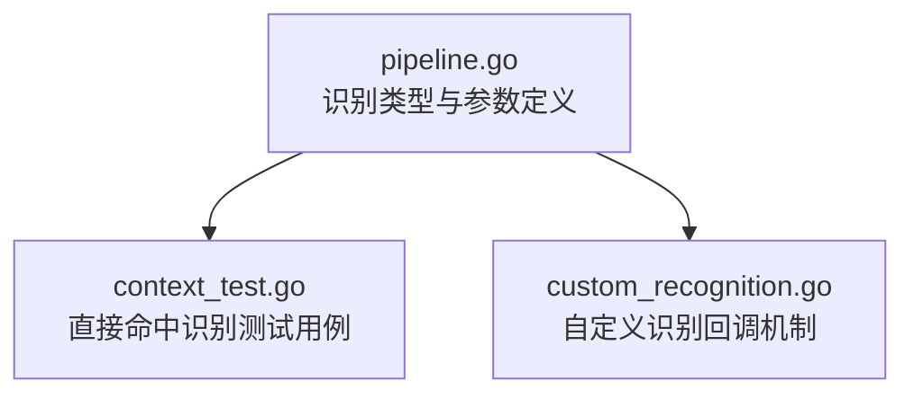
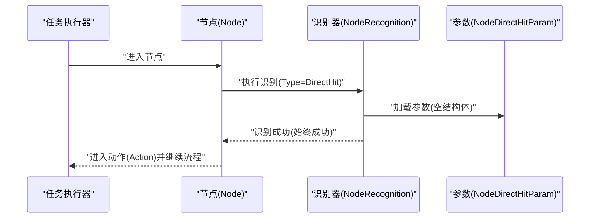
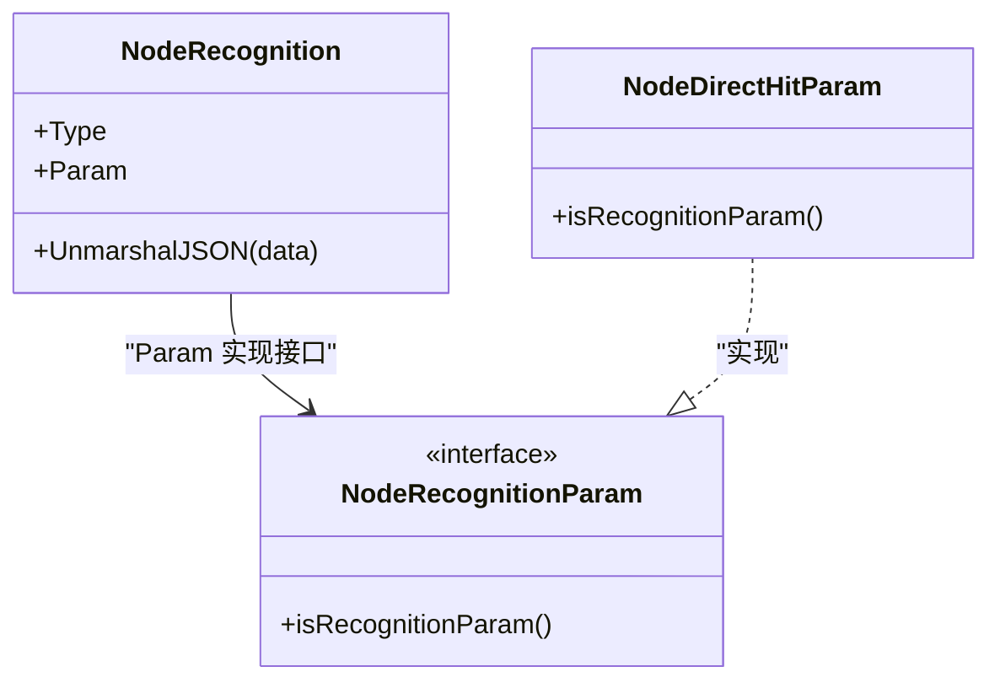
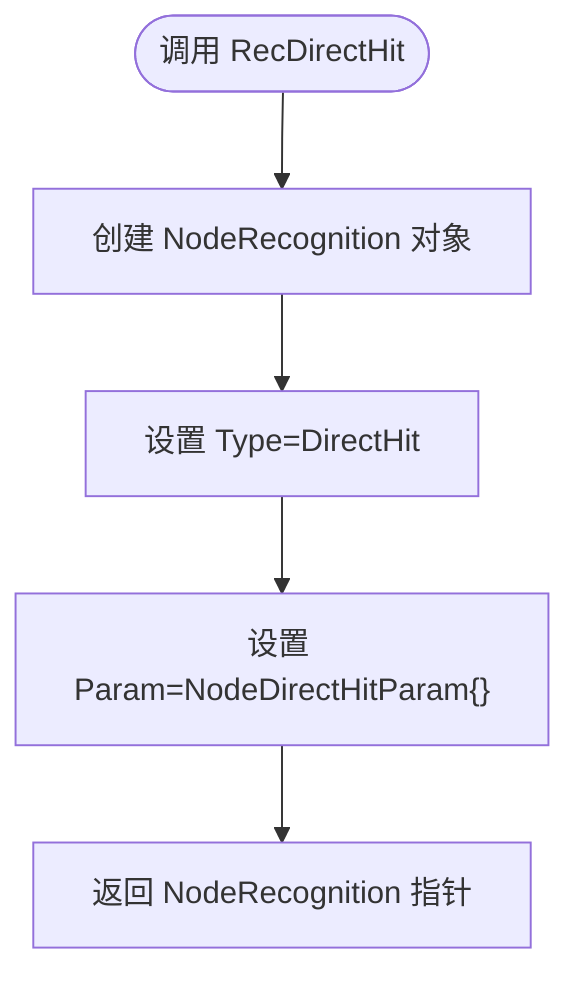
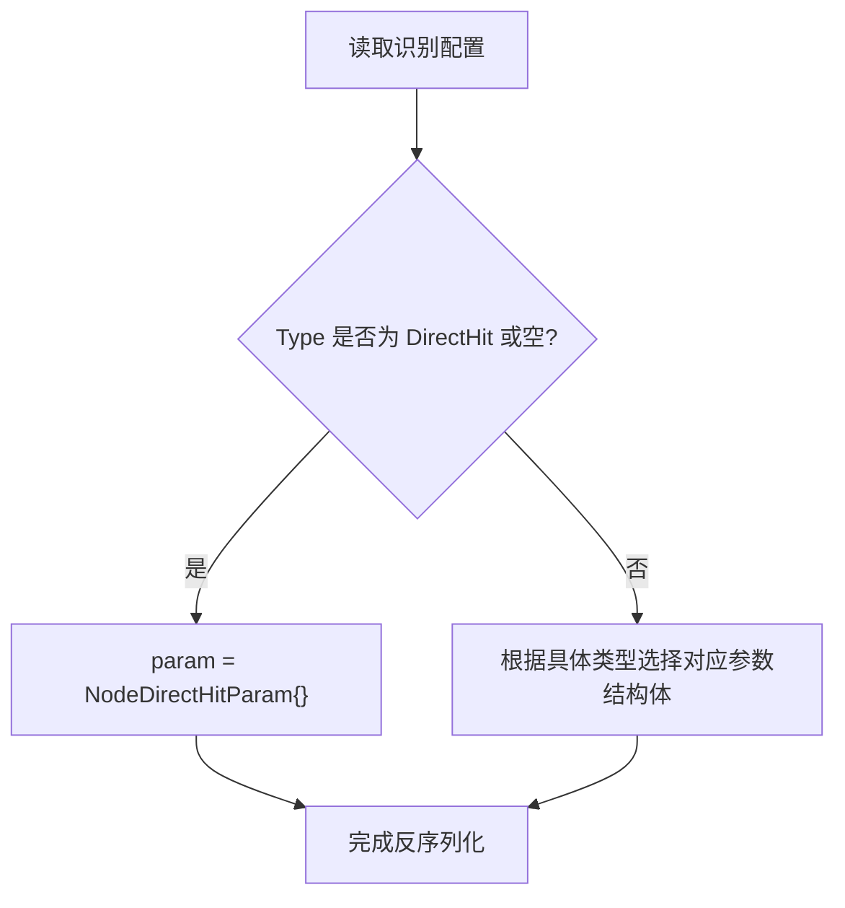
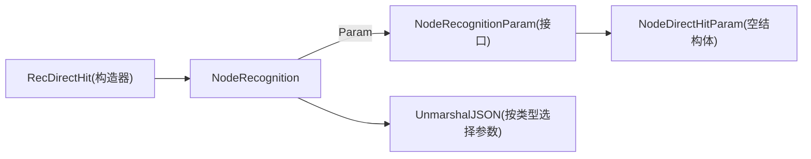

# 直接命中识别

<cite>
**本文引用的文件**
- [pipeline.go](file://pipeline.go)
- [context_test.go](file://context_test.go)
- [custom_recognition.go](file://custom_recognition.go)
</cite>

## 目录
1. [简介](#简介)
2. [项目结构](#项目结构)
3. [核心组件](#核心组件)
4. [架构总览](#架构总览)
5. [组件详解](#组件详解)
6. [依赖关系分析](#依赖关系分析)
7. [性能考量](#性能考量)
8. [故障排查指南](#故障排查指南)
9. [结论](#结论)
10. [附录](#附录)

## 简介
本篇文档聚焦于“直接命中识别”（DirectHit）这一识别模式，系统性解释其类型定义、参数结构体为何为空、在任务流中作为流程控制节点的作用，以及如何通过构造函数创建该识别节点。同时，对比其与模板匹配、特征匹配、颜色匹配、OCR、神经网络等识别模式的根本差异：它不进行任何图像分析，总是返回成功结果，常用于流程控制、锚点标记、条件跳转与错误处理链路的触发。

## 项目结构
围绕直接命中识别的相关实现与测试主要分布在以下文件：
- pipeline.go：定义识别类型、参数接口、具体参数结构体（含空参数的直接命中）、识别节点构建器函数等。
- context_test.go：包含对直接命中识别类型的单元测试，验证从 JSON 配置到节点数据解析的一致性。
- custom_recognition.go：自定义识别回调机制，为理解“直接命中识别”的行为边界提供上下文参考。

图表来源
- [pipeline.go](file://pipeline.go#L438-L523)
- [context_test.go](file://context_test.go#L426-L440)
- [custom_recognition.go](file://custom_recognition.go#L1-L103)

章节来源
- [pipeline.go](file://pipeline.go#L438-L523)
- [context_test.go](file://context_test.go#L426-L440)
- [custom_recognition.go](file://custom_recognition.go#L1-L103)

## 核心组件
- 识别类型枚举：包含 DirectHit 常量。
- 参数接口与实现：NodeRecognitionParam 接口及各识别模式的参数结构体实现。
- 直接命中参数结构体：NodeDirectHitParam 定义为空结构体，表示无额外参数。
- 识别节点构造器：RecDirectHit 返回一个识别节点，类型为 DirectHit，参数为 NodeDirectHitParam 实例。
- 节点识别反序列化：NodeRecognition.UnmarshalJSON 在未提供 param 或类型为 DirectHit 时，自动填充 NodeDirectHitParam。

章节来源
- [pipeline.go](file://pipeline.go#L492-L523)
- [pipeline.go](file://pipeline.go#L446-L490)

## 架构总览
直接命中识别在任务流中的作用是“无条件成功”的触发器，常用于：
- 条件分支的默认路径或兜底分支；
- 锚点标记，配合 next/anchor 属性实现跳转；
- 错误处理链 on_error 的触发；
- 与 inverse 组合实现“非命中即成功”的否定逻辑。

图表来源
- [pipeline.go](file://pipeline.go#L446-L490)
- [pipeline.go](file://pipeline.go#L511-L523)

## 组件详解

### 直接命中识别类型与参数
- 类型常量：DirectHit 表示该识别模式。
- 参数结构体：NodeDirectHitParam 为空结构体，意味着该识别模式不携带任何运行时参数。
- 参数接口：所有识别参数均实现 NodeRecognitionParam 接口，保证统一的多态行为。

图表来源
- [pipeline.go](file://pipeline.go#L506-L523)
- [pipeline.go](file://pipeline.go#L446-L490)

章节来源
- [pipeline.go](file://pipeline.go#L492-L523)
- [pipeline.go](file://pipeline.go#L506-L523)

### 识别节点构造器 RecDirectHit
- 功能：创建一个识别节点，类型为 DirectHit，参数为 NodeDirectHitParam 实例。
- 使用场景：以编程方式快速插入一个“总是成功”的识别节点，常用于流程控制。

图表来源
- [pipeline.go](file://pipeline.go#L517-L523)

章节来源
- [pipeline.go](file://pipeline.go#L517-L523)

### 识别参数反序列化与默认行为
- 当识别类型为 DirectHit 或未指定类型时，NodeRecognition.UnmarshalJSON 会将参数解包为 NodeDirectHitParam。
- 若未提供 param 字段或其值为 null，则仅设置类型，不报错。

图表来源
- [pipeline.go](file://pipeline.go#L446-L490)

章节来源
- [pipeline.go](file://pipeline.go#L446-L490)

### 单元测试验证
- 测试用例通过覆盖管道配置，声明识别类型为 DirectHit，随后断言节点识别类型确实为 NodeRecognitionTypeDirectHit。
- 这确保了从 JSON 到节点数据的解析链路正确无误。

章节来源
- [context_test.go](file://context_test.go#L426-L440)

### 与其它识别模式的根本区别
- 图像分析：DirectHit 不进行任何图像分析，始终返回成功；而模板匹配、特征匹配、颜色匹配、OCR、神经网络等均需要对图像进行计算。
- 参数形态：DirectHit 的参数为空结构体；其他模式参数包含 ROI、阈值、排序策略、检测器、模型等丰富字段。
- 性能特性：DirectHit 无图像分析开销，识别耗时极低；其他模式通常涉及 CPU/GPU 计算，耗时更高。
- 用途差异：DirectHit 主要用于流程控制；其他模式用于目标定位与语义识别。

章节来源
- [pipeline.go](file://pipeline.go#L492-L523)
- [pipeline.go](file://pipeline.go#L525-L800)

### 在跳转逻辑与条件分支中的典型应用
- 作为默认分支：当多个条件分支中某一分支未命中时，可将 DirectHit 放入兜底分支，确保流程不会停滞。
- 作为锚点：通过节点的 anchor 与 next/anchor 属性，将 DirectHit 作为锚点，实现跨节点跳转。
- 与 inverse 组合：inverse=true 时，DirectHit 将被解释为“非命中”，可用于否定式条件判断。
- 与 on_error 组合：当识别超时或动作失败时，可将 DirectHit 放入 on_error，作为错误恢复的快速通道。

章节来源
- [pipeline.go](file://pipeline.go#L300-L380)
- [pipeline.go](file://pipeline.go#L438-L523)

### 实际配置示例（基于仓库中的测试与示例）
- JSON 管道配置示例（摘自测试用例）：
  - 节点 recognition.type 设置为 "DirectHit"，即可创建直接命中识别节点。
- 编程方式示例（摘自构造器）：
  - 通过调用识别节点构造器创建 DirectHit 节点，然后将其设置到 Node 上。

章节来源
- [context_test.go](file://context_test.go#L426-L440)
- [pipeline.go](file://pipeline.go#L517-L523)

## 依赖关系分析
- NodeRecognition 依赖 NodeRecognitionParam 接口，以支持多态参数。
- NodeDirectHitParam 实现 NodeRecognitionParam，满足统一接口约束。
- NodeRecognition.UnmarshalJSON 在解析阶段根据类型选择参数实例，DirectHit 场景下固定为 NodeDirectHitParam。
- RecDirectHit 作为便捷构造器，简化了 DirectHit 节点的创建。

图表来源
- [pipeline.go](file://pipeline.go#L446-L523)

章节来源
- [pipeline.go](file://pipeline.go#L446-L523)

## 性能考量
- DirectHit 无图像分析，识别时间几乎为零，适合频繁触发的流程控制节点。
- 在高并发或高频识别场景中，优先使用 DirectHit 可显著降低 CPU/GPU 压力。
- 与其他识别模式相比，DirectHit 不引入额外的内存拷贝与计算图开销。

## 故障排查指南
- 识别类型解析异常：若配置中 type 未设置或拼写错误，NodeRecognition.UnmarshalJSON 会尝试回退为 DirectHit 并填充空参数，检查配置是否符合预期。
- 参数缺失：DirectHit 允许省略 param 或显式设为 null，不会报错；若出现行为异常，确认是否误用了 inverse 或 next/anchor 配置。
- 与自定义识别的关系：DirectHit 不依赖自定义识别回调；若业务中需要自定义识别，请参考自定义识别回调机制，但 DirectHit 本身不参与回调。

章节来源
- [pipeline.go](file://pipeline.go#L446-L490)
- [custom_recognition.go](file://custom_recognition.go#L1-L103)

## 结论
DirectHit 是一种轻量级的流程控制识别模式，其核心价值在于“无条件成功”。它不进行任何图像分析，参数为空结构体，便于在任务流中作为锚点、默认分支、错误恢复通道或与 inverse 组合使用。通过 RecDirectHit 构造器与 NodeRecognition.UnmarshalJSON 的默认行为，开发者可以以最小成本在管道中集成 DirectHit，从而提升流程的可控性与鲁棒性。

## 附录
- 关键实现位置参考：
  - 识别类型与参数接口：[pipeline.go](file://pipeline.go#L492-L523)
  - 识别节点反序列化：[pipeline.go](file://pipeline.go#L446-L490)
  - 直接命中参数结构体与构造器：[pipeline.go](file://pipeline.go#L511-L523)
  - 单元测试验证：[context_test.go](file://context_test.go#L426-L440)
  - 自定义识别回调机制（背景参考）：[custom_recognition.go](file://custom_recognition.go#L1-L103)