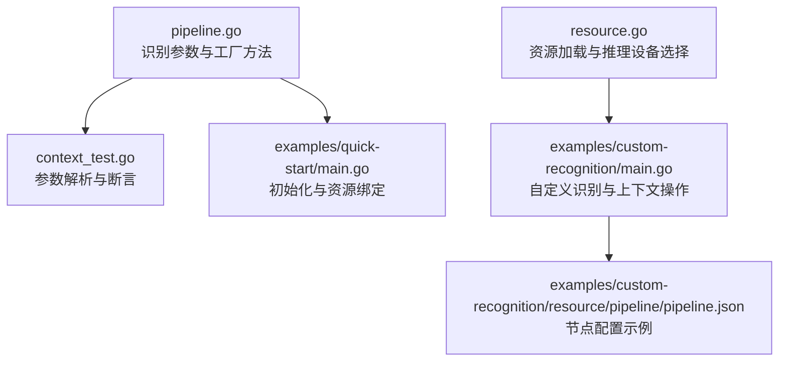
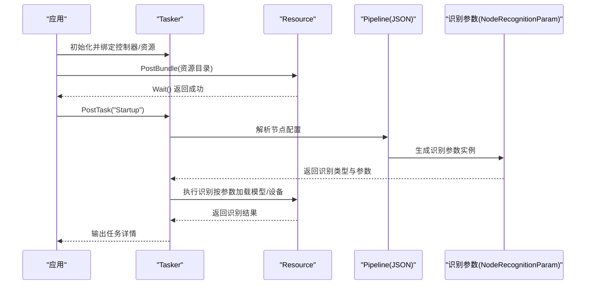
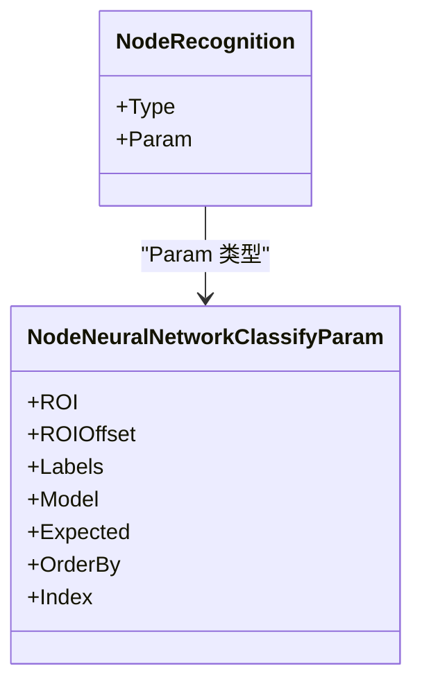
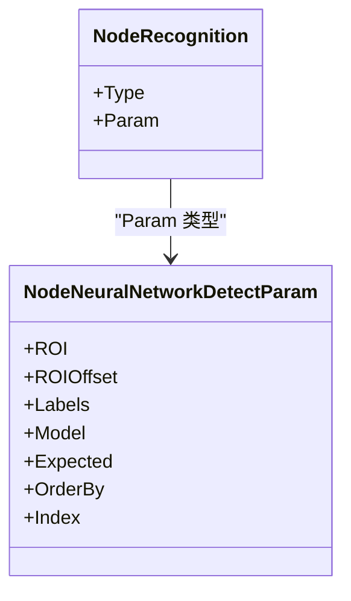
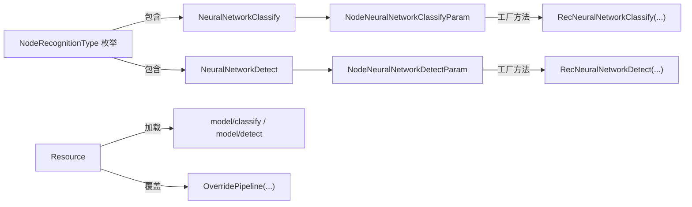

# 神经网络识别

<cite>
**本文引用的文件列表**
- [pipeline.go](file://pipeline.go)
- [context_test.go](file://context_test.go)
- [resource.go](file://resource.go)
- [examples/quick-start/main.go](file://examples/quick-start/main.go)
- [examples/custom-recognition/main.go](file://examples/custom-recognition/main.go)
- [examples/custom-recognition/resource/pipeline/pipeline.json](file://examples/custom-recognition/resource/pipeline/pipeline.json)
- [README.md](file://README.md)
- [README_zh.md](file://README_zh.md)
</cite>

## 目录
1. [简介](#简介)
2. [项目结构](#项目结构)
3. [核心组件](#核心组件)
4. [架构总览](#架构总览)
5. [组件详解](#组件详解)
6. [依赖关系分析](#依赖关系分析)
7. [性能与精度考量](#性能与精度考量)
8. [故障排查指南](#故障排查指南)
9. [结论](#结论)
10. [附录](#附录)

## 简介
本文件围绕 MaaFramework Go 绑定中的“神经网络识别”能力展开，重点解析两类模式：
- 分类模式：NeuralNetworkClassify
- 检测模式：NeuralNetworkDetect

内容涵盖：
- NodeNeuralNetworkClassifyParam 与 NodeNeuralNetworkDetectParam 的结构差异与适用场景
- Model、Label、Input 等关键参数的配置要求与最佳实践
- 如何准备与部署自定义 ONNX 模型文件
- 置信度阈值（Threshold）在过滤误识别结果中的作用
- 结合实际案例，分析神经网络识别在复杂视觉模式下的优势，并与传统图像处理算法进行性能与精度对比

## 项目结构
与神经网络识别直接相关的代码主要集中在 pipeline.go 中的识别参数定义与构造函数，以及测试用例对参数行为的验证；资源加载与执行由 resource.go 提供；示例工程展示了基本使用流程。

图表来源
- [pipeline.go](file://pipeline.go#L957-L1157)
- [context_test.go](file://context_test.go#L567-L639)
- [resource.go](file://resource.go#L1-L120)
- [examples/quick-start/main.go](file://examples/quick-start/main.go#L1-L41)
- [examples/custom-recognition/main.go](file://examples/custom-recognition/main.go#L1-L77)
- [examples/custom-recognition/resource/pipeline/pipeline.json](file://examples/custom-recognition/resource/pipeline/pipeline.json#L1-L12)

章节来源
- [pipeline.go](file://pipeline.go#L957-L1157)
- [context_test.go](file://context_test.go#L567-L639)
- [resource.go](file://resource.go#L1-L120)
- [examples/quick-start/main.go](file://examples/quick-start/main.go#L1-L41)
- [examples/custom-recognition/main.go](file://examples/custom-recognition/main.go#L1-L77)
- [examples/custom-recognition/resource/pipeline/pipeline.json](file://examples/custom-recognition/resource/pipeline/pipeline.json#L1-L12)

## 核心组件
- 识别类型枚举：包含 NeuralNetworkClassify 与 NeuralNetworkDetect
- 参数结构体：
  - NodeNeuralNetworkClassifyParam：用于固定位置的分类识别
  - NodeNeuralNetworkDetectParam：用于任意位置的目标检测（如 YOLO）
- 工厂方法：
  - RecNeuralNetworkClassify：创建分类识别节点
  - RecNeuralNetworkDetect：创建检测识别节点
- 可选参数：
  - ROI/ROIOffset：感兴趣区域与偏移
  - Labels：类别名称（调试与日志）
  - Expected：期望类别索引集合
  - OrderBy：排序策略（按坐标、置信度、面积、随机）
  - Index：选择第几个匹配项
- 资源与推理设备：
  - Resource 提供模型加载路径、覆盖管线、获取节点数据等
  - 推理设备选择：CPU/DirectML/CoreML/AutoExecutionProvider

章节来源
- [pipeline.go](file://pipeline.go#L492-L504)
- [pipeline.go](file://pipeline.go#L989-L1005)
- [pipeline.go](file://pipeline.go#L1077-L1092)
- [pipeline.go](file://pipeline.go#L1047-L1063)
- [pipeline.go](file://pipeline.go#L1134-L1150)
- [resource.go](file://resource.go#L212-L238)
- [resource.go](file://resource.go#L65-L112)

## 架构总览
下图展示从任务节点到识别参数、再到资源加载与推理设备的整体流程。

图表来源
- [examples/quick-start/main.go](file://examples/quick-start/main.go#L1-L41)
- [examples/custom-recognition/resource/pipeline/pipeline.json](file://examples/custom-recognition/resource/pipeline/pipeline.json#L1-L12)
- [pipeline.go](file://pipeline.go#L957-L1157)
- [resource.go](file://resource.go#L212-L238)

## 组件详解

### 分类模式：NeuralNetworkClassify
- 适用场景
  - 固定位置的图像分类，例如按钮图标、状态指示、UI 元素类别判断
  - 输入图像尺寸固定且预裁剪，便于模型快速推理
- 关键参数
  - Model：模型相对路径（model/classify 目录），仅支持 ONNX
  - Expected：期望类别索引集合，用于过滤与命中判定
  - Labels：类别名称（调试与日志），未提供时填充默认值
  - ROI/ROIOffset：限定识别区域，减少无关区域干扰
  - OrderBy/Index：对多个候选结果进行排序与选择
- 工厂方法
  - RecNeuralNetworkClassify(model, expected, opts...)：创建分类识别节点
- 测试验证
  - 通过测试用例验证参数解析、类型匹配与字段取值

图表来源
- [pipeline.go](file://pipeline.go#L989-L1005)
- [pipeline.go](file://pipeline.go#L1047-L1063)

章节来源
- [pipeline.go](file://pipeline.go#L989-L1005)
- [pipeline.go](file://pipeline.go#L1047-L1063)
- [context_test.go](file://context_test.go#L578-L606)

### 检测模式：NeuralNetworkDetect
- 适用场景
  - 任意位置的目标检测（如 YOLOv8/YOLOv11 ONNX），适合多目标、多尺度、复杂背景
  - 输出边界框与类别，便于后续动作定位
- 关键参数
  - Model：模型相对路径（model/detect 目录），支持 YOLOv8/YOLOv11 ONNX
  - Expected：期望类别索引集合
  - Labels：类别名称（未提供时可自动读取模型元数据）
  - ROI/ROIOffset：限定搜索区域
  - OrderBy：支持按坐标、置信度、面积排序
  - Index：选择第几个匹配项
- 工厂方法
  - RecNeuralNetworkDetect(model, expected, opts...)：创建检测识别节点
- 测试验证
  - 通过测试用例验证参数解析、类型匹配与字段取值

图表来源
- [pipeline.go](file://pipeline.go#L1077-L1092)
- [pipeline.go](file://pipeline.go#L1134-L1150)

章节来源
- [pipeline.go](file://pipeline.go#L1077-L1092)
- [pipeline.go](file://pipeline.go#L1134-L1150)
- [context_test.go](file://context_test.go#L608-L638)

### 参数差异与适用场景对比
- 模型类型
  - 分类：仅支持 ONNX，输入为固定尺寸图像块
  - 检测：支持 YOLOv8/YOLOv11 ONNX，输出多目标边界框
- 识别范围
  - 分类：通常固定 ROI，适合局部特征稳定场景
  - 检测：可在较大区域内搜索，适合动态布局与多目标
- 输出形态
  - 分类：返回类别索引与置信度
  - 检测：返回边界框、类别与置信度，便于进一步动作定位
- 排序与选择
  - 两者均支持多种 OrderBy 与 Index，但检测模式常以 Area 或 Score 更具实用价值

章节来源
- [pipeline.go](file://pipeline.go#L997-L1005)
- [pipeline.go](file://pipeline.go#L1084-L1092)

### Model、Label、Input 等核心参数配置要求
- Model
  - 分类：相对路径至 model/classify 目录，ONNX 格式
  - 检测：相对路径至 model/detect 目录，YOLOv8/YOLOv11 ONNX 格式
- Label
  - 分类：可选，用于调试与日志；若未提供，系统会填充默认值
  - 检测：可选，若未提供，可从模型元数据自动读取
- Input
  - ROI/ROIOffset：限定识别区域，有助于加速与降噪
  - Expected：必须提供，用于命中过滤与预期控制
  - OrderBy/Index：可选，用于多候选时的选择策略
- 资源加载
  - 使用 Resource.PostBundle 加载资源目录，确保模型文件位于上述约定路径
  - 可通过 Resource.OverridePipeline 对节点参数进行覆盖

章节来源
- [pipeline.go](file://pipeline.go#L996-L1005)
- [pipeline.go](file://pipeline.go#L1082-L1092)
- [resource.go](file://resource.go#L212-L238)

### 自定义模型文件准备与部署
- 目录结构
  - 分类模型：放置于 model/classify/<your_model_folder>/ 下
  - 检测模型：放置于 model/detect/<your_model_folder>/ 下
- 文件格式
  - 分类：ONNX
  - 检测：YOLOv8/YOLOv11 ONNX
- 部署步骤
  - 将模型文件放入上述目录
  - 使用 Resource.PostBundle 指向资源根目录
  - 在节点配置中设置 Model 为相对路径（不包含前缀目录名）
- 示例参考
  - quick-start 示例展示了资源加载与任务执行的基本流程
  - custom-recognition 示例展示了如何在自定义识别中复用上下文与覆盖管线

章节来源
- [examples/quick-start/main.go](file://examples/quick-start/main.go#L1-L41)
- [examples/custom-recognition/main.go](file://examples/custom-recognition/main.go#L1-L77)
- [examples/custom-recognition/resource/pipeline/pipeline.json](file://examples/custom-recognition/resource/pipeline/pipeline.json#L1-L12)

### 置信度阈值（Threshold）在过滤误识别中的作用
- 当前仓库中未发现通用的 Threshold 字段用于神经网络识别参数。测试用例中出现的 Threshold 主要出现在 OCR 参数中，用于文本识别的置信度过滤。
- 在神经网络识别中，误检过滤可通过以下方式实现：
  - Expected：仅允许期望类别，避免误命中
  - OrderBy + Index：优先选择置信度最高或面积最大的候选
  - ROI/ROIOffset：缩小搜索范围，降低误检概率
- 若需引入阈值过滤，可在上层业务逻辑中对识别结果进行二次筛选（例如在自定义识别中对置信度进行判断后再决定是否继续）

章节来源
- [context_test.go](file://context_test.go#L567-L576)
- [pipeline.go](file://pipeline.go#L989-L1005)
- [pipeline.go](file://pipeline.go#L1077-L1092)

### 复杂视觉模式识别优势与对比
- 优势
  - 检测模式（YOLO）对多目标、多尺度、复杂背景具有更强鲁棒性
  - 分类模式在固定特征稳定的局部区域能快速准确分类
- 性能与精度
  - 神经网络识别通常在复杂视觉模式下精度更高，但推理成本也更高
  - 传统图像处理（模板匹配、特征匹配、颜色匹配）在简单场景下更轻量，但在复杂光照、形变、遮挡下易失效
- 开销控制
  - 合理设置 ROI/ROIOffset 可显著降低计算量
  - 选择合适的推理设备（CPU/DirectML/CoreML/Auto）可平衡性能与能耗
  - 通过 Expected 与 OrderBy/Index 减少无效分支与重复推理

[本节为概念性分析，不直接引用具体代码文件]

## 依赖关系分析
- 识别参数与工厂方法
  - NodeRecognitionType 枚举包含 NeuralNetworkClassify 与 NeuralNetworkDetect
  - RecNeuralNetworkClassify/RecNeuralNetworkDetect 生成对应参数对象
- 资源与执行
  - Resource 提供 PostBundle、OverridePipeline、GetNodeJSON 等能力
  - 推理设备选择通过 Resource.UseCPU/UseDirectml/UseCoreml/UseAutoExecutionProvider 控制
- 测试验证
  - 通过测试用例验证参数解析、类型匹配与字段取值

图表来源
- [pipeline.go](file://pipeline.go#L492-L504)
- [pipeline.go](file://pipeline.go#L989-L1005)
- [pipeline.go](file://pipeline.go#L1077-L1092)
- [pipeline.go](file://pipeline.go#L1047-L1063)
- [pipeline.go](file://pipeline.go#L1134-L1150)
- [resource.go](file://resource.go#L212-L238)

章节来源
- [pipeline.go](file://pipeline.go#L492-L504)
- [pipeline.go](file://pipeline.go#L989-L1005)
- [pipeline.go](file://pipeline.go#L1077-L1092)
- [pipeline.go](file://pipeline.go#L1047-L1063)
- [pipeline.go](file://pipeline.go#L1134-L1150)
- [resource.go](file://resource.go#L212-L238)

## 性能与精度考量
- 模型选择
  - 分类：选择轻量级 ONNX 模型，输入尺寸适配 ROI
  - 检测：优先 YOLOv8/YOLOv11 ONNX，注意输入分辨率与后处理
- 推理设备
  - CPU：通用兼容，延迟较低
  - DirectML/CoreML：利用 GPU/CPU 加速，吞吐更高
  - AutoExecutionProvider：自动选择最优执行提供者
- 参数优化
  - ROI/ROIOffset：缩小搜索域，减少无效计算
  - Expected：限制类别空间，提高命中率
  - OrderBy/Index：优先高置信度或大目标，减少误判
- 资源管理
  - 使用 Resource.PostBundle 批量加载资源，避免重复 IO
  - 使用 Resource.OverridePipeline 动态调整节点参数，降低调试成本

章节来源
- [resource.go](file://resource.go#L65-L112)
- [resource.go](file://resource.go#L212-L238)
- [pipeline.go](file://pipeline.go#L996-L1005)
- [pipeline.go](file://pipeline.go#L1082-L1092)

## 故障排查指南
- 模型加载失败
  - 确认模型文件位于 model/classify 或 model/detect 对应目录
  - 确认 Resource.PostBundle 指向正确的资源根目录
- 参数解析异常
  - 检查节点 JSON 配置中 type 是否为 NeuralNetworkClassify 或 NeuralNetworkDetect
  - 确认 param 字段包含必需字段（如 Model、Expected）
- 识别结果为空或误检
  - 缩小 ROI/ROIOffset，减少无关区域
  - 设置 Expected 限定类别
  - 调整 OrderBy/Index，优先选择高置信度或大目标
- 推理设备问题
  - 尝试切换 Resource.UseCPU/UseDirectml/UseCoreml/UseAutoExecutionProvider
  - 确保运行时环境具备相应驱动与库

章节来源
- [context_test.go](file://context_test.go#L578-L638)
- [resource.go](file://resource.go#L212-L238)
- [examples/custom-recognition/resource/pipeline/pipeline.json](file://examples/custom-recognition/resource/pipeline/pipeline.json#L1-L12)

## 结论
- NeuralNetworkClassify 适用于固定位置的稳定特征分类，配置简洁、推理高效
- NeuralNetworkDetect 适用于复杂背景与多目标场景，具备更强的泛化能力
- 正确的参数配置（ROI/ROIOffset、Labels、Expected、OrderBy/Index）与合理的模型部署（ONNX/YOLOv8/YOLOv11）是获得高精度与高性能的关键
- 通过资源与推理设备的合理选择，可在不同平台上取得最佳平衡

[本节为总结性内容，不直接引用具体代码文件]

## 附录
- 快速开始与示例
  - quick-start 展示了初始化、设备连接、资源加载与任务执行的完整流程
  - custom-recognition 展示了自定义识别与上下文操作，可用于扩展神经网络识别的前后处理链路
- 参考文档
  - README 与 README_zh 提供安装、运行时要求与示例入口

章节来源
- [examples/quick-start/main.go](file://examples/quick-start/main.go#L1-L41)
- [examples/custom-recognition/main.go](file://examples/custom-recognition/main.go#L1-L77)
- [README.md](file://README.md#L1-L169)
- [README_zh.md](file://README_zh.md#L1-L169)