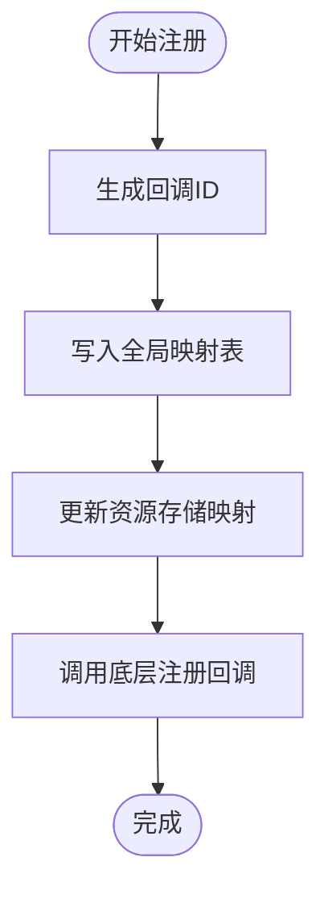

# 自定义识别

<cite>
**本文引用的文件列表**
- [custom_recognition.go](file://custom_recognition.go)
- [resource.go](file://resource.go)
- [pipeline.go](file://pipeline.go)
- [examples/custom-recognition/main.go](file://examples/custom-recognition/main.go)
- [examples/custom-recognition/resource/pipeline/pipeline.json](file://examples/custom-recognition/resource/pipeline/pipeline.json)
- [agent_server.go](file://agent_server.go)
- [examples/agent-server/main.go](file://examples/agent-server/main.go)
- [examples/agent-client/main.go](file://examples/agent-client/main.go)
- [internal/store/store.go](file://internal/store/store.go)
</cite>

## 目录
1. [简介](#简介)
2. [项目结构](#项目结构)
3. [核心组件](#核心组件)
4. [架构总览](#架构总览)
5. [组件详解](#组件详解)
6. [依赖关系分析](#依赖关系分析)
7. [性能考量](#性能考量)
8. [故障排查指南](#故障排查指南)
9. [结论](#结论)
10. [附录：从Go到JSON的完整集成示例](#附录从go到json的完整集成示例)

## 简介
本篇文档围绕 NodeCustomRecognitionParam 结构体及其在流水线中的使用展开，系统讲解如何通过 RegisterCustomRecognition 接口注册自定义识别算法，并与流水线系统集成；深入解析 Name 字段（即 CustomRecognition）在绑定自定义处理器时的作用机制；结合 Agent 架构，阐述外部进程如何实现并暴露自定义识别逻辑；最后提供从 Go 代码到 JSON 配置的完整集成示例，展示如何将业务特定的图像分析算法嵌入标准识别流程，并分析自定义识别在处理专有 UI 元素或复杂逻辑判断时的独特优势。

## 项目结构
- 自定义识别相关的核心代码位于：
  - custom_recognition.go：定义 CustomRecognition 接口、回调代理函数、参数与结果类型，以及内部注册/注销逻辑。
  - resource.go：资源层对自定义识别的注册入口，负责将 Go 层的处理器映射为底层回调。
  - pipeline.go：定义 NodeCustomRecognitionParam 结构体及识别节点的序列化/反序列化逻辑，支持 JSON 配置驱动。
  - examples/custom-recognition：演示如何在本地注册自定义识别并在流水线中使用。
  - agent_server.go 与 examples/agent-*：演示如何在 Agent 服务端注册自定义识别，并由客户端通过远程连接调用。
  - internal/store/store.go：资源侧存储自定义识别器的回调 ID 映射，用于管理生命周期。

图表来源
- [custom_recognition.go](file://custom_recognition.go#L1-L102)
- [resource.go](file://resource.go#L114-L133)
- [pipeline.go](file://pipeline.go#L1155-L1202)
- [examples/custom-recognition/main.go](file://examples/custom-recognition/main.go#L38-L41)
- [examples/agent-client/main.go](file://examples/agent-client/main.go#L39-L51)
- [agent_server.go](file://agent_server.go#L1-L20)
- [examples/agent-server/main.go](file://examples/agent-server/main.go#L10-L22)
- [internal/store/store.go](file://internal/store/store.go#L54-L65)

章节来源
- [custom_recognition.go](file://custom_recognition.go#L1-L102)
- [resource.go](file://resource.go#L114-L133)
- [pipeline.go](file://pipeline.go#L1155-L1202)
- [examples/custom-recognition/main.go](file://examples/custom-recognition/main.go#L38-L41)
- [examples/agent-client/main.go](file://examples/agent-client/main.go#L39-L51)
- [agent_server.go](file://agent_server.go#L1-L20)
- [examples/agent-server/main.go](file://examples/agent-server/main.go#L10-L22)
- [internal/store/store.go](file://internal/store/store.go#L54-L65)

## 核心组件
- NodeCustomRecognitionParam：描述“自定义识别”节点的参数，关键字段包括：
  - CustomRecognition：绑定的自定义识别器名称（即注册名），用于在运行时定位具体处理器。
  - CustomRecognitionParam：传递给回调的自定义参数（任意 JSON 可序列化数据）。
  - ROI/ROIOffset：可选的识别区域与偏移。
- CustomRecognition 接口：定义 Run(ctx, arg) -> (*CustomRecognitionResult, bool)，用于执行自定义识别逻辑。
- _MaaCustomRecognitionCallbackAgent：底层回调代理，负责从 C/C++ 回调中查找已注册的处理器并调用 Run。
- Resource.RegisterCustomRecognition：将 Go 层处理器注册为底层回调，建立名称到回调的映射。
- AgentServerRegisterCustomRecognition：在 Agent 服务端注册自定义识别，供远程客户端调用。

章节来源
- [pipeline.go](file://pipeline.go#L1155-L1202)
- [custom_recognition.go](file://custom_recognition.go#L38-L55)
- [custom_recognition.go](file://custom_recognition.go#L56-L102)
- [resource.go](file://resource.go#L114-L133)
- [agent_server.go](file://agent_server.go#L1-L20)

## 架构总览
下图展示了从 JSON 流水线配置到底层回调执行的全链路：

图表来源
- [examples/custom-recognition/resource/pipeline/pipeline.json](file://examples/custom-recognition/resource/pipeline/pipeline.json#L1-L12)
- [pipeline.go](file://pipeline.go#L1155-L1202)
- [resource.go](file://resource.go#L114-L133)
- [internal/store/store.go](file://internal/store/store.go#L54-L65)
- [custom_recognition.go](file://custom_recognition.go#L56-L102)

## 组件详解

### NodeCustomRecognitionParam 设计与使用
- 字段说明
  - CustomRecognition：必填，标识要调用的自定义识别器名称。该名称必须与 Resource.RegisterCustomRecognition 的第一个参数一致，否则无法绑定到处理器。
  - CustomRecognitionParam：可选，作为字符串传入回调，可在 Run 中按需解析为业务参数。
  - ROI/ROIOffset：可选，限定识别区域，减少计算量并提升鲁棒性。
- 参数生成与配置
  - 通过 RecCustom(name, opts...) 快速构建识别节点，配合 WithCustomRecognitionParam/WithCustomRecognitionROI 等选项设置参数。
  - 在 JSON 中以 recognition.type="Custom" 并提供 param.custom_recognition 指向处理器名称。
- 处理流程
  - JSON 反序列化时根据 type 分派到 NodeCustomRecognitionParam。
  - 运行时根据 CustomRecognition 查找已注册的处理器并执行 Run。

章节来源
- [pipeline.go](file://pipeline.go#L1155-L1202)

### RegisterCustomRecognition 接口与注册机制
- Resource.RegisterCustomRecognition(name, recognition) 将 Go 层处理器注册到底层，返回布尔值表示是否成功。
- 内部流程
  - 生成全局唯一回调ID，并将 recognition 存入全局映射表。
  - 更新资源存储中的 CustomRecognizersCallbackID[name] -> id，确保同一名称可被替换。
  - 调用底层注册函数，将 _MaaCustomRecognitionCallbackAgent 与 id 一并传入。
- 生命周期管理
  - UnregisterCustomRecognition 清理映射并调用底层卸载。
  - ClearCustomRecognition 批量清理并重置映射。

图表来源
- [resource.go](file://resource.go#L114-L133)
- [custom_recognition.go](file://custom_recognition.go#L17-L25)
- [internal/store/store.go](file://internal/store/store.go#L54-L65)

章节来源
- [resource.go](file://resource.go#L114-L133)
- [custom_recognition.go](file://custom_recognition.go#L17-L25)
- [internal/store/store.go](file://internal/store/store.go#L54-L65)

### Name 字段在绑定自定义处理器中的作用机制
- 在 NodeCustomRecognitionParam 中，CustomRecognition 字段即“处理器名称”，用于在运行时将 JSON 配置与已注册的处理器进行绑定。
- 绑定过程
  - Resource.RegisterCustomRecognition(name, recognition) 建立 name -> id 的映射。
  - 底层回调代理 _MaaCustomRecognitionCallbackAgent 通过 id 查找 recognition 并调用 Run。
- 一致性要求
  - JSON 中的 param.custom_recognition 必须与 RegisterCustomRecognition 的 name 完全一致，否则无法找到处理器。
  - 若同名重复注册，新处理器会覆盖旧映射。

章节来源
- [pipeline.go](file://pipeline.go#L1155-L1162)
- [resource.go](file://resource.go#L114-L133)
- [custom_recognition.go](file://custom_recognition.go#L56-L102)

### 与流水线系统的集成
- JSON 配置
  - 识别节点 type="Custom"，param.custom_recognition 指向处理器名称。
  - 可选地通过 WithCustomRecognitionParam 注入业务参数，或通过 WithCustomRecognitionROI 设置识别区域。
- 示例路径
  - JSON 示例：[examples/custom-recognition/resource/pipeline/pipeline.json](file://examples/custom-recognition/resource/pipeline/pipeline.json#L1-L12)
  - Go 注册与任务执行：[examples/custom-recognition/main.go](file://examples/custom-recognition/main.go#L38-L41)

章节来源
- [examples/custom-recognition/resource/pipeline/pipeline.json](file://examples/custom-recognition/resource/pipeline/pipeline.json#L1-L12)
- [examples/custom-recognition/main.go](file://examples/custom-recognition/main.go#L38-L41)
- [pipeline.go](file://pipeline.go#L1155-L1202)

### Agent 架构下的外部进程实现与暴露
- Agent 服务端
  - 使用 AgentServerRegisterCustomRecognition(name, recognition) 在服务端注册处理器。
  - 启动 AgentServerStartUp(identifier) 并保持服务运行。
- Agent 客户端
  - 创建 AgentClient 并 Connect，随后在任务中通过自定义动作/识别引用服务端已注册的处理器名称。
- 示例路径
  - 服务端注册与启动：[examples/agent-server/main.go](file://examples/agent-server/main.go#L10-L22)、[agent_server.go](file://agent_server.go#L1-L20)
  - 客户端调用：[examples/agent-client/main.go](file://examples/agent-client/main.go#L39-L51)

图表来源
- [examples/agent-client/main.go](file://examples/agent-client/main.go#L39-L51)
- [agent_server.go](file://agent_server.go#L1-L20)
- [examples/agent-server/main.go](file://examples/agent-server/main.go#L10-L22)

章节来源
- [agent_server.go](file://agent_server.go#L1-L20)
- [examples/agent-server/main.go](file://examples/agent-server/main.go#L10-L22)
- [examples/agent-client/main.go](file://examples/agent-client/main.go#L39-L51)

### 自定义识别在复杂逻辑判断中的优势
- 优势场景
  - 专有 UI 元素：当标准模板匹配/OCR/特征点等方法无法稳定识别时，可通过自定义识别注入领域知识。
  - 多步推理：在 Run 中组合多个识别步骤、缓存中间结果、动态调整 ROI 或参数。
  - 动态控制：利用 Context 提供的 OverridePipeline/OverrideNext/Clone 等能力，按当前上下文动态切换策略。
- 示例参考
  - 在示例中，处理器通过 Context.RunRecognition、OverridePipeline、Clone 上下文、PostClick 等操作，展示灵活的流程控制与交互能力。

章节来源
- [examples/custom-recognition/main.go](file://examples/custom-recognition/main.go#L46-L76)

## 依赖关系分析
- 组件耦合
  - Resource.RegisterCustomRecognition 依赖全局映射表与资源存储，保证名称到回调ID的一致性。
  - _MaaCustomRecognitionCallbackAgent 依赖全局映射表与资源存储，实现回调查找。
  - NodeCustomRecognitionParam 仅承载配置信息，不直接依赖运行时处理器。
- 外部依赖
  - 底层注册/卸载接口由 native 包桥接到 C/C++ 实现。
- 循环依赖
  - 无循环依赖：Resource 与 CallbackAgent 通过 store 间接通信，未形成直接循环。

图表来源
- [resource.go](file://resource.go#L114-L133)
- [internal/store/store.go](file://internal/store/store.go#L54-L65)
- [custom_recognition.go](file://custom_recognition.go#L56-L102)
- [pipeline.go](file://pipeline.go#L1155-L1202)
- [agent_server.go](file://agent_server.go#L1-L20)

章节来源
- [resource.go](file://resource.go#L114-L133)
- [custom_recognition.go](file://custom_recognition.go#L56-L102)
- [pipeline.go](file://pipeline.go#L1155-L1202)
- [internal/store/store.go](file://internal/store/store.go#L54-L65)
- [agent_server.go](file://agent_server.go#L1-L20)

## 性能考量
- 回调查找开销
  - 全局映射表采用读写锁保护，查找为 O(1)，注册/注销为 O(1)。
- 图像与缓冲区
  - 回调代理通过缓冲区封装图像与矩形，避免频繁内存拷贝。
- ROI 优化
  - 通过 ROI/ROIOffset 缩小识别范围，显著降低计算成本。
- 并发安全
  - 注册/注销使用原子递增 ID 与互斥锁，避免竞态条件。

章节来源
- [custom_recognition.go](file://custom_recognition.go#L1-L102)
- [resource.go](file://resource.go#L114-L133)
- [internal/store/store.go](file://internal/store/store.go#L1-L65)

## 故障排查指南
- 问题：识别节点无法命中处理器
  - 检查 JSON 中 param.custom_recognition 是否与 RegisterCustomRecognition 的 name 一致。
  - 检查资源是否已绑定且初始化成功。
- 问题：重复注册导致行为异常
  - 同名重复注册会覆盖旧映射，确认是否预期覆盖。
- 问题：Agent 场景下无法调用
  - 确认服务端已注册并启动，客户端已 Connect 并绑定资源。
- 问题：ROI 不生效
  - 检查 WithCustomRecognitionROI/WithCustomRecognitionROIOffset 的设置是否正确。

章节来源
- [examples/custom-recognition/resource/pipeline/pipeline.json](file://examples/custom-recognition/resource/pipeline/pipeline.json#L1-L12)
- [examples/custom-recognition/main.go](file://examples/custom-recognition/main.go#L38-L41)
- [examples/agent-client/main.go](file://examples/agent-client/main.go#L39-L51)
- [examples/agent-server/main.go](file://examples/agent-server/main.go#L10-L22)

## 结论
NodeCustomRecognitionParam 通过名称绑定机制，将 JSON 配置与 Go 层处理器解耦，既支持本地直连模式，也支持 Agent 远程模式。借助 Resource.RegisterCustomRecognition 与 _MaaCustomRecognitionCallbackAgent，开发者可以轻松扩展自定义识别能力，并在复杂 UI 与多步骤逻辑场景中发挥独特优势。合理使用 ROI、参数化与上下文控制，可进一步提升稳定性与性能。

## 附录：从Go到JSON的完整集成示例
- 步骤概览
  1) 在 Go 代码中实现 CustomRecognition 接口并注册处理器名称。
  2) 在 JSON 中定义识别节点，指定 type="Custom" 与 param.custom_recognition。
  3) 将资源加载到 Tasker 并绑定控制器，提交任务触发识别。
- 关键路径
  - 注册处理器与任务执行：[examples/custom-recognition/main.go](file://examples/custom-recognition/main.go#L38-L41)
  - JSON 配置示例：[examples/custom-recognition/resource/pipeline/pipeline.json](file://examples/custom-recognition/resource/pipeline/pipeline.json#L1-L12)
  - 参数与 ROI 配置：[pipeline.go](file://pipeline.go#L1155-L1202)
  - 底层注册与映射：[resource.go](file://resource.go#L114-L133)、[internal/store/store.go](file://internal/store/store.go#L54-L65)

章节来源
- [examples/custom-recognition/main.go](file://examples/custom-recognition/main.go#L38-L41)
- [examples/custom-recognition/resource/pipeline/pipeline.json](file://examples/custom-recognition/resource/pipeline/pipeline.json#L1-L12)
- [pipeline.go](file://pipeline.go#L1155-L1202)
- [resource.go](file://resource.go#L114-L133)
- [internal/store/store.go](file://internal/store/store.go#L54-L65)