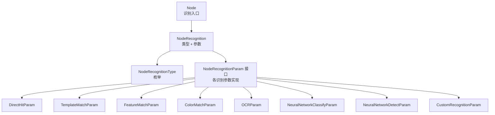
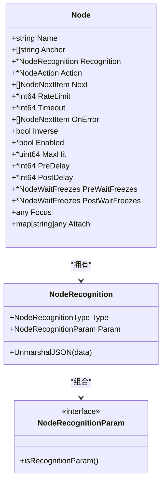
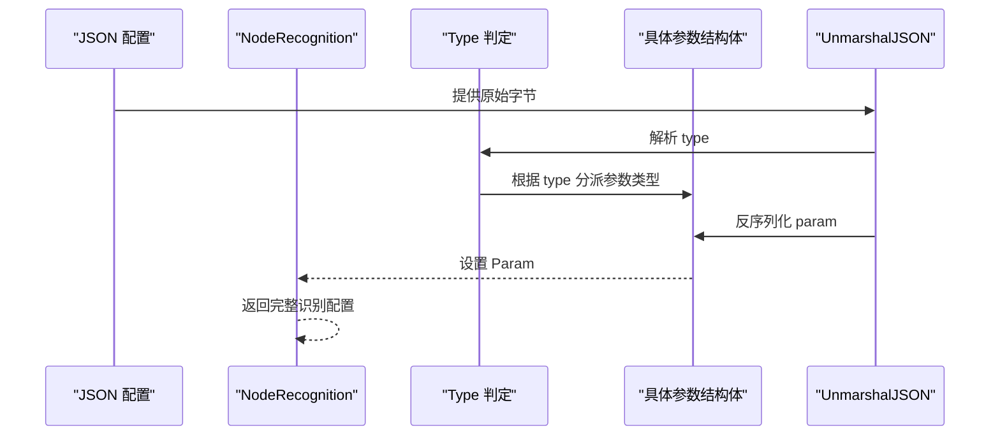
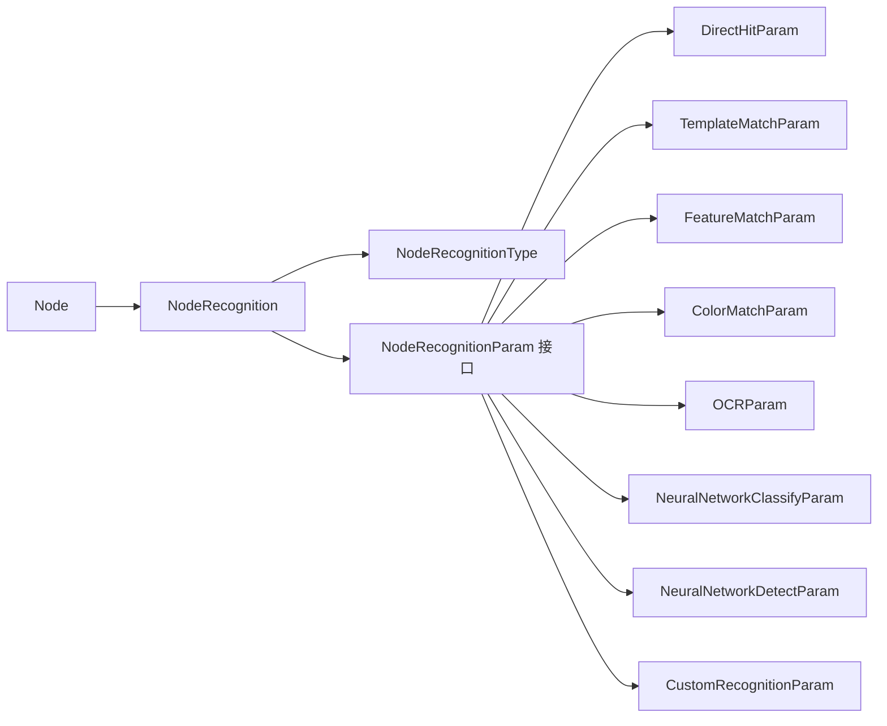

# 识别配置详解

<cite>
**本文引用的文件列表**
- [pipeline.go](file://pipeline.go)
- [context_test.go](file://context_test.go)
- [custom-recognition/resource/pipeline/pipeline.json](file://examples/custom-recognition/resource/pipeline/pipeline.json)
- [custom-recognition/main.go](file://examples/custom-recognition/main.go)
</cite>

## 目录
1. [简介](#简介)
2. [项目结构与定位](#项目结构与定位)
3. [核心组件：Node 结构与 Recognition 字段](#核心组件node-结构与-recognition-字段)
4. [架构总览](#架构总览)
5. [详细组件分析](#详细组件分析)
6. [依赖关系分析](#依赖关系分析)
7. [性能与参数调优建议](#性能与参数调优建议)
8. [故障排查指南](#故障排查指南)
9. [结论](#结论)
10. [附录：常见识别类型的配置要点](#附录常见识别类型的配置要点)

## 简介
本篇文档聚焦于 Node 结构体中的 Recognition 字段，系统性解析 NodeRecognition 类型与其 Param 参数的结构设计，覆盖 DirectHit、TemplateMatch、FeatureMatch、ColorMatch、OCR、NeuralNetworkClassify、NeuralNetworkDetect、Custom 等识别类型。文档将结合 NodeRecognitionType 常量定义与各识别类型的构造函数，说明如何通过代码配置不同识别算法；并深入解释 UnmarshalJSON 的动态解析机制，最后给出模板匹配、特征匹配、颜色匹配等参数的配置策略与最佳实践。

## 项目结构与定位
- Node 结构体位于 pipeline.go 中，其中 Recognition 字段用于声明该节点的识别策略。
- 各识别类型的参数结构体与构造函数也集中在此文件中，便于统一管理与扩展。
- 测试用例 context_test.go 展示了多种识别类型的 JSON 配置与运行时断言，是理解参数含义与默认值的重要参考。
- 示例工程 examples/custom-recognition 展示了 Custom 识别类型的使用方式与 JSON 配置。

图表来源
- [pipeline.go](file://pipeline.go#L36-L72)
- [pipeline.go](file://pipeline.go#L438-L490)
- [pipeline.go](file://pipeline.go#L492-L504)
- [pipeline.go](file://pipeline.go#L506-L516)
- [pipeline.go](file://pipeline.go#L517-L563)
- [pipeline.go](file://pipeline.go#L564-L754)
- [pipeline.go](file://pipeline.go#L755-L867)
- [pipeline.go](file://pipeline.go#L869-L977)
- [pipeline.go](file://pipeline.go#L979-L1150)
- [pipeline.go](file://pipeline.go#L1152-L1202)

章节来源
- [pipeline.go](file://pipeline.go#L36-L72)
- [pipeline.go](file://pipeline.go#L438-L504)

## 核心组件：Node 结构与 Recognition 字段
- Node 结构体包含 Recognition 指针字段，用于声明该节点的识别策略。
- NodeRecognition 定义了识别类型 Type 与参数 Param，二者共同决定识别行为。
- UnmarshalJSON 在反序列化时根据 Type 动态选择对应的参数结构体进行二次解析，从而实现“按类型注入”的灵活配置。

图表来源
- [pipeline.go](file://pipeline.go#L36-L72)
- [pipeline.go](file://pipeline.go#L438-L490)
- [pipeline.go](file://pipeline.go#L506-L516)

章节来源
- [pipeline.go](file://pipeline.go#L36-L72)
- [pipeline.go](file://pipeline.go#L438-L490)

## 架构总览
下图展示了识别配置在运行时的解析流程：JSON 中的 recognition 节点被反序列化为 NodeRecognition，随后根据 Type 选择对应参数结构体并完成参数解析。

图表来源
- [pipeline.go](file://pipeline.go#L446-L490)

章节来源
- [pipeline.go](file://pipeline.go#L446-L490)

## 详细组件分析

### 1) DirectHit 识别
- 用途：不进行实际识别，直接判定成功，适合占位或快速跳过。
- 参数：空结构体 NodeDirectHitParam。
- 构造：RecDirectHit() 返回已设置 Type 与 Param 的 NodeRecognition。

章节来源
- [pipeline.go](file://pipeline.go#L511-L516)
- [pipeline.go](file://pipeline.go#L517-L523)

### 2) TemplateMatch 模板匹配
- 适用场景：基于图像模板的精确或近似匹配，适用于图标、按钮、界面元素等固定形状目标。
- 关键参数：
  - ROI/ROIOffset：识别区域与偏移。
  - Template：模板图片路径数组。
  - Threshold：匹配阈值数组，默认 0.7。
  - OrderBy：结果排序方式（Horizontal/Vertical/Score/Random），默认 Horizontal。
  - Index：选择第几个匹配结果，默认 0。
  - Method：匹配算法（SQDIFF_NORMED/CCORR_NORMED/CCOEFF_NORMED），默认 CCOEFF_NORMED。
  - GreenMask：对透明区域启用绿色遮罩。
- 构造与选项：
  - RecTemplateMatch(template, opts...)：创建模板匹配识别。
  - WithTemplateMatchROI/ROIOffset/Threshold/OrderBy/Index/Method/GreenMask：配置参数。
- 最佳实践：
  - 使用 CCOEFF_NORMED 作为默认算法以获得更稳健的匹配。
  - 对透明背景的图标启用 GreenMask。
  - 合理设置 ROI 缩小搜索范围，提高性能。
  - 多阈值策略可提升鲁棒性，但需平衡误检率。

章节来源
- [pipeline.go](file://pipeline.go#L544-L563)
- [pipeline.go](file://pipeline.go#L566-L617)
- [pipeline.go](file://pipeline.go#L618-L632)
- [context_test.go](file://context_test.go#L451-L475)

### 3) FeatureMatch 特征匹配
- 适用场景：需要抗旋转、缩放、透视变化的通用目标识别，如复杂图标、文字块等。
- 关键参数：
  - ROI/ROIOffset：识别区域与偏移。
  - Template：模板图片路径数组。
  - Count：最小匹配点数阈值，默认 4。
  - OrderBy：结果排序方式（Horizontal/Vertical/Score/Area/Random），默认 Horizontal。
  - Index：选择第几个匹配结果，默认 0。
  - GreenMask：对透明区域启用绿色遮罩。
  - Detector：特征检测器（SIFT/KAZE/AKAZE/BRISK/ORB），默认 SIFT。
  - Ratio：KNN 匹配距离比阈值，默认 0.6。
- 构造与选项：
  - RecFeatureMatch(template, opts...)：创建特征匹配识别。
  - WithFeatureMatchROI/ROIOffset/Count/OrderBy/Index/GreenMask/Detector/Ratio：配置参数。
- 最佳实践：
  - 默认使用 SIFT 获取高精度；若追求速度可用 ORB/BRISK。
  - Ratio 过小易漏检，过大易误检，需结合样本数据校准。
  - ROI 尽量包含关键特征点，避免模糊或重复纹理。

章节来源
- [pipeline.go](file://pipeline.go#L656-L677)
- [pipeline.go](file://pipeline.go#L680-L738)
- [pipeline.go](file://pipeline.go#L739-L754)
- [context_test.go](file://context_test.go#L477-L509)

### 4) ColorMatch 颜色匹配
- 适用场景：基于颜色范围的区域匹配，适合纯色按钮、边框、特定像素区域等。
- 关键参数：
  - ROI/ROIOffset：识别区域与偏移。
  - Method：颜色空间（RGB/HSV/GRAY），默认 RGB。
  - Lower/Upper：颜色下界与上界，维度需与颜色通道一致。
  - Count：最小像素计数阈值，默认 1。
  - OrderBy：结果排序方式（Horizontal/Vertical/Score/Area/Random），默认 Horizontal。
  - Index：选择第几个匹配结果，默认 0。
  - Connected：是否进行连通域分析，默认 false。
- 构造与选项：
  - RecColorMatch(lower, upper, opts...)：创建颜色匹配识别。
  - WithColorMatchROI/ROIOffset/Method/Count/OrderBy/Index/Connected：配置参数。
- 最佳实践：
  - RGB 适合明亮、无阴影场景；HSV 更稳定，适合光照变化。
  - Lower/Upper 应覆盖目标颜色的容差范围，避免误判。
  - Connected 打开后能过滤分散噪点，但会增加计算成本。

章节来源
- [pipeline.go](file://pipeline.go#L756-L775)
- [pipeline.go](file://pipeline.go#L776-L797)
- [pipeline.go](file://pipeline.go#L800-L851)
- [pipeline.go](file://pipeline.go#L852-L867)
- [context_test.go](file://context_test.go#L511-L542)

### 5) OCR 文字识别
- 适用场景：屏幕文字识别与匹配，支持正则表达式与文本替换。
- 关键参数：
  - ROI/ROIOffset：识别区域与偏移。
  - Expected：期望文本数组，支持正则，默认必填。
  - Threshold：模型置信度阈值，默认 0.3。
  - Replace：文本替换规则，用于纠正 OCR 错误。
  - OrderBy：结果排序方式（Horizontal/Vertical/Area/Length/Random），默认 Horizontal。
  - Index：选择第几个匹配结果，默认 0。
  - OnlyRec：仅识别模式（无需检测，需精准 ROI），默认 false。
  - Model：模型目录名（相对 model/ocr）。
- 构造与选项：
  - RecOCR(expected, opts...)：创建 OCR 识别。
  - WithOCRROI/ROIOffset/Threshold/Replace/OrderBy/Index/OnlyRec/Model：配置参数。
- 最佳实践：
  - 优先使用更稳定的模型与更高的阈值，降低误检。
  - Replace 规则应覆盖常见 OCR 错误字符映射。
  - OnlyRec 适合已知固定位置与字体的文本，能显著提升速度。

章节来源
- [pipeline.go](file://pipeline.go#L869-L878)
- [pipeline.go](file://pipeline.go#L880-L901)
- [pipeline.go](file://pipeline.go#L904-L962)
- [pipeline.go](file://pipeline.go#L963-L977)
- [context_test.go](file://context_test.go#L544-L576)

### 6) NeuralNetworkClassify 神经网络分类
- 适用场景：对固定区域内的图像进行类别分类（如按钮状态、图标类型）。
- 关键参数：
  - ROI/ROIOffset：识别区域与偏移。
  - Labels：类别名称（调试日志），未提供时填充“Unknown”。
  - Model：模型路径（相对 model/classify），ONNX 模型。
  - Expected：期望类别索引数组（必填）。
  - OrderBy：结果排序方式（Horizontal/Vertical/Score/Random），默认 Horizontal。
  - Index：选择第几个匹配结果，默认 0。
- 构造与选项：
  - RecNeuralNetworkClassify(model, expected, opts...)：创建分类识别。
  - WithNeuralClassifyROI/ROIOffset/Labels/OrderBy/Index：配置参数。
- 最佳实践：
  - Expected 与 Labels 应与模型元数据一致，确保输出语义清晰。
  - 训练集与测试集分布要贴近真实环境，避免过拟合。

章节来源
- [pipeline.go](file://pipeline.go#L979-L1006)
- [pipeline.go](file://pipeline.go#L1009-L1047)
- [pipeline.go](file://pipeline.go#L1048-L1063)
- [context_test.go](file://context_test.go#L578-L606)

### 7) NeuralNetworkDetect 神经网络检测
- 适用场景：对任意位置的目标进行检测与分类（如 YOLO 系列）。
- 关键参数：
  - ROI/ROIOffset：识别区域与偏移。
  - Labels：类别名称（未提供时从模型元数据读取）。
  - Model：模型路径（相对 model/detect），支持 YOLOv8/YOLOv11 ONNX。
  - Expected：期望类别索引数组（必填）。
  - OrderBy：结果排序方式（Horizontal/Vertical/Score/Area/Random），默认 Horizontal。
  - Index：选择第几个匹配结果，默认 0。
- 构造与选项：
  - RecNeuralNetworkDetect(model, expected, opts...)：创建检测识别。
  - WithNeuralDetectROI/ROIOffset/Labels/OrderBy/Index：配置参数。
- 最佳实践：
  - Expected 与模型类别顺序保持一致，避免误判。
  - ROI 可设为全屏或局部区域，平衡精度与性能。

章节来源
- [pipeline.go](file://pipeline.go#L1065-L1093)
- [pipeline.go](file://pipeline.go#L1096-L1134)
- [pipeline.go](file://pipeline.go#L1135-L1150)
- [context_test.go](file://context_test.go#L608-L638)

### 8) Custom 自定义识别
- 适用场景：用户自定义识别逻辑，通过注册回调实现复杂业务。
- 关键参数：
  - ROI/ROIOffset：识别区域与偏移。
  - CustomRecognition：注册的识别器名称。
  - CustomRecognitionParam：传递给回调的自定义参数。
- 构造与选项：
  - RecCustom(name, opts...)：创建自定义识别。
  - WithCustomRecognitionROI/ROIOffset/CustomRecognitionParam：配置参数。
- 示例参考：
  - JSON 配置示例中，Startup 节点使用 "Custom" 类型并指定自定义识别器名称。
  - Go 示例展示了在回调中如何运行其他任务与控制流。

章节来源
- [pipeline.go](file://pipeline.go#L1152-L1202)
- [pipeline.go](file://pipeline.go#L1189-L1202)
- [custom-recognition/resource/pipeline/pipeline.json](file://examples/custom-recognition/resource/pipeline/pipeline.json#L1-L12)
- [custom-recognition/main.go](file://examples/custom-recognition/main.go#L1-L77)

## 依赖关系分析
- Node 依赖 NodeRecognition；NodeRecognition 组合 NodeRecognitionParam 接口。
- NodeRecognitionParam 由多种具体参数结构体实现，形成多态参数体系。
- UnmarshalJSON 通过 NodeRecognitionType 实现“按类型分派”，避免硬编码分支膨胀。
- 各识别类型的构造函数提供函数式选项，便于链式配置与默认值覆盖。

图表来源
- [pipeline.go](file://pipeline.go#L438-L504)
- [pipeline.go](file://pipeline.go#L506-L516)
- [pipeline.go](file://pipeline.go#L517-L563)
- [pipeline.go](file://pipeline.go#L564-L754)
- [pipeline.go](file://pipeline.go#L755-L867)
- [pipeline.go](file://pipeline.go#L869-L977)
- [pipeline.go](file://pipeline.go#L979-L1150)
- [pipeline.go](file://pipeline.go#L1152-L1202)

章节来源
- [pipeline.go](file://pipeline.go#L438-L504)
- [pipeline.go](file://pipeline.go#L506-L516)

## 性能与参数调优建议
- 模板匹配（TemplateMatch）
  - 优先使用 CCOEFF_NORMED；对透明背景启用 GreenMask。
  - 合理设置 ROI，减少搜索面积；多阈值策略需权衡误检率。
- 特征匹配（FeatureMatch）
  - 默认 SIFT；对实时性要求高的场景可考虑 ORB/BRISK。
  - Ratio 与 Count 需结合样本数据校准；ROI 要包含足够特征点。
- 颜色匹配（ColorMatch）
  - 光照变化大时优先 HSV；Lower/Upper 要覆盖容差范围。
  - Connected 可过滤噪点，但会增加计算；按需开启。
- OCR
  - 适当提高阈值与模型置信度；Replace 规则覆盖常见错误字符。
  - OnlyRec 适合固定位置文本，能显著提速。
- 神经网络分类/检测（NeuralNetworkClassify/Detect）
  - Expected 与 Labels 必须与模型一致；ROI 设定影响精度与速度。
  - 模型选择与训练数据质量直接影响识别效果。

[本节为通用建议，不直接分析具体文件]

## 故障排查指南
- UnmarshalJSON 报错“不支持的识别类型”
  - 检查 JSON 中 type 是否拼写正确且在 NodeRecognitionType 枚举内。
  - 若为自定义类型，请确认已注册并在运行时可用。
- 参数缺失或默认值不符合预期
  - 检查各识别类型的默认值与可选参数；必要时显式传入。
  - 对于 OCR、NN 分类/检测，Expected/Model 等必填项必须提供。
- ROI 设置不当导致误检或漏检
  - 缩小 ROI 或调整 ROIOffset，确保只包含目标区域。
  - 对颜色匹配，Lower/Upper 要覆盖目标颜色范围。
- 性能问题
  - 减少 ROI 面积、降低阈值或关闭不必要的排序/连通域分析。
  - 对特征匹配，优先使用更快的检测器（如 ORB）或降低 Count。

章节来源
- [pipeline.go](file://pipeline.go#L446-L490)
- [pipeline.go](file://pipeline.go#L492-L504)
- [context_test.go](file://context_test.go#L451-L542)
- [context_test.go](file://context_test.go#L544-L638)

## 结论
通过 NodeRecognition 与 NodeRecognitionParam 的接口化设计，框架实现了“按类型注入”的灵活识别配置。配合 UnmarshalJSON 的动态解析机制，开发者既可通过 JSON 快速声明识别策略，也可通过构造函数进行细粒度编程式配置。针对不同识别类型，合理设置参数与 ROI 是提升准确率与性能的关键。对于复杂业务，Custom 识别提供了强大的扩展能力。

[本节为总结，不直接分析具体文件]

## 附录：常见识别类型的配置要点
- DirectHit：无需参数，适合占位或快速跳过。
- TemplateMatch：设置 Template、Method、Threshold、OrderBy、Index、GreenMask；建议启用 ROI。
- FeatureMatch：设置 Template、Detector、Ratio、Count、OrderBy、Index；建议启用 ROI。
- ColorMatch：设置 Method、Lower、Upper、Count、Connected、OrderBy、Index；建议启用 ROI。
- OCR：设置 Expected、Threshold、Replace、OrderBy、Index、OnlyRec、Model；建议启用 ROI。
- NeuralNetworkClassify：设置 Model、Expected、Labels、OrderBy、Index；建议启用 ROI。
- NeuralNetworkDetect：设置 Model、Expected、Labels、OrderBy、Index；建议启用 ROI。
- Custom：设置 CustomRecognition、CustomRecognitionParam；需先注册识别器。

章节来源
- [pipeline.go](file://pipeline.go#L517-L523)
- [pipeline.go](file://pipeline.go#L618-L632)
- [pipeline.go](file://pipeline.go#L739-L754)
- [pipeline.go](file://pipeline.go#L852-L867)
- [pipeline.go](file://pipeline.go#L963-L977)
- [pipeline.go](file://pipeline.go#L1048-L1063)
- [pipeline.go](file://pipeline.go#L1135-L1150)
- [pipeline.go](file://pipeline.go#L1189-L1202)
- [custom-recognition/resource/pipeline/pipeline.json](file://examples/custom-recognition/resource/pipeline/pipeline.json#L1-L12)