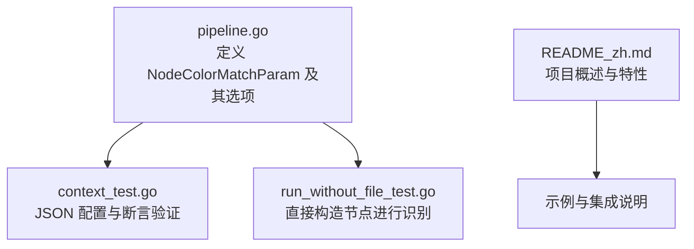
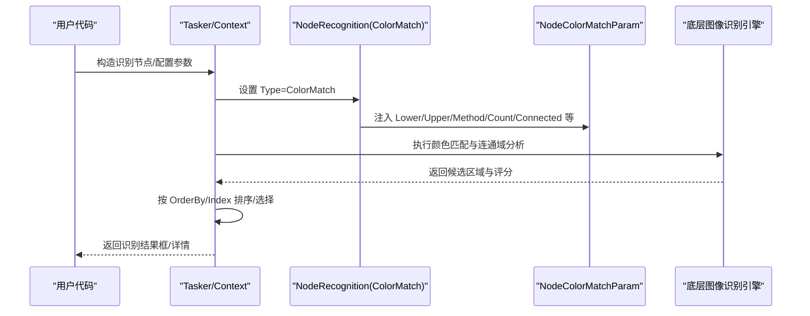
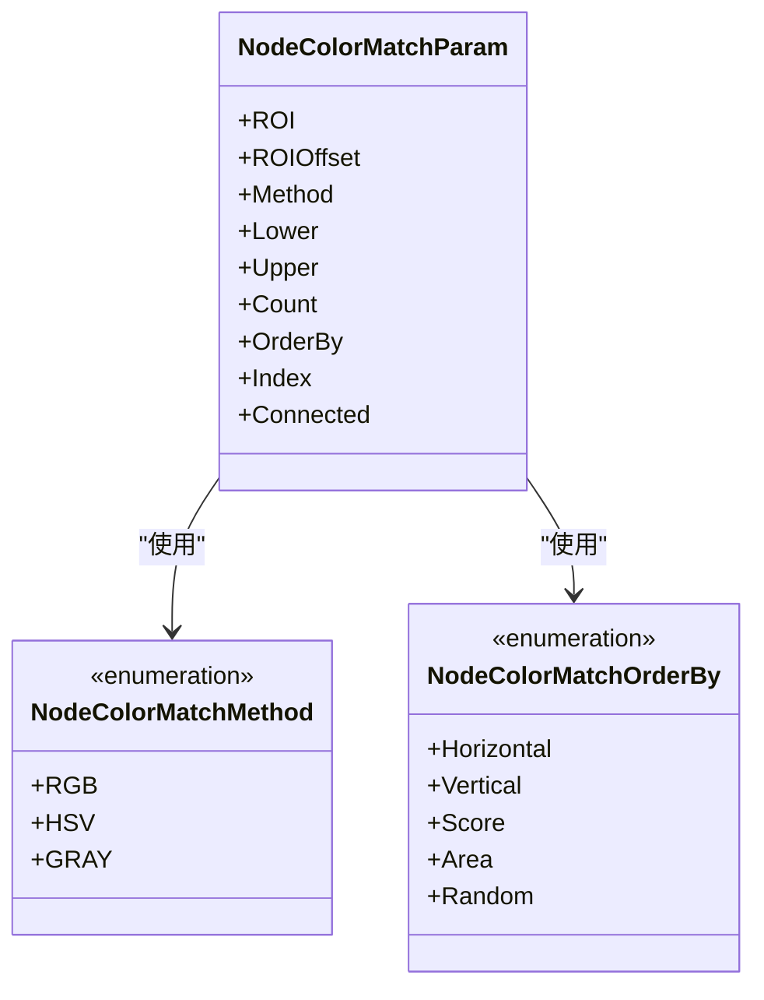
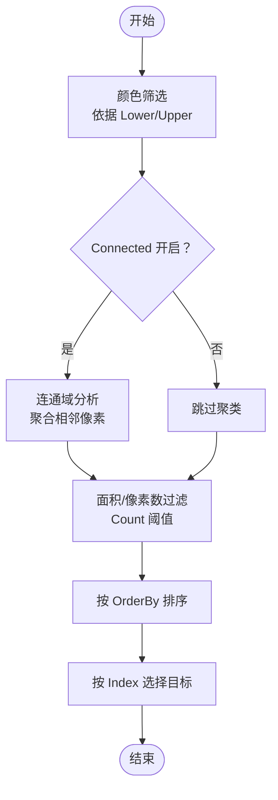
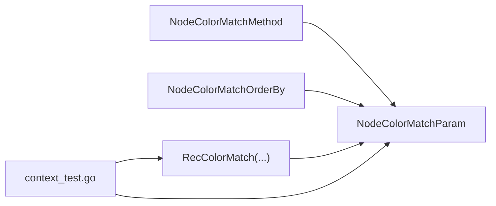

# 颜色匹配识别

<cite>
**本文引用的文件列表**
- [pipeline.go](file://pipeline.go)
- [context_test.go](file://context_test.go)
- [run_without_file_test.go](file://test/run_without_file_test.go)
- [README_zh.md](file://README_zh.md)
</cite>

## 目录
1. [简介](#简介)
2. [项目结构](#项目结构)
3. [核心组件](#核心组件)
4. [架构总览](#架构总览)
5. [详细组件分析](#详细组件分析)
6. [依赖关系分析](#依赖关系分析)
7. [性能与鲁棒性考量](#性能与鲁棒性考量)
8. [故障排查指南](#故障排查指南)
9. [结论](#结论)
10. [附录](#附录)

## 简介
本文件系统化讲解 NodeColorMatchParam 结构体的配置方法与应用场景，重点覆盖：
- RGB、HSV、GRAY 三种颜色空间（Method）的技术特点与适用情况
- Lower 和 Upper 边界数组的配置规则，以及如何通过多组颜色范围实现复杂颜色模式识别
- Count、Connected 等参数在过滤噪点与识别连通区域中的作用
- 不同光照条件下的颜色空间与阈值选择策略
- Connected 连通域分析在识别不规则色块时的优势

## 项目结构
与颜色匹配识别直接相关的代码集中在 pipeline.go 中，包含 NodeColorMatchParam 结构体、颜色空间枚举、排序与索引选项，以及构建识别节点的工厂函数。测试用例 context_test.go 展示了 JSON 配置与运行时参数校验；run_without_file_test.go 展示了在无资源文件情况下直接构造节点进行识别的用法。

**图表来源**
- [pipeline.go](file://pipeline.go#L756-L880)
- [context_test.go](file://context_test.go#L511-L542)
- [run_without_file_test.go](file://test/run_without_file_test.go#L52-L71)
- [README_zh.md](file://README_zh.md#L27-L40)

**章节来源**
- [pipeline.go](file://pipeline.go#L756-L880)
- [context_test.go](file://context_test.go#L511-L542)
- [run_without_file_test.go](file://test/run_without_file_test.go#L52-L71)
- [README_zh.md](file://README_zh.md#L27-L40)

## 核心组件
- NodeColorMatchParam：颜色匹配识别的核心参数载体，包含 ROI、颜色空间 Method、Lower/Upper 多组边界、Count 最小像素数、结果排序 OrderBy、Index 选择、Connected 连通域分析开关等。
- NodeColorMatchMethod：颜色空间枚举，支持 RGB（默认）、HSV、GRAY。
- NodeColorMatchOrderBy：结果排序策略，支持按横坐标、纵坐标、分数、区域面积、随机等排序。
- RecColorMatch 工厂函数：以 Lower/Upper 多组边界创建颜色匹配识别节点，支持 WithColorMatch* 选项函数进行参数配置。

关键字段与含义（来自结构体注释与类型定义）：
- Method：颜色空间选择（RGB 默认，HSV，GRAY）
- Lower/Upper：二维数组，每组边界对应 Method 的通道数；例如 RGB 为 3 通道，GRAY 为 1 通道
- Count：最小像素计数阈值，用于过滤噪声与小干扰区域
- Connected：启用连通域分析，将离散的像素聚类为连通区域，提升对不规则色块的识别稳定性
- OrderBy/Index：控制结果排序与选择，便于在多区域匹配时定位目标

**章节来源**
- [pipeline.go](file://pipeline.go#L756-L880)

## 架构总览
颜色匹配识别在框架中的位置与调用链如下：

**图表来源**
- [pipeline.go](file://pipeline.go#L756-L880)
- [context_test.go](file://context_test.go#L511-L542)
- [run_without_file_test.go](file://test/run_without_file_test.go#L52-L71)

## 详细组件分析

### NodeColorMatchParam 结构体与配置要点
- 颜色空间（Method）
  - RGB：3 通道，对光照变化敏感，适合高对比度、色彩明确的场景
  - HSV：3 通道，分离明度（V），对光照变化相对稳健，适合明暗变化大但颜色稳定的场景
  - GRAY：1 通道，最简单，适合灰度特征或已转换为灰度的场景
- Lower/Upper 边界
  - 每个元素为一组边界，长度需与 Method 通道数一致
  - 可提供多组边界，实现“或”的颜色范围组合，从而覆盖复杂颜色模式
- Count
  - 最小像素数阈值，过滤掉过小的噪声区域，提高鲁棒性
- Connected
  - 启用后对满足阈值的颜色区域进行连通域分析，将相邻像素聚类为整体区域，有利于识别不规则色块
- OrderBy/Index
  - 对多个候选区域进行排序与选择，如按面积、分数、坐标等

**图表来源**
- [pipeline.go](file://pipeline.go#L756-L880)

**章节来源**
- [pipeline.go](file://pipeline.go#L756-L880)

### Lower/Upper 边界配置规则与多组范围
- 通道数与边界长度
  - RGB：每组边界长度为 3
  - HSV：每组边界长度为 3
  - GRAY：每组边界长度为 1
- 多组范围
  - Lower/Upper 可传入多组边界，表示“任一组满足即命中”，常用于覆盖同一对象在不同光照或材质下的颜色差异
- 与 Connected 协同
  - 先通过 Lower/Upper 粗筛颜色区域，再通过 Connected 聚合连通域，最后用 Count 过滤小区域，能有效提升识别稳定性

**章节来源**
- [pipeline.go](file://pipeline.go#L756-L880)

### Count 与 Connected 的过滤与聚类机制
- Count
  - 作为像素计数阈值，过滤掉面积过小的噪声区域，避免误检
- Connected
  - 将满足阈值的颜色像素按邻接关系聚类为连通区域，减少碎片化影响
  - 对不规则色块尤为有效，可将分散的小色块合并为完整目标
- 典型流程
  - 颜色筛选 → 连通域聚类 → 面积/像素数过滤 → 排序与选择

**图表来源**
- [pipeline.go](file://pipeline.go#L756-L880)

**章节来源**
- [pipeline.go](file://pipeline.go#L756-L880)

### 实际案例与配置示例
- JSON 配置示例（测试用例）
  - 使用 RGB 颜色空间，设置 Lower/Upper 为单组边界，Count 为 100，OrderBy 为 Score，Connected 为 true
  - 该配置强调对大面积、高置信度区域的识别，并通过连通域提升鲁棒性
- 无资源文件直接识别示例
  - 通过 RecColorMatch 直接创建颜色匹配节点，传入 Lower/Upper 多组边界，然后在上下文中运行识别

参考路径（不展示具体代码内容）：
- [JSON 配置与断言](file://context_test.go#L511-L542)
- [直接构造节点识别](file://test/run_without_file_test.go#L52-L71)

**章节来源**
- [context_test.go](file://context_test.go#L511-L542)
- [run_without_file_test.go](file://test/run_without_file_test.go#L52-L71)

### 不同光照条件下的颜色空间与阈值选择
- 明亮且稳定光照
  - RGB：色彩丰富，对比度高时效果好；若存在轻微阴影，可适当放宽 Upper/Lower 边界
- 明暗变化大
  - HSV：分离 V（明度），对亮度变化更稳健；优先在 H（色调）上精确定位颜色，在 S（饱和度）上设置一定范围
- 弱光或灰度场景
  - GRAY：直接使用灰度通道；Lower/Upper 更偏向亮度范围
- 多组范围策略
  - 在不同光照下分别设定一组 Lower/Upper，通过多组范围覆盖复杂颜色模式

[本节为通用实践建议，不直接分析具体文件]

### Connected 连通域分析在不规则色块识别中的优势
- 将分散的小色块聚合成完整区域，降低误检概率
- 与 Count 配合，过滤掉细小噪声，保留有意义的目标区域
- 与 OrderBy（如 Area）结合，优先选择面积更大的目标，提升稳定性

[本节为通用实践建议，不直接分析具体文件]

## 依赖关系分析
- NodeColorMatchParam 依赖于颜色空间枚举与排序枚举
- RecColorMatch 工厂函数负责组装识别节点，内部通过 WithColorMatch* 选项函数注入参数
- 测试用例通过 JSON 配置与断言验证参数解析与行为一致性

**图表来源**
- [pipeline.go](file://pipeline.go#L756-L880)
- [context_test.go](file://context_test.go#L511-L542)

**章节来源**
- [pipeline.go](file://pipeline.go#L756-L880)
- [context_test.go](file://context_test.go#L511-L542)

## 性能与鲁棒性考量
- 颜色空间选择
  - RGB：计算量较小，但易受光照影响
  - HSV：对光照变化更稳健，但可能引入色调漂移
  - GRAY：最轻量，适合灰度特征
- Lower/Upper 范围
  - 过窄会漏检，过宽会引入噪声；建议先粗后细，逐步收紧
- Count 与 Connected
  - Count 建议结合图像分辨率与目标大小经验设定；Connected 有助于减少碎片化带来的误检
- OrderBy/Index
  - 在多候选时，优先使用 Area 或 Score，再配合 Index 精确选择

[本节提供一般性指导，不直接分析具体文件]

## 故障排查指南
- 颜色空间与边界长度不匹配
  - 现象：参数解析失败或识别结果异常
  - 排查：确认 Method 通道数与 Lower/Upper 每组长度一致
- Count 过小导致误检
  - 现象：出现大量小面积伪阳性
  - 排查：适当提高 Count，或开启 Connected 并结合 Area 排序
- Connected 未开启导致碎片化
  - 现象：目标被拆分为多个小区域
  - 排查：开启 Connected，并结合 Count 过滤
- 多组范围未覆盖全场景
  - 现象：不同光照下识别不稳定
  - 排查：增加多组 Lower/Upper，覆盖典型光照区间

**章节来源**
- [pipeline.go](file://pipeline.go#L756-L880)
- [context_test.go](file://context_test.go#L511-L542)

## 结论
NodeColorMatchParam 提供了灵活而强大的颜色匹配能力。通过合理选择颜色空间、配置多组边界、设置 Count 与 Connected，并结合排序与索引策略，可在不同光照与复杂背景下实现稳定可靠的识别。对于不规则色块，Connected 的连通域分析尤为关键，能显著提升鲁棒性与准确性。

[本节为总结性内容，不直接分析具体文件]

## 附录
- 相关文件与路径
  - [pipeline.go](file://pipeline.go#L756-L880)
  - [context_test.go](file://context_test.go#L511-L542)
  - [run_without_file_test.go](file://test/run_without_file_test.go#L52-L71)
  - [README_zh.md](file://README_zh.md#L27-L40)