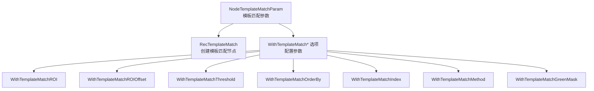
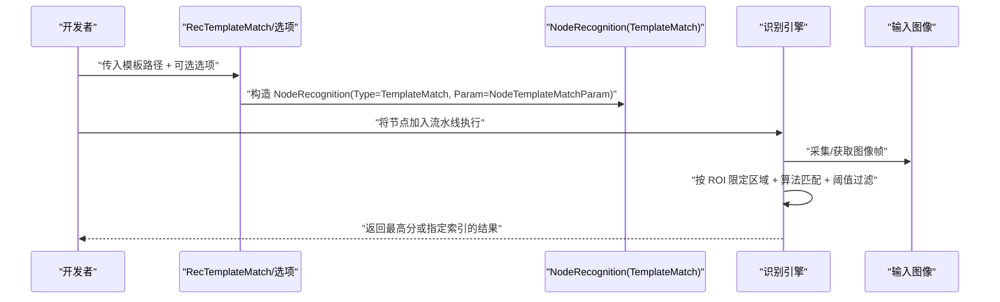
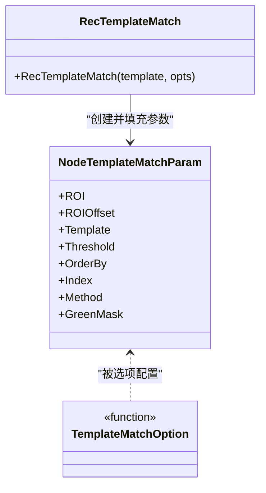
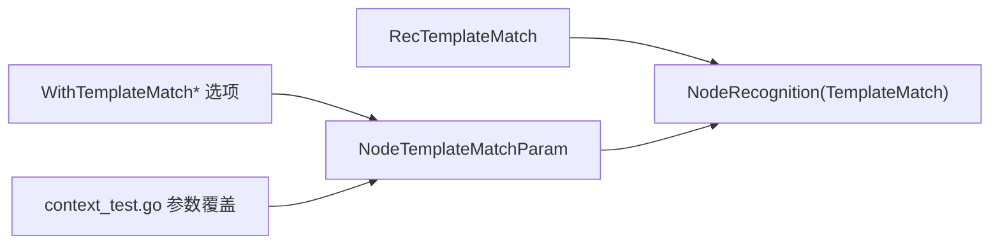

# 模板匹配

<cite>
**本文引用的文件**
- [pipeline.go](file://pipeline.go)
- [context_test.go](file://context_test.go)
- [README_zh.md](file://README_zh.md)
- [examples/custom-recognition/main.go](file://examples/custom-recognition/main.go)
- [examples/custom-recognition/resource/pipeline/pipeline.json](file://examples/custom-recognition/resource/pipeline/pipeline.json)
</cite>

## 目录
1. [简介](#简介)
2. [项目结构](#项目结构)
3. [核心组件](#核心组件)
4. [架构总览](#架构总览)
5. [详细组件分析](#详细组件分析)
6. [依赖关系分析](#依赖关系分析)
7. [性能与算法特性](#性能与算法特性)
8. [模板图像准备与最佳实践](#模板图像准备与最佳实践)
9. [在不同分辨率设备上的适配策略](#在不同分辨率设备上的适配策略)
10. [故障排查指南](#故障排查指南)
11. [结论](#结论)

## 简介
本篇文档围绕模板匹配识别能力展开，重点解析 NodeTemplateMatchParam 结构体及其全部配置参数，并结合 Go 绑定中的 RecTemplateMatch 与一系列 WithTemplateMatch* 选项，给出高效配置与调用流程。同时对模板匹配算法（尤其是 CCOEFF_NORMED）进行原理与性能说明，提供模板图像准备、准确率优化与多分辨率适配的实操建议。

## 项目结构
模板匹配相关的核心实现位于 pipeline.go 中，包含：
- NodeTemplateMatchParam 结构体及字段说明
- NodeTemplateMatchOrderBy 与 NodeTemplateMatchMethod 枚举
- RecTemplateMatch 工厂函数与 WithTemplateMatch* 选项
- 测试用例对参数的覆盖验证

图表来源
- [pipeline.go](file://pipeline.go#L544-L632)

章节来源
- [pipeline.go](file://pipeline.go#L525-L632)

## 核心组件
- NodeTemplateMatchParam：模板匹配识别的参数载体，包含 ROI、阈值、排序方式、索引、算法、绿幕遮罩等关键字段。
- NodeTemplateMatchOrderBy：结果排序策略枚举，支持按水平、垂直、分数、随机排序。
- NodeTemplateMatchMethod：模板匹配算法枚举，包含 SQDIFF_NORMED、CCORR_NORMED、CCOEFF_NORMED。
- RecTemplateMatch：基于模板图片列表创建模板匹配识别节点的工厂函数。
- WithTemplateMatch*：一组函数式选项，用于逐步配置 NodeTemplateMatchParam。

章节来源
- [pipeline.go](file://pipeline.go#L525-L632)

## 架构总览
模板匹配在流水线中的典型调用链路如下：

图表来源
- [pipeline.go](file://pipeline.go#L618-L632)

## 详细组件分析

### NodeTemplateMatchParam 字段详解
- ROI：识别区域（Target），限定模板匹配的搜索范围，有助于提升性能与准确性。
- ROIOffset：对 ROI 的偏移量（Rect），可微调搜索框位置。
- Template：模板图片路径数组（必填），支持多模板以增强鲁棒性。
- Threshold：匹配阈值数组（0-1.0），默认 0.7；可针对不同模板设置差异化阈值。
- OrderBy：结果排序方式，默认 Horizontal；可选 Vertical、Score、Random。
- Index：从多个匹配结果中选择第几个（从 0 开始），用于固定目标或优先级控制。
- Method：匹配算法，默认 CCOEFF_NORMED；可选 SQDIFF_NORMED、CCORR_NORMED。
- GreenMask：启用绿幕遮罩，对透明区域进行绿色掩码处理，常用于去除背景干扰。

章节来源
- [pipeline.go](file://pipeline.go#L544-L562)

### 排序与算法枚举
- OrderBy 枚举项：
  - Horizontal：按 x 坐标排序
  - Vertical：按 y 坐标排序
  - Score：按匹配分数排序
  - Random：随机排序
- Method 枚举项：
  - SQDIFF_NORMED：归一化平方差
  - CCORR_NORMED：归一化交叉相关
  - CCOEFF_NORMED：归一化相关系数（默认，通常更准确）

章节来源
- [pipeline.go](file://pipeline.go#L525-L542)

### 工厂函数与选项模式
- RecTemplateMatch(template []string, opts ...TemplateMatchOption)：创建模板匹配识别节点。
- WithTemplateMatchROI/ROIOffset/Threshold/OrderBy/Index/Method/GreenMask：逐项配置 NodeTemplateMatchParam。

图表来源
- [pipeline.go](file://pipeline.go#L544-L632)

章节来源
- [pipeline.go](file://pipeline.go#L566-L632)

### 使用示例与配置要点
- 通过 RecTemplateMatch 与 WithTemplateMatch* 选项组合，即可快速构建模板匹配识别节点。
- 测试用例展示了完整参数覆盖：模板、阈值、排序、索引、算法、绿幕遮罩等。
- 在自定义识别中，可通过上下文接口动态覆盖流水线参数，实现灵活的 ROI 调整与识别行为切换。

章节来源
- [context_test.go](file://context_test.go#L451-L475)
- [examples/custom-recognition/main.go](file://examples/custom-recognition/main.go#L44-L77)
- [examples/custom-recognition/resource/pipeline/pipeline.json](file://examples/custom-recognition/resource/pipeline/pipeline.json#L1-L12)

## 依赖关系分析
- NodeTemplateMatchParam 作为识别参数，被 RecTemplateMatch 构造为 NodeRecognition 的 Param 字段。
- WithTemplateMatch* 选项通过闭包对 NodeTemplateMatchParam 进行增量配置。
- 测试用例验证了参数映射与默认值行为，确保配置正确传递至识别引擎。

图表来源
- [pipeline.go](file://pipeline.go#L566-L632)
- [context_test.go](file://context_test.go#L451-L475)

章节来源
- [pipeline.go](file://pipeline.go#L566-L632)
- [context_test.go](file://context_test.go#L451-L475)

## 性能与算法特性
- 归一化相关系数（CCOEFF_NORMED，默认）通常具有更高的匹配准确度，尤其在光照变化、对比度变化场景下表现稳定。
- 归一化交叉相关（CCORR_NORMED）与归一化平方差（SQDIFF_NORMED）在特定场景可能更快或更稳健，但准确度略逊于 CCOEFF_NORMED。
- 合理设置阈值（Threshold）与 ROI 能显著减少误检与漏检，提高整体吞吐与稳定性。
- 使用绿幕遮罩（GreenMask）可有效去除透明区域的背景干扰，提升匹配鲁棒性。

章节来源
- [pipeline.go](file://pipeline.go#L525-L542)

## 模板图像准备与最佳实践
- 图像质量：模板应清晰、边缘分明、无模糊；避免过度压缩导致细节丢失。
- 多尺度与多视角：准备多张不同角度、尺寸的模板，以应对设备分辨率差异与视角变化。
- 避免相似干扰：模板之间尽量避免高度相似的局部特征，减少误匹配概率。
- 阈值策略：对不同模板设定差异化阈值，高重要性目标可适当提高阈值。
- ROI 精准定位：尽可能缩小 ROI，减少无关区域的计算开销。
- 绿幕处理：对透明背景的图标使用绿幕遮罩，提升匹配稳定性。

## 在不同分辨率设备上的适配策略
- 缩放策略：在不同分辨率下，保持模板与目标的相对比例一致；必要时对模板进行缩放或生成多分辨率版本。
- ROI 自适应：根据设备分辨率动态调整 ROI，确保目标始终处于搜索范围内。
- 阈值自适应：在低分辨率或低对比度环境下适当降低阈值，但需配合更严格的后处理过滤。
- 多模板融合：为不同分辨率准备多套模板，按设备分辨率选择最优模板集。

## 故障排查指南
- 识别不到目标
  - 检查 Template 是否存在且路径正确
  - 调整 Threshold 至合理范围
  - 缩小 ROI 或增加 ROIOffset 微调位置
- 误检或重复检
  - 提升 Threshold 或使用 Score 排序后手动选择更高分结果
  - 使用 Index 固定唯一目标
  - 启用 GreenMask 去除透明背景干扰
- 性能过慢
  - 缩小 ROI，减少搜索面积
  - 选择更合适的 Method（如 CCORR_NORMED 在某些场景更快）
  - 减少模板数量或优化模板质量

## 结论
通过 NodeTemplateMatchParam 与 RecTemplateMatch/WithTemplateMatch* 选项，可以灵活、高效地构建模板匹配识别配置。结合合理的模板准备、阈值与 ROI 设置、以及多分辨率适配策略，可在复杂环境中获得稳定的识别效果。对于追求准确性的场景，推荐默认使用 CCOEFF_NORMED 并配合绿幕遮罩与严格阈值策略。