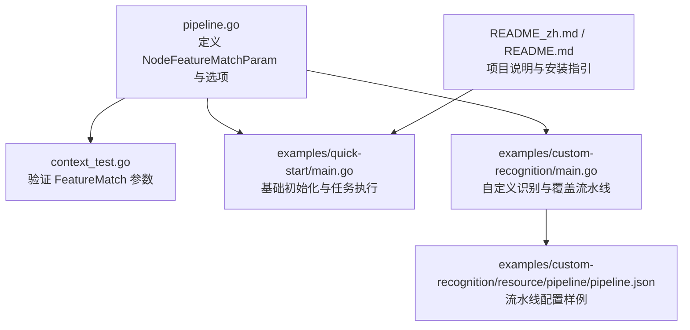
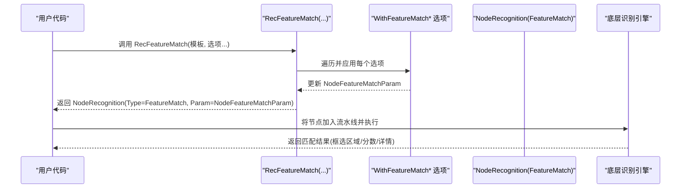
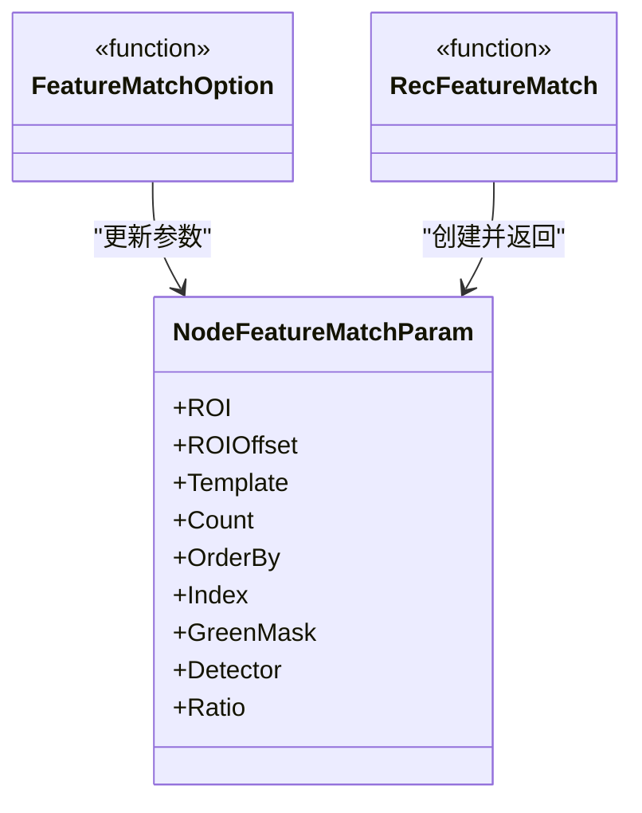
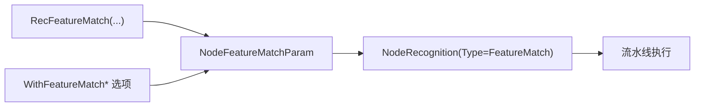

# 特征匹配

<cite>
**本文引用的文件列表**
- [pipeline.go](file://pipeline.go)
- [context_test.go](file://context_test.go)
- [README_zh.md](file://README_zh.md)
- [README.md](file://README.md)
- [examples/quick-start/main.go](file://examples/quick-start/main.go)
- [examples/custom-recognition/main.go](file://examples/custom-recognition/main.go)
- [examples/custom-recognition/resource/pipeline/pipeline.json](file://examples/custom-recognition/resource/pipeline/pipeline.json)
</cite>

## 目录
1. [简介](#简介)
2. [项目结构](#项目结构)
3. [核心组件](#核心组件)
4. [架构总览](#架构总览)
5. [组件详解](#组件详解)
6. [依赖关系分析](#依赖关系分析)
7. [性能与调优建议](#性能与调优建议)
8. [故障排查指南](#故障排查指南)
9. [结论](#结论)
10. [附录](#附录)

## 简介
本篇文档围绕 NodeFeatureMatchParam 结构体及其相关选项，系统讲解在存在旋转、缩放或视角变化的复杂场景下，如何通过 RecFeatureMatch 函数与 WithFeatureMatchDetector、WithFeatureMatchRatio 等选项构建鲁棒的特征匹配识别配置。同时结合仓库中的测试用例与示例，说明 Count、Ratio 等关键参数的调优方法，并给出面向工程实践的性能与准确性权衡建议。

## 项目结构
- 特征匹配能力由 Go 绑定层提供，核心类型与工厂函数位于 pipeline.go 中。
- 测试用例 context_test.go 展示了 FeatureMatch 的典型配置项与默认值行为。
- README_zh.md/README.md 提供项目背景与快速开始信息。
- 示例 examples/quick-start 与 examples/custom-recognition 展示了基本使用与自定义识别流程。

图表来源
- [pipeline.go](file://pipeline.go#L634-L754)
- [context_test.go](file://context_test.go#L477-L509)
- [examples/quick-start/main.go](file://examples/quick-start/main.go#L1-L41)
- [examples/custom-recognition/main.go](file://examples/custom-recognition/main.go#L1-L77)
- [examples/custom-recognition/resource/pipeline/pipeline.json](file://examples/custom-recognition/resource/pipeline/pipeline.json#L1-L12)

章节来源
- [pipeline.go](file://pipeline.go#L634-L754)
- [context_test.go](file://context_test.go#L477-L509)
- [README_zh.md](file://README_zh.md#L1-L169)
- [README.md](file://README.md#L1-L169)
- [examples/quick-start/main.go](file://examples/quick-start/main.go#L1-L41)
- [examples/custom-recognition/main.go](file://examples/custom-recognition/main.go#L1-L77)
- [examples/custom-recognition/resource/pipeline/pipeline.json](file://examples/custom-recognition/resource/pipeline/pipeline.json#L1-L12)

## 核心组件
- NodeFeatureMatchParam：特征匹配节点的参数载体，包含模板路径、区域裁剪、特征点阈值、排序策略、索引选择、绿色掩码、检测器类型、匹配比阈值等字段。
- FeatureMatchOption：用于 RecFeatureMatch 的函数式选项，支持设置 ROI、ROIOffset、Count、OrderBy、Index、GreenMask、Detector、Ratio 等。
- RecFeatureMatch：特征匹配识别节点的构造函数，将模板与选项组合为 NodeRecognition。

章节来源
- [pipeline.go](file://pipeline.go#L634-L754)

## 架构总览
特征匹配识别在流水线中的调用链路如下：

图表来源
- [pipeline.go](file://pipeline.go#L634-L754)

## 组件详解

### NodeFeatureMatchParam 字段与语义
- ROI/ROIOffset：限定识别区域，减少计算量并提升鲁棒性。
- Template：模板图像路径数组，至少提供一张模板以进行特征匹配。
- Count：最小特征点数阈值，默认值为 4；用于过滤低质量匹配。
- OrderBy/Index：结果排序策略与索引选择，便于在多候选中稳定取用。
- GreenMask：启用绿色掩码以处理透明区域。
- Detector：特征检测器类型，支持 SIFT、KAZE、AKAZE、BRISK、ORB。
- Ratio：KNN 匹配距离比阈值，默认 0.6；用于抑制误匹配。

章节来源
- [pipeline.go](file://pipeline.go#L656-L676)

### 选项与工厂函数
- WithFeatureMatchROI/WithFeatureMatchROIOffset：设置识别区域与偏移。
- WithFeatureMatchCount：设置 Count 阈值。
- WithFeatureMatchOrderBy/WithFeatureMatchIndex：设置排序与索引。
- WithFeatureMatchGreenMask：启用绿色掩码。
- WithFeatureMatchDetector：设置 Detector。
- WithFeatureMatchRatio：设置 Ratio。
- RecFeatureMatch：构造 FeatureMatch 节点。

章节来源
- [pipeline.go](file://pipeline.go#L680-L754)

### 使用示例与配置要点
- 在测试用例中可以看到 FeatureMatch 的典型配置：模板、ROI、Count、OrderBy、Index、GreenMask、Detector、Ratio。
- 通过 OverridePipeline 可在运行时动态调整节点参数，实现灵活的调试与实验。

章节来源
- [context_test.go](file://context_test.go#L477-L509)

### 类图（参数与选项）

图表来源
- [pipeline.go](file://pipeline.go#L634-L754)

## 依赖关系分析
- NodeFeatureMatchParam 作为识别参数，被 NodeRecognition 持有，最终由流水线调度执行。
- 选项函数以闭包形式修改 NodeFeatureMatchParam，形成“函数式配置”的风格。
- 测试用例验证了参数解析与默认值行为，确保配置正确映射到结构体。

图表来源
- [pipeline.go](file://pipeline.go#L634-L754)
- [context_test.go](file://context_test.go#L477-L509)

章节来源
- [pipeline.go](file://pipeline.go#L634-L754)
- [context_test.go](file://context_test.go#L477-L509)

## 性能与调优建议

### 关键参数调优
- Count（特征点数量阈值）
  - 作用：过滤低质量匹配，避免噪声干扰；过小易误检，过大易漏检。
  - 建议：
    - 初次配置可设为 4~8，依据误检/漏检情况逐步调整；
    - 复杂纹理或低对比度场景可适当提高；
    - 简单目标或高对比度场景可降低以提升召回。
- Ratio（匹配比阈值）
  - 作用：抑制近邻距离比接近的误匹配；越小越严格，误检越少但可能漏检。
  - 建议：
    - 默认 0.6 适合作为起点；
    - 视场景精度需求与误检容忍度微调，如 0.5~0.7；
    - 对光照变化大、遮挡频繁的场景可适度放宽。

### 检测器选择（Detector）
- SIFT
  - 特点：尺度不变、旋转不变，精度高，计算开销较大。
  - 适用：复杂场景（旋转、缩放、视角变化），对准确性要求高。
- KAZE/AKAZE
  - 特点：非线性扩散滤波，适合 2D/3D 图像，表现接近 SIFT。
  - 适用：纹理丰富、形变较大的目标。
- BRISK
  - 特点：二进制描述子，速度快，适合实时性要求高的场景。
  - 适用：对速度敏感、对精度要求略低的场景。
- ORB
  - 特点：FAST+BRISK 的组合，速度快，但无尺度不变性。
  - 适用：实时性优先、对尺度变化不敏感的场景；若存在显著缩放，建议改用 SIFT/KAZE/AKAZE。

章节来源
- [pipeline.go](file://pipeline.go#L645-L654)

### ROI 与 GreenMask
- ROI/ROIOffset：缩小搜索范围，显著降低计算量，提升稳定性。
- GreenMask：对透明区域进行绿色掩码，避免伪匹配。

章节来源
- [pipeline.go](file://pipeline.go#L656-L676)

### 排序与索引（OrderBy/Index）
- 通过 OrderBy（按横坐标、纵坐标、分数、面积、随机）与 Index，可在多候选中稳定选择目标，减少误判。

章节来源
- [pipeline.go](file://pipeline.go#L634-L643)

### 实战参考
- 测试用例展示了 FeatureMatch 的典型配置与默认值行为，可作为调参起点：
  - 模板、ROI、Count、OrderBy、Index、GreenMask、Detector、Ratio。
- 通过 OverridePipeline 可在运行时快速切换参数，验证不同 Detector/Ratio/Count 的效果。

章节来源
- [context_test.go](file://context_test.go#L477-L509)

## 故障排查指南
- 误检/漏检
  - 检查 Ratio 是否过于宽松或严格；适当调整至 0.5~0.7。
  - 检查 Count 是否过低或过高；根据场景逐步微调。
  - 检查 ROI 是否过大/过小；必要时缩小 ROI 或增加 ROIOffset。
- 旋转/缩放/视角变化导致的失败
  - 更换 Detector 为 SIFT/KAZE/AKAZE；ORB 不具备尺度不变性。
  - 确认模板图像是否覆盖目标的典型姿态与比例。
- 透明区域干扰
  - 启用 GreenMask，或更换模板以去除透明区域。
- 结果不稳定
  - 使用 OrderBy + Index 固定选择策略；或在流水线中引入去抖动逻辑（如多次匹配取众数）。

章节来源
- [pipeline.go](file://pipeline.go#L634-L754)
- [context_test.go](file://context_test.go#L477-L509)

## 结论
NodeFeatureMatchParam 提供了特征匹配识别的核心配置入口。通过合理设置 Count、Ratio、Detector、ROI/GreenMask、OrderBy/Index 等参数，可以在复杂场景（旋转、缩放、视角变化）下取得更稳健的识别效果。建议以测试用例中的配置为起点，结合业务场景逐步微调，优先保证准确性，再兼顾性能。

## 附录

### API 一览（路径定位）
- NodeFeatureMatchParam 定义与字段说明
  - [pipeline.go](file://pipeline.go#L656-L676)
- FeatureMatchOption 选项
  - [pipeline.go](file://pipeline.go#L680-L737)
- RecFeatureMatch 工厂函数
  - [pipeline.go](file://pipeline.go#L739-L754)
- 测试用例中的 FeatureMatch 配置
  - [context_test.go](file://context_test.go#L477-L509)
- 项目说明与快速开始
  - [README_zh.md](file://README_zh.md#L1-L169)
  - [README.md](file://README.md#L1-L169)
- 示例：基础使用与自定义识别
  - [examples/quick-start/main.go](file://examples/quick-start/main.go#L1-L41)
  - [examples/custom-recognition/main.go](file://examples/custom-recognition/main.go#L1-L77)
  - [examples/custom-recognition/resource/pipeline/pipeline.json](file://examples/custom-recognition/resource/pipeline/pipeline.json#L1-L12)