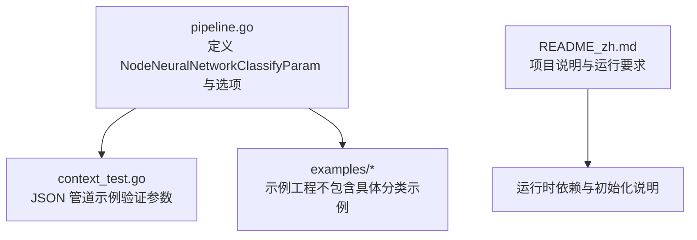
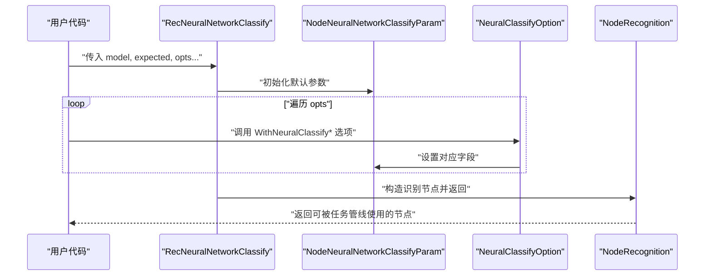
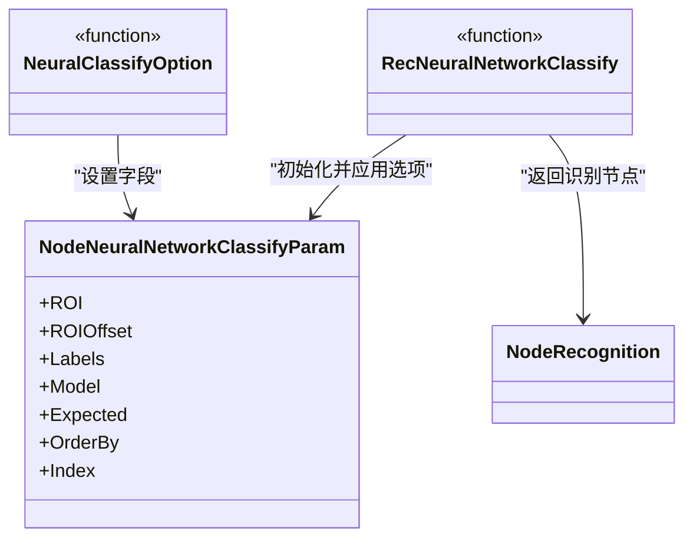
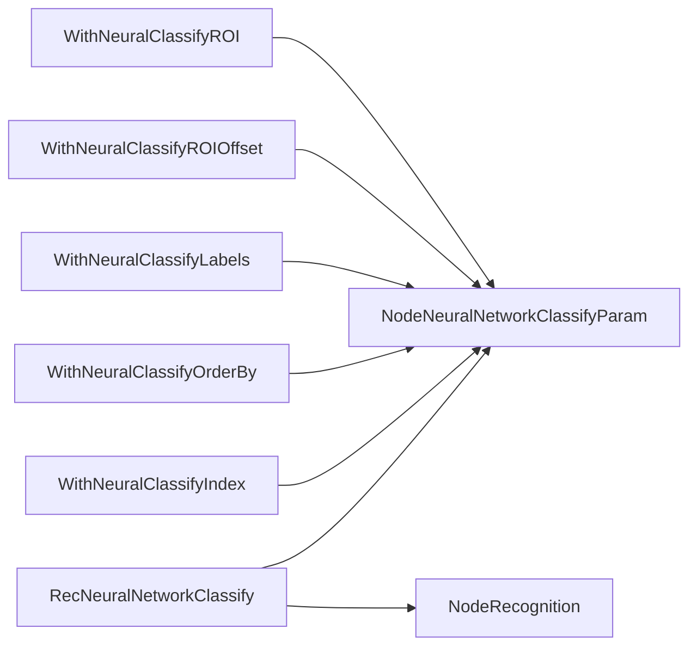

# 神经网络分类

<cite>
**本文引用的文件**
- [pipeline.go](file://pipeline.go)
- [context_test.go](file://context_test.go)
- [README_zh.md](file://README_zh.md)
</cite>

## 目录
1. [简介](#简介)
2. [项目结构](#项目结构)
3. [核心组件](#核心组件)
4. [架构总览](#架构总览)
5. [组件详解](#组件详解)
6. [依赖关系分析](#依赖关系分析)
7. [性能与阈值影响](#性能与阈值影响)
8. [故障排查指南](#故障排查指南)
9. [结论](#结论)
10. [附录](#附录)

## 简介
本文件围绕 NodeNeuralNetworkClassifyParam 结构体及其相关选项，系统说明如何在图像分类任务中配置模型文件路径、标签列表与期望输出，并解释排序策略与索引选择对结果的影响。同时提供通过 RecNeuralNetworkClassify 与 WithNeuralClassifyLabels 等选项集成自定义神经网络模型的实践方法，帮助读者快速上手并优化分类性能。

## 项目结构
与神经网络分类直接相关的代码位于 pipeline.go 中，包含参数结构体、选项函数与创建识别节点的工厂方法；测试用例 context_test.go 展示了参数在 JSON 管道中的实际使用方式。

图表来源
- [pipeline.go](file://pipeline.go#L989-L1063)
- [context_test.go](file://context_test.go#L578-L606)
- [README_zh.md](file://README_zh.md#L62-L77)

章节来源
- [pipeline.go](file://pipeline.go#L989-L1063)
- [context_test.go](file://context_test.go#L578-L606)
- [README_zh.md](file://README_zh.md#L62-L77)

## 核心组件
- NodeNeuralNetworkClassifyParam：神经网络图像分类的参数载体，包含 ROI、标签、模型路径、期望类别索引、排序策略与索引选择等字段。
- NeuralClassifyOption：用于配置 NodeNeuralNetworkClassifyParam 的函数式选项，如设置 ROI、标签、排序策略、索引等。
- RecNeuralNetworkClassify：创建“神经网络分类”识别节点的工厂方法，接收模型路径与期望类别索引，并支持传入选项函数以进一步定制。

章节来源
- [pipeline.go](file://pipeline.go#L989-L1063)

## 架构总览
下图展示了从调用 RecNeuralNetworkClassify 到生成识别节点的整体流程，以及参数结构体与选项函数之间的关系。

图表来源
- [pipeline.go](file://pipeline.go#L1049-L1063)

## 组件详解

### NodeNeuralNetworkClassifyParam 参数说明
- ROI：识别区域目标，限定模型推理的输入图像范围。
- ROIOffset：对 ROI 的偏移，便于微调识别窗口。
- Labels：调试与日志使用的类别名称列表；若未提供，将填充为占位值（见注释说明）。
- Model：模型文件夹路径（相对 model/classify 目录），仅支持 ONNX 模型。
- Expected：期望的类别索引集合，用于过滤或优先匹配。
- OrderBy：结果排序策略，默认按坐标顺序，支持按分数、随机等。
- Index：从多候选结果中选择第几个匹配项，用于稳定选择。

章节来源
- [pipeline.go](file://pipeline.go#L989-L1005)

### 选项函数与工厂方法
- WithNeuralClassifyROI：设置识别区域。
- WithNeuralClassifyROIOffset：设置 ROI 偏移。
- WithNeuralClassifyLabels：设置类别标签列表。
- WithNeuralClassifyOrderBy：设置排序策略。
- WithNeuralClassifyIndex：设置索引选择。
- RecNeuralNetworkClassify：创建“神经网络分类”识别节点，内部会将传入的选项逐一应用到参数对象。

章节来源
- [pipeline.go](file://pipeline.go#L1012-L1063)

### JSON 管道中的使用示例
测试用例展示了如何在 JSON 管道中配置“神经网络分类”节点，包括：
- roi：识别区域
- labels：类别标签
- model：模型文件名
- expected：期望类别索引
- order_by：排序策略
- index：索引选择

章节来源
- [context_test.go](file://context_test.go#L578-L606)

### 类图（参数与选项）

图表来源
- [pipeline.go](file://pipeline.go#L989-L1063)

## 依赖关系分析
- 参数结构体与选项函数之间是松耦合的函数式配置模式，通过闭包将配置应用到参数对象。
- 工厂方法 RecNeuralNetworkClassify 负责组装参数并返回识别节点，便于在任务管线中复用。
- 测试用例验证了参数在 JSON 管道中的序列化与反序列化行为，确保与运行时一致。

图表来源
- [pipeline.go](file://pipeline.go#L1012-L1063)

章节来源
- [pipeline.go](file://pipeline.go#L1012-L1063)

## 性能与阈值影响
- 当前仓库中未发现 NodeNeuralNetworkClassifyParam 结构体包含“阈值（Threshold）”字段的实现。测试用例中出现的阈值主要用于 OCR 场景，而非分类。
- 对分类结果的影响因素主要体现在：
  - 排序策略（OrderBy）：按分数排序有助于优先选择高置信度类别。
  - 索引选择（Index）：固定索引可提升结果稳定性，但需结合 Expected 与排序策略共同使用。
  - ROI 与 ROIOffset：精准裁剪输入区域可减少无关背景干扰，提高识别稳定性。
  - Labels：便于调试与日志定位，间接提升问题定位效率。

章节来源
- [context_test.go](file://context_test.go#L567-L576)
- [pipeline.go](file://pipeline.go#L989-L1005)

## 故障排查指南
- 模型路径错误
  - 症状：无法加载模型或推理失败。
  - 排查：确认 Model 字段为相对 model/classify 目录的路径，且仅支持 ONNX 模型。
- 期望类别索引无效
  - 症状：无匹配结果或结果不符合预期。
  - 排查：核对 Expected 中的类别索引是否与模型输出类别一一对应。
- 排序与索引不当
  - 症状：结果不稳定或非最优类别未被选中。
  - 排查：结合 OrderBy（如按分数排序）与 Index（固定索引）进行组合优化。
- ROI 设置不合理
  - 症状：误检或漏检。
  - 排查：使用 WithNeuralClassifyROI 与 WithNeuralClassifyROIOffset 精确定位目标区域。

章节来源
- [pipeline.go](file://pipeline.go#L989-L1005)

## 结论
NodeNeuralNetworkClassifyParam 为图像分类提供了清晰、可扩展的参数配置入口。通过 WithNeuralClassifyLabels、WithNeuralClassifyOrderBy、WithNeuralClassifyIndex 等选项，可以灵活地优化分类结果的稳定性与准确性。配合 RecNeuralNetworkClassify 工厂方法，可在任务管线中便捷集成自定义神经网络模型，满足多样化的图像分类场景需求。

## 附录

### 使用步骤与最佳实践
- 准备模型
  - 将 ONNX 模型放置于 model/classify 目录下的对应子目录，并在参数中指定相对路径。
- 配置参数
  - 使用 RecNeuralNetworkClassify 指定模型与期望类别索引。
  - 使用 WithNeuralClassifyLabels 提供类别名称，便于调试。
  - 使用 WithNeuralClassifyOrderBy 按分数排序，提升置信度优先的结果命中率。
  - 使用 WithNeuralClassifyIndex 固定选择第 n 个结果，增强稳定性。
- 验证与优化
  - 通过 JSON 管道或测试用例验证参数生效情况。
  - 根据实际效果调整 ROI、ROIOffset 与排序策略。

章节来源
- [pipeline.go](file://pipeline.go#L989-L1063)
- [context_test.go](file://context_test.go#L578-L606)