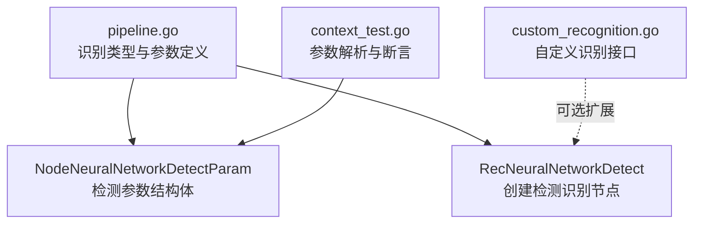
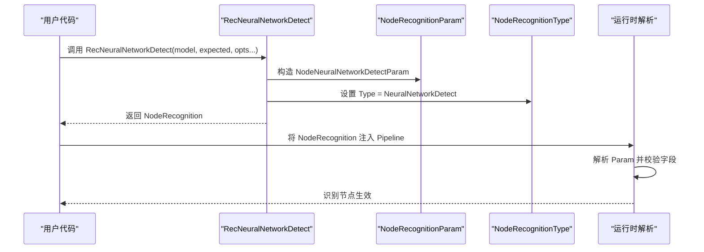
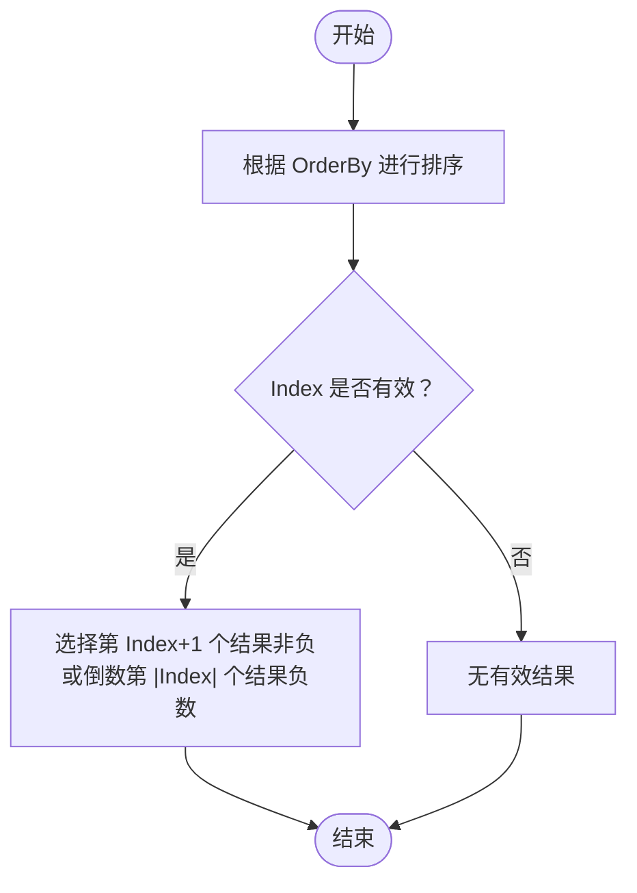
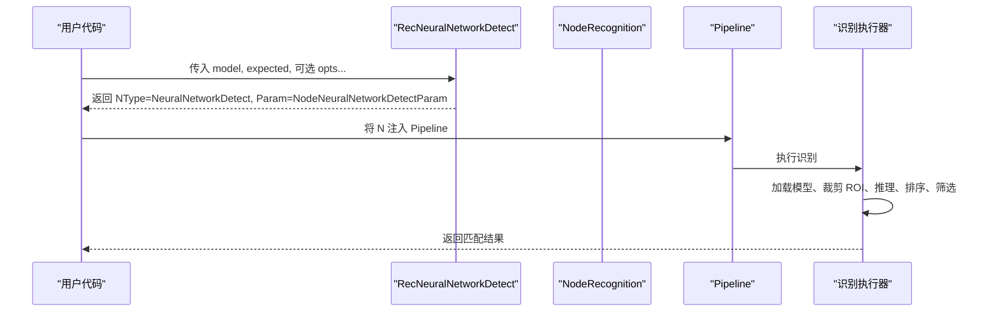
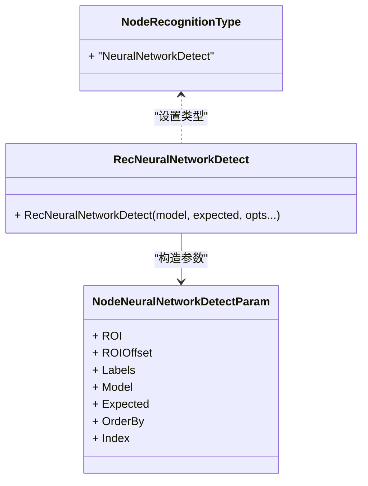

# 神经网络检测

<cite>
**本文引用的文件**
- [pipeline.go](file://pipeline.go)
- [context_test.go](file://context_test.go)
- [custom_recognition.go](file://custom_recognition.go)
- [README.md](file://README.md)
</cite>

## 目录
1. [简介](#简介)
2. [项目结构](#项目结构)
3. [核心组件](#核心组件)
4. [架构总览](#架构总览)
5. [详细组件分析](#详细组件分析)
6. [依赖关系分析](#依赖关系分析)
7. [性能考量](#性能考量)
8. [故障排查指南](#故障排查指南)
9. [结论](#结论)
10. [附录](#附录)

## 简介
本文件聚焦于神经网络检测相关能力，系统性解析 NodeNeuralNetworkDetectParam 结构体的参数含义与用法，涵盖：
- 目标检测模型（Model）
- 标签映射（Labels）
- 阈值（Threshold）在该识别类型中的作用与默认行为
- 多目标检测结果的排序（OrderBy）与筛选（Index）
- 使用 RecNeuralNetworkDetect 函数集成 YOLO 等目标检测模型，实现复杂场景下的对象定位

同时提供面向初学者的可操作示例路径与最佳实践建议。

## 项目结构
与神经网络检测直接相关的代码集中在 pipeline.go 中，定义了识别节点类型、参数结构体以及创建识别节点的工厂方法；测试文件 context_test.go 展示了参数在运行时的解析与验证；自定义识别接口 custom_recognition.go 提供了扩展点以便在需要时进行二次封装或代理。

图表来源
- [pipeline.go](file://pipeline.go#L492-L504)
- [pipeline.go](file://pipeline.go#L1065-L1150)
- [context_test.go](file://context_test.go#L608-L638)
- [custom_recognition.go](file://custom_recognition.go#L38-L54)

章节来源
- [pipeline.go](file://pipeline.go#L492-L504)
- [pipeline.go](file://pipeline.go#L1065-L1150)
- [context_test.go](file://context_test.go#L608-L638)
- [custom_recognition.go](file://custom_recognition.go#L38-L54)

## 核心组件
- NodeRecognitionType：识别类型枚举，包含 NeuralNetworkDetect。
- NodeNeuralNetworkDetectParam：神经网络目标检测参数结构体，包含 ROI、ROIOffset、Labels、Model、Expected、OrderBy、Index 等字段。
- RecNeuralNetworkDetect：用于创建“神经网络目标检测”类型的识别节点的工厂方法。
- NodeNeuralNetworkDetectOrderBy：检测结果排序策略枚举，支持 Horizontal、Vertical、Score、Area、Random。

章节来源
- [pipeline.go](file://pipeline.go#L492-L504)
- [pipeline.go](file://pipeline.go#L1065-L1150)

## 架构总览
下图展示了从调用 RecNeuralNetworkDetect 到最终形成识别节点的过程，以及参数在运行时被解析并应用到识别流程的关键环节。

图表来源
- [pipeline.go](file://pipeline.go#L1135-L1150)
- [pipeline.go](file://pipeline.go#L492-L504)

## 详细组件分析

### NodeNeuralNetworkDetectParam 参数详解
- ROI 与 ROIOffset
  - 限定检测区域，减少无关区域计算，提升效率。
- Labels
  - 用于调试与日志输出的类别名称；若未提供，将自动从模型元数据读取。
- Model
  - 模型目录相对路径，位于 model/detect 下；支持 YOLOv8/YOLOv11 的 ONNX 模型。
- Expected
  - 期望的类别索引集合，用于过滤检测结果。
- OrderBy
  - 排序策略，默认 Horizontal（按 x 坐标），可选 Vertical（按 y）、Score（按置信度）、Area（按面积）、Random（随机）。
- Index
  - 选择结果中的第几个匹配项；负数表示从后往前取，如 -1 表示最后一个。

章节来源
- [pipeline.go](file://pipeline.go#L1076-L1150)

### 排序（OrderBy）与筛选（Index）
- 排序策略
  - Horizontal：优先按水平方向（x 坐标）排序。
  - Vertical：优先按垂直方向（y 坐标）排序。
  - Score：按置信度降序排序。
  - Area：按边界框面积降序排序。
  - Random：随机打乱顺序。
- 筛选策略
  - Index 为非负整数时，选择第 Index+1 个结果（从 0 开始计数）。
  - Index 为负数时，从末尾开始计数，-1 表示最后一个，-2 表示倒数第二个，依此类推。
  - 若 Index 超出结果数量范围，则通常不会返回有效匹配。

图表来源
- [pipeline.go](file://pipeline.go#L1065-L1150)

章节来源
- [pipeline.go](file://pipeline.go#L1065-L1150)

### 阈值（Threshold）在目标检测中的角色
- 在当前识别类型中，NodeNeuralNetworkDetectParam 并未显式声明 Threshold 字段。
- 对应的阈值控制在其他识别类型中有明确字段（例如 OCR、模板匹配等），但目标检测参数结构体未包含 Threshold。
- 实际推理阈值通常由底层推理引擎或模型本身决定，框架侧不暴露统一的 Threshold 字段。

章节来源
- [pipeline.go](file://pipeline.go#L1076-L1150)
- [pipeline.go](file://pipeline.go#L540-L560)
- [pipeline.go](file://pipeline.go#L887-L923)

### 使用 RecNeuralNetworkDetect 集成 YOLO 等目标检测模型
- 创建识别节点
  - 使用 RecNeuralNetworkDetect(model, expected, opts...) 构造识别节点。
  - 可通过 WithNeuralDetectROI、WithNeuralDetectROIOffset、WithNeuralDetectLabels、WithNeuralDetectOrderBy、WithNeuralDetectIndex 等选项配置参数。
- 典型流程
  - 定义模型路径与类别索引集合。
  - 指定期望类别（Expected）以过滤无关类。
  - 选择合适的排序策略（OrderBy）与筛选策略（Index）以稳定选取目标。
  - 将识别节点注入 Pipeline，并在任务流中使用。

图表来源
- [pipeline.go](file://pipeline.go#L1135-L1150)
- [pipeline.go](file://pipeline.go#L1076-L1150)

章节来源
- [pipeline.go](file://pipeline.go#L1135-L1150)
- [pipeline.go](file://pipeline.go#L1076-L1150)

### 示例路径（基于仓库现有测试与示例）
- 测试中对 NeuralNetworkDetect 的参数解析与断言
  - 参考路径：[context_test.go](file://context_test.go#L608-L638)
- 快速开始示例（设备连接与资源加载）
  - 参考路径：[examples/quick-start/main.go](file://examples/quick-start/main.go#L1-L41)
- 自定义识别接口（可选扩展）
  - 参考路径：[custom_recognition.go](file://custom_recognition.go#L38-L54)

章节来源
- [context_test.go](file://context_test.go#L608-L638)
- [README.md](file://README.md#L78-L134)
- [custom_recognition.go](file://custom_recognition.go#L38-L54)

## 依赖关系分析
- 类型与参数耦合
  - NodeNeuralNetworkDetectParam 作为识别参数，与 NodeRecognitionType 枚举配合，确保识别节点类型与参数一致。
- 工厂方法与参数选项
  - RecNeuralNetworkDetect 通过可变参数选项函数构建参数，保持 API 灵活性与可读性。
- 运行时解析
  - 识别节点的 Param 字段在运行时被解析并应用，确保与结构体定义一致。

图表来源
- [pipeline.go](file://pipeline.go#L492-L504)
- [pipeline.go](file://pipeline.go#L1065-L1150)
- [pipeline.go](file://pipeline.go#L1135-L1150)

章节来源
- [pipeline.go](file://pipeline.go#L492-L504)
- [pipeline.go](file://pipeline.go#L1065-L1150)
- [pipeline.go](file://pipeline.go#L1135-L1150)

## 性能考量
- ROI 与 ROIOffset
  - 合理设置 ROI 可显著降低推理成本，避免全图扫描。
- 排序策略
  - Score 或 Area 排序可能带来额外开销，仅在需要稳定选择时启用。
- Index 策略
  - 优先选择前若干个高分目标，避免对大量候选框进行排序。
- 模型选择
  - 选用合适大小的 YOLO 模型以平衡精度与速度。

## 故障排查指南
- 参数未生效
  - 确认识别节点类型是否为 NeuralNetworkDetect，且 Param 正确解析。
  - 参考测试断言路径：[context_test.go](file://context_test.go#L608-L638)
- 无匹配结果
  - 检查 Expected 是否包含目标类别索引。
  - 检查 Index 是否超出结果数量范围。
  - 检查模型路径与标签是否正确。
- 模型加载失败
  - 确认模型位于 model/detect 目录下，且为 YOLOv8/YOLOv11 的 ONNX 模型。
  - 参考结构体注释说明：[pipeline.go](file://pipeline.go#L1084-L1084)

章节来源
- [context_test.go](file://context_test.go#L608-L638)
- [pipeline.go](file://pipeline.go#L1084-L1084)

## 结论
- NodeNeuralNetworkDetectParam 提供了目标检测所需的核心参数：模型、类别索引、区域裁剪、排序与筛选。
- 当前识别类型未暴露 Threshold 字段，阈值控制通常由底层推理引擎或模型决定。
- 通过 RecNeuralNetworkDetect 与选项函数，可以灵活配置检测参数，并在复杂场景中稳定定位目标。

## 附录
- 快速开始参考路径：[README.md](file://README.md#L78-L134)
- 自定义识别接口参考路径：[custom_recognition.go](file://custom_recognition.go#L38-L54)