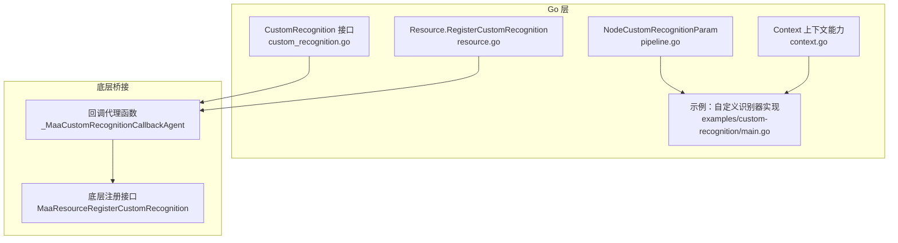
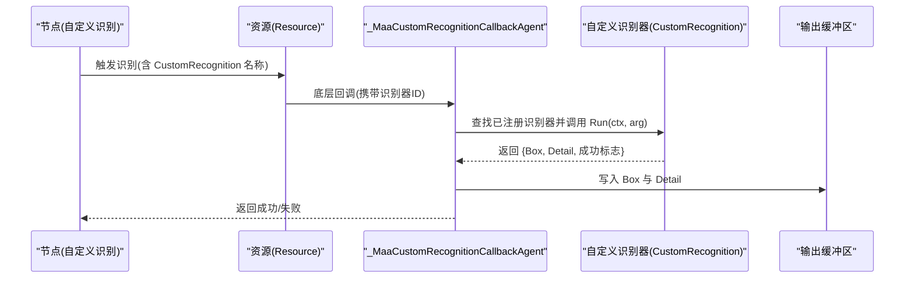
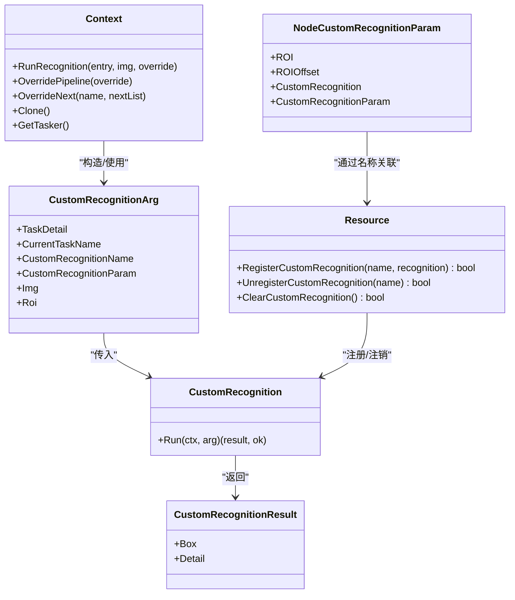
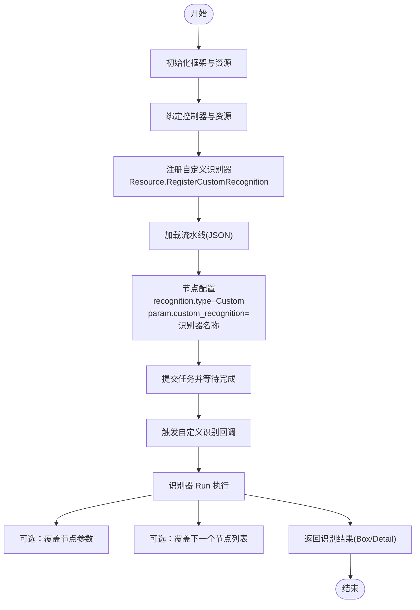

# 自定义识别

<cite>
**本文引用的文件列表**
- [custom_recognition.go](file://custom_recognition.go)
- [resource.go](file://resource.go)
- [context.go](file://context.go)
- [pipeline.go](file://pipeline.go)
- [examples/custom-recognition/main.go](file://examples/custom-recognition/main.go)
- [examples/custom-recognition/resource/pipeline/pipeline.json](file://examples/custom-recognition/resource/pipeline/pipeline.json)
- [tasker.go](file://tasker.go)
- [job.go](file://job.go)
</cite>

## 目录
1. [简介](#简介)
2. [项目结构与定位](#项目结构与定位)
3. [核心组件总览](#核心组件总览)
4. [架构概览](#架构概览)
5. [详细组件解析](#详细组件解析)
6. [依赖关系分析](#依赖关系分析)
7. [性能与并发特性](#性能与并发特性)
8. [故障排查指南](#故障排查指南)
9. [结论](#结论)
10. [附录：从零到一的完整流程](#附录从零到一的完整流程)

## 简介
本篇文档围绕“自定义识别”能力展开，重点讲解 NodeCustomRecognitionParam 结构体的配置方法，说明如何通过 Name（在代码中体现为 CustomRecognition 字段）将自定义识别处理器与节点绑定；结合 custom_recognition.go 中的接口定义，阐述如何实现自定义识别逻辑并注册到框架；并通过示例展示从创建自定义识别器、注册、到在流水线中使用的完整流程，同时解释如何通过 Attach 字段在节点上携带上下文数据。

## 项目结构与定位
- 自定义识别的核心接口与回调代理位于 custom_recognition.go，负责将 Go 层的自定义识别器与底层 C/C++ 回调打通。
- 资源层的注册入口位于 resource.go，提供 RegisterCustomRecognition 方法，将自定义识别器与资源绑定，并向底层注册回调。
- 流水线参数定义位于 pipeline.go，其中 NodeCustomRecognitionParam 提供了自定义识别的参数模型，包含 ROI、ROIOffset、CustomRecognition 名称以及自定义参数。
- 上下文能力位于 context.go，提供 OverridePipeline、RunRecognition、OverrideNext 等方法，用于在识别器内部动态覆盖节点配置或控制后续节点。
- 示例位于 examples/custom-recognition，演示了如何实现自定义识别器并在 JSON 流水线中使用。

图表来源
- [custom_recognition.go](file://custom_recognition.go#L1-L103)
- [resource.go](file://resource.go#L114-L133)
- [context.go](file://context.go#L1-L200)
- [pipeline.go](file://pipeline.go#L1152-L1202)
- [examples/custom-recognition/main.go](file://examples/custom-recognition/main.go#L1-L77)

章节来源
- [custom_recognition.go](file://custom_recognition.go#L1-L103)
- [resource.go](file://resource.go#L114-L133)
- [context.go](file://context.go#L1-L200)
- [pipeline.go](file://pipeline.go#L1152-L1202)
- [examples/custom-recognition/main.go](file://examples/custom-recognition/main.go#L1-L77)

## 核心组件总览
- 自定义识别接口：CustomRecognition.Run(ctx, arg) 定义了识别器的执行入口，返回结果包含 Box 和 Detail。
- 回调代理：_MaaCustomRecognitionCallbackAgent 将底层传入的指针转换为 Go 对象，调用已注册的识别器并回写结果。
- 资源注册：Resource.RegisterCustomRecognition(name, recognition) 注册识别器，生成唯一 ID 并向底层注册回调。
- 参数模型：NodeCustomRecognitionParam 定义了自定义识别节点的参数，关键字段包括：
  - CustomRecognition：与资源侧注册时的名称一致，用于关联具体识别器。
  - CustomRecognitionParam：任意类型，作为识别器的自定义参数传入。
  - ROI/ROIOffset：限定识别区域。
- 上下文能力：Context 提供 OverridePipeline、RunRecognition、OverrideNext、Clone 等，便于在识别器内动态调整行为。

章节来源
- [custom_recognition.go](file://custom_recognition.go#L38-L102)
- [resource.go](file://resource.go#L114-L133)
- [pipeline.go](file://pipeline.go#L1152-L1202)
- [context.go](file://context.go#L1-L200)

## 架构概览
下面的序列图展示了从流水线节点触发自定义识别，到回调代理调用识别器并回写结果的完整过程。

图表来源
- [custom_recognition.go](file://custom_recognition.go#L56-L102)
- [resource.go](file://resource.go#L114-L133)
- [pipeline.go](file://pipeline.go#L1152-L1202)

## 详细组件解析

### NodeCustomRecognitionParam 参数模型
- 字段说明
  - CustomRecognition：字符串，必须与 Resource.RegisterCustomRecognition 的 name 一致，用于在运行时关联到具体的识别器实例。
  - CustomRecognitionParam：任意类型，作为识别器的自定义参数传入 CustomRecognitionArg.CustomRecognitionParam。
  - ROI/ROIOffset：限定识别区域，减少无效计算，提升性能。
- 配置方式
  - 在 JSON 流水线中设置 recognition.type 为 "Custom"，并在 param 中提供 CustomRecognition 字段。
  - 也可通过编程方式使用 RecCustom(name, opts...) 构建节点，opts 支持 WithCustomRecognitionROI、WithCustomRecognitionROIOffset、WithCustomRecognitionParam 等。

章节来源
- [pipeline.go](file://pipeline.go#L1152-L1202)
- [examples/custom-recognition/resource/pipeline/pipeline.json](file://examples/custom-recognition/resource/pipeline/pipeline.json#L1-L12)

### 自定义识别接口与回调代理
- CustomRecognition 接口
  - Run(ctx, arg) -> (*CustomRecognitionResult, bool)
  - 返回值包含 Box（识别框）与 Detail（识别详情），布尔值表示是否命中。
- 回调代理
  - _MaaCustomRecognitionCallbackAgent 负责：
    - 从底层回调中提取识别器 ID，查找已注册的识别器实例。
    - 组装 CustomRecognitionArg，包含 TaskDetail、CurrentTaskName、CustomRecognitionName、CustomRecognitionParam、Img、Roi。
    - 调用识别器 Run，若成功则将 Box 与 Detail 写入底层输出缓冲区。

章节来源
- [custom_recognition.go](file://custom_recognition.go#L38-L102)

### 资源注册与生命周期
- Resource.RegisterCustomRecognition(name, recognition)
  - 生成唯一 ID 并登记到全局映射表。
  - 调用底层注册接口，将回调代理与 ID 绑定。
- 销毁时清理
  - Resource.Destroy 会遍历已注册的识别器 ID 并调用注销函数，确保不会残留回调。

章节来源
- [resource.go](file://resource.go#L114-L133)

### 上下文数据与 Attach 字段
- Attach 字段
  - 在节点 JSON 中可配置 attach 字段，用于携带任意键值对的上下文数据。
  - 在识别器内部可通过 Context 获取当前任务信息、覆盖管道、克隆上下文等，从而间接利用这些上下文数据。
- 典型用法
  - 在识别器中使用 OverridePipeline 动态覆盖某个识别节点的参数（如 ROI）。
  - 使用 Clone 获取独立上下文，避免影响主流程。
  - 使用 OverrideNext 控制后续节点列表。

章节来源
- [context.go](file://context.go#L1-L200)
- [examples/custom-recognition/main.go](file://examples/custom-recognition/main.go#L1-L77)

## 依赖关系分析
- 组件耦合
  - Resource.RegisterCustomRecognition 与 _MaaCustomRecognitionCallbackAgent 存在直接依赖，前者负责注册，后者负责回调分发。
  - CustomRecognitionArg 与 TaskDetail、Rect、image.Image 等类型存在组合关系，用于承载识别所需的上下文与输入图像。
- 外部依赖
  - 底层注册接口 MaaResourceRegisterCustomRecognition 由 Resource 层封装调用。
  - 图像与矩形缓冲区通过 internal/buffer 进行跨语言传递。

图表来源
- [custom_recognition.go](file://custom_recognition.go#L38-L102)
- [resource.go](file://resource.go#L114-L133)
- [pipeline.go](file://pipeline.go#L1152-L1202)
- [context.go](file://context.go#L1-L200)

## 性能与并发特性
- 并发安全
  - 注册与注销识别器使用互斥锁保护全局映射表，避免竞态。
- 回调效率
  - 回调代理通过 ID 快速定位识别器实例，避免重复查找。
- 输入输出
  - 图像与矩形通过缓冲区进行跨语言传递，减少拷贝成本。
- 建议
  - 合理设置 ROI/ROIOffset，缩小识别范围。
  - 在识别器内部尽量复用 Context 的能力，避免重复构建对象。

章节来源
- [custom_recognition.go](file://custom_recognition.go#L1-L36)
- [resource.go](file://resource.go#L114-L133)

## 故障排查指南
- 识别未命中
  - 检查 NodeCustomRecognitionParam.CustomRecognition 是否与 Resource.RegisterCustomRecognition 的 name 一致。
  - 确认 CustomRecognitionParam 是否正确传入，且识别器内部能正确解析。
- 回调未触发
  - 确认 Resource.RegisterCustomRecognition 已成功返回。
  - 检查底层注册接口是否被调用，以及回调代理是否正确绑定 ID。
- ROI 设置问题
  - 确认 ROI/ROIOffset 是否合理，过大可能导致误检或性能下降。
- 上下文覆盖无效
  - 确认在识别器内部调用了 Context.OverridePipeline 或 Context.OverrideNext，并确保覆盖的节点名正确。
- 任务状态与细节
  - 可通过 TaskJob.GetDetail 获取 TaskDetail，检查节点执行情况与状态。

章节来源
- [resource.go](file://resource.go#L114-L133)
- [custom_recognition.go](file://custom_recognition.go#L56-L102)
- [job.go](file://job.go#L66-L96)
- [tasker.go](file://tasker.go#L284-L344)

## 结论
通过 NodeCustomRecognitionParam 的 CustomRecognition 字段，可以将自定义识别器与节点精确绑定；借助 Resource.RegisterCustomRecognition 与回调代理，实现了从 Go 层到底层的无缝衔接；配合 Context 的动态覆盖能力，可在识别器内部灵活地调整后续行为。Attach 字段则为节点提供了携带上下文数据的能力，便于在识别器中读取并使用。

## 附录：从零到一的完整流程
以下流程基于示例工程，展示从创建自定义识别器到在流水线中使用的全过程。

图表来源
- [examples/custom-recognition/main.go](file://examples/custom-recognition/main.go#L1-L77)
- [examples/custom-recognition/resource/pipeline/pipeline.json](file://examples/custom-recognition/resource/pipeline/pipeline.json#L1-L12)
- [resource.go](file://resource.go#L114-L133)
- [pipeline.go](file://pipeline.go#L1152-L1202)
- [context.go](file://context.go#L1-L200)

章节来源
- [examples/custom-recognition/main.go](file://examples/custom-recognition/main.go#L1-L77)
- [examples/custom-recognition/resource/pipeline/pipeline.json](file://examples/custom-recognition/resource/pipeline/pipeline.json#L1-L12)
- [resource.go](file://resource.go#L114-L133)
- [pipeline.go](file://pipeline.go#L1152-L1202)
- [context.go](file://context.go#L1-L200)