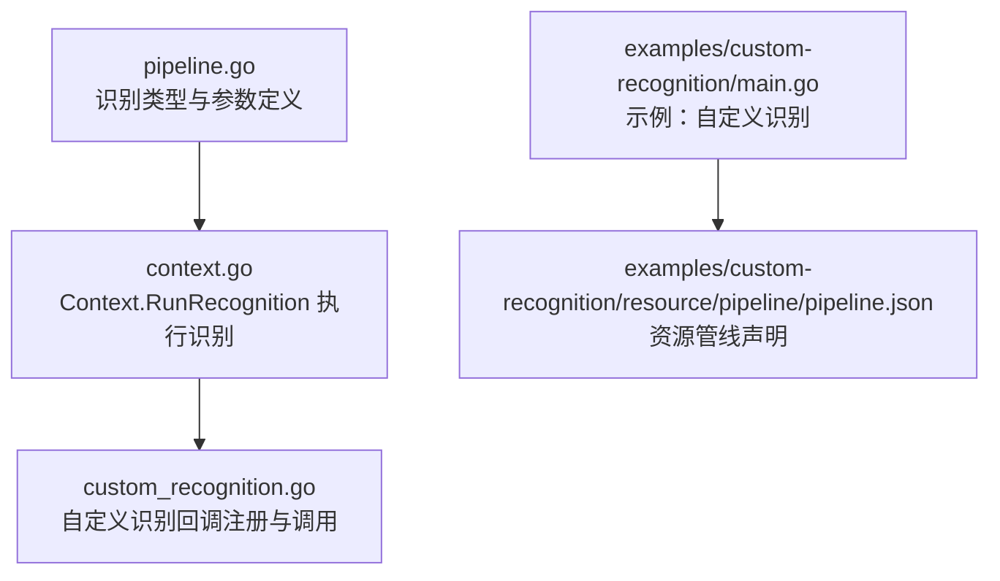
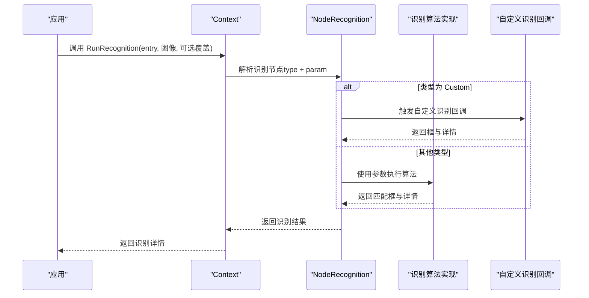
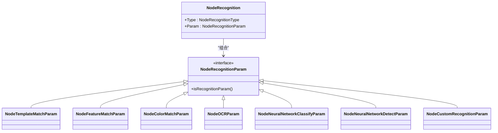

# 识别系统配置

<cite>
**本文引用的文件列表**
- [pipeline.go](file://pipeline.go)
- [context.go](file://context.go)
- [custom_recognition.go](file://custom_recognition.go)
- [examples/custom-recognition/main.go](file://examples/custom-recognition/main.go)
- [examples/custom-recognition/resource/pipeline/pipeline.json](file://examples/custom-recognition/resource/pipeline/pipeline.json)
- [context_test.go](file://context_test.go)
- [README.md](file://README.md)
</cite>

## 目录
1. [简介](#简介)
2. [项目结构与入口](#项目结构与入口)
3. [核心组件总览](#核心组件总览)
4. [架构概览](#架构概览)
5. [详细组件分析](#详细组件分析)
6. [依赖关系分析](#依赖关系分析)
7. [性能与资源权衡](#性能与资源权衡)
8. [故障排查指南](#故障排查指南)
9. [结论](#结论)
10. [附录：参数与使用示例路径](#附录参数与使用示例路径)

## 简介
本文件面向希望在MaaFramework Go绑定中进行图像识别的开发者，系统性解析NodeRecognition类型及其支持的识别算法族，包括TemplateMatch（模板匹配）、FeatureMatch（特征匹配）、OCR（光学字符识别）、ColorMatch（颜色匹配）、NeuralNetworkClassify（神经网络分类）、NeuralNetworkDetect（神经网络检测）以及Custom（自定义识别）。文档将从数据结构、参数含义、使用方式、适用场景、性能与资源消耗权衡等方面进行深入说明，并提供可直接定位到源码的示例路径，帮助快速上手。

## 项目结构与入口
- 识别配置的核心定义位于pipeline.go，包含NodeRecognition类型、各类识别参数结构体、以及对应的构造函数（如RecTemplateMatch、RecFeatureMatch、RecOCR、RecColorMatch、RecNeuralNetworkClassify、RecNeuralNetworkDetect、RecCustom）。
- 运行时上下文与识别执行由context.go提供，Context.RunRecognition用于对给定图像运行识别节点。
- 自定义识别回调机制由custom_recognition.go提供，支持注册自定义识别器并在任务流中调用。
- 示例工程展示了如何在资源管线中声明识别节点，以及如何在自定义识别中复用Context能力。

图表来源
- [pipeline.go](file://pipeline.go#L442-L549)
- [context.go](file://context.go#L60-L92)
- [custom_recognition.go](file://custom_recognition.go#L17-L103)
- [examples/custom-recognition/main.go](file://examples/custom-recognition/main.go#L1-L77)
- [examples/custom-recognition/resource/pipeline/pipeline.json](file://examples/custom-recognition/resource/pipeline/pipeline.json#L1-L12)

章节来源
- [README.md](file://README.md#L27-L40)
- [pipeline.go](file://pipeline.go#L442-L549)
- [context.go](file://context.go#L60-L92)
- [custom_recognition.go](file://custom_recognition.go#L17-L103)
- [examples/custom-recognition/main.go](file://examples/custom-recognition/main.go#L1-L77)
- [examples/custom-recognition/resource/pipeline/pipeline.json](file://examples/custom-recognition/resource/pipeline/pipeline.json#L1-L12)

## 核心组件总览
- NodeRecognition：识别节点的统一抽象，包含识别类型与参数。
- NodeRecognitionType：枚举所有可用的识别算法类型。
- NodeRecognitionParam接口及各算法参数结构体：封装对应算法所需的全部配置项。
- 构造函数族：RecTemplateMatch、RecFeatureMatch、RecOCR、RecColorMatch、RecNeuralNetworkClassify、RecNeuralNetworkDetect、RecCustom，用于便捷构建识别节点。
- Context.RunRecognition：在给定图像上执行识别节点，返回识别结果详情。

章节来源
- [pipeline.go](file://pipeline.go#L442-L549)
- [pipeline.go](file://pipeline.go#L544-L632)
- [pipeline.go](file://pipeline.go#L634-L754)
- [pipeline.go](file://pipeline.go#L756-L867)
- [pipeline.go](file://pipeline.go#L880-L977)
- [pipeline.go](file://pipeline.go#L980-L1063)
- [pipeline.go](file://pipeline.go#L1065-L1150)
- [pipeline.go](file://pipeline.go#L1152-L1202)
- [context.go](file://context.go#L60-L92)

## 架构概览
下图展示了识别配置在运行时的调用链路：应用通过Context.RunRecognition触发识别；识别节点根据NodeRecognition.Type选择对应算法；算法参数由NodeRecognition.Param提供；对于Custom类型，会回调已注册的自定义识别器。

图表来源
- [context.go](file://context.go#L60-L92)
- [pipeline.go](file://pipeline.go#L442-L549)
- [custom_recognition.go](file://custom_recognition.go#L56-L103)

## 详细组件分析

### NodeRecognition与识别类型
- NodeRecognition：包含识别类型与参数两部分，通过UnmarshalJSON按类型动态反序列化参数对象。
- NodeRecognitionType：包含DirectHit、TemplateMatch、FeatureMatch、ColorMatch、OCR、NeuralNetworkClassify、NeuralNetworkDetect、Custom等类型。
- NodeRecognitionParam：识别参数接口，各算法参数结构体实现该接口。

章节来源
- [pipeline.go](file://pipeline.go#L442-L549)
- [pipeline.go](file://pipeline.go#L492-L504)
- [pipeline.go](file://pipeline.go#L506-L516)

### TemplateMatch（模板匹配）
- 参数结构：NodeTemplateMatchParam，关键字段包括ROI、ROIOffset、Template、Threshold、OrderBy、Index、Method、GreenMask。
- 方法与排序：
  - 匹配方法：支持SQDIFF_NORMED、CCORR_NORMED、CCOEFF_NORMED（默认更准确）。
  - 排序：Horizontal、Vertical、Score、Random。
- 构造函数：RecTemplateMatch(template, ...TemplateMatchOption)，支持WithTemplateMatchROI、WithTemplateMatchROIOffset、WithTemplateMatchThreshold、WithTemplateMatchOrderBy、WithTemplateMatchIndex、WithTemplateMatchMethod、WithTemplateMatchGreenMask。
- 使用建议：
  - 高精度场景优先使用CCOEFF_NORMED，但计算成本更高。
  - 大图搜索建议配合ROI缩小范围。
  - GreenMask可用于透明区域遮罩，提升匹配鲁棒性。
- 性能与资源：匹配复杂度与模板数量、阈值设置相关；大模板或高分辨率图像会显著增加耗时。

章节来源
- [pipeline.go](file://pipeline.go#L544-L632)
- [pipeline.go](file://pipeline.go#L618-L632)
- [context_test.go](file://context_test.go#L450-L475)

### FeatureMatch（特征匹配）
- 参数结构：NodeFeatureMatchParam，关键字段包括ROI、ROIOffset、Template、Count、OrderBy、Index、Detector、Ratio、GreenMask。
- 检测器与排序：
  - 检测器：SIFT（最准确）、KAZE、AKAZE、BRISK（快）、ORB（快且无尺度不变性）。
  - 排序：Horizontal、Vertical、Score、Area、Random。
- 构造函数：RecFeatureMatch(template, ...FeatureMatchOption)，支持WithFeatureMatchROI、WithFeatureMatchROIOffset、WithFeatureMatchCount、WithFeatureMatchOrderBy、WithFeatureMatchIndex、WithFeatureMatchGreenMask、WithFeatureMatchDetector、WithFeatureMatchRatio。
- 使用建议：
  - 对透视、缩放、旋转有较强泛化需求时优先SIFT/KAZE/AKAZE。
  - BRISK/ORB适合实时性要求高的场景。
  - Ratio用于KNN匹配距离阈值，降低误匹配。
- 性能与资源：SIFT/KAZE/AKAZE计算量较大；BRISK/ORB更快但精度略低。

章节来源
- [pipeline.go](file://pipeline.go#L656-L754)
- [pipeline.go](file://pipeline.go#L738-L754)
- [context_test.go](file://context_test.go#L477-L509)

### ColorMatch（颜色匹配）
- 参数结构：NodeColorMatchParam，关键字段包括ROI、ROIOffset、Method、Lower、Upper、Count、OrderBy、Index、Connected。
- 颜色空间与排序：
  - 颜色空间：RGB（默认）、HSV、GRAY。
  - 排序：Horizontal、Vertical、Score、Area、Random。
- 构造函数：RecColorMatch(lower, upper, ...ColorMatchOption)，支持WithColorMatchROI、WithColorMatchROIOffset、WithColorMatchMethod、WithColorMatchCount、WithColorMatchOrderBy、WithColorMatchIndex、WithColorMatchConnected。
- 使用建议：
  - Lower/Upper维度需与Method通道数一致（RGB=3，HSV=3，GRAY=1）。
  - Connected开启后可合并连通域，适合连续颜色区域。
- 性能与资源：通道数越少、阈值越高，计算量越小；Connected会增加后处理开销。

章节来源
- [pipeline.go](file://pipeline.go#L776-L867)
- [pipeline.go](file://pipeline.go#L852-L867)
- [context_test.go](file://context_test.go#L511-L542)

### OCR（光学字符识别）
- 参数结构：NodeOCRParam，关键字段包括ROI、ROIOffset、Expected、Threshold、Replace、OrderBy、Index、OnlyRec、Model。
- 排序与模式：
  - 排序：Horizontal、Vertical、Area、Length、Random。
  - OnlyRec：仅识别模式（不进行文本检测），需精确ROI。
- 构造函数：RecOCR(expected, ...OCROption)，支持WithOCRROI、WithOCRROIOffset、WithOCRThreshold、WithOCRReplace、WithOCROrderBy、WithOCRIndex、WithOCROnlyRec、WithOCRModel。
- 使用建议：
  - Expected支持正则表达式，便于灵活匹配。
  - Replace用于纠正常见OCR错误字符。
  - OnlyRec适合固定位置、固定字体的稳定场景。
- 性能与资源：模型越大、阈值越低，推理时间越长；OnlyRec可显著提速。

章节来源
- [pipeline.go](file://pipeline.go#L880-L977)
- [pipeline.go](file://pipeline.go#L963-L977)
- [context_test.go](file://context_test.go#L544-L576)

### NeuralNetworkClassify（神经网络分类）
- 参数结构：NodeNeuralNetworkClassifyParam，关键字段包括ROI、ROIOffset、Labels、Model、Expected、OrderBy、Index。
- 排序：
  - 排序：Horizontal、Vertical、Score、Random。
- 构造函数：RecNeuralNetworkClassify(model, expected, ...NeuralClassifyOption)，支持WithNeuralClassifyROI、WithNeuralClassifyROIOffset、WithNeuralClassifyLabels、WithNeuralClassifyOrderBy、WithNeuralClassifyIndex。
- 使用建议：
  - Labels用于调试与日志，便于定位类别名称。
  - Expected为期望类别索引列表，用于过滤结果。
- 性能与资源：ONNX模型加载与推理带来一定内存与CPU开销；固定位置的分类通常较快。

章节来源
- [pipeline.go](file://pipeline.go#L989-L1063)
- [pipeline.go](file://pipeline.go#L1046-L1063)
- [context_test.go](file://context_test.go#L578-L606)

### NeuralNetworkDetect（神经网络检测）
- 参数结构：NodeNeuralNetworkDetectParam，关键字段包括ROI、ROIOffset、Labels、Model、Expected、OrderBy、Index。
- 排序：
  - 排序：Horizontal、Vertical、Score、Area、Random。
- 构造函数：RecNeuralNetworkDetect(model, expected, ...NeuralDetectOption)，支持WithNeuralDetectROI、WithNeuralDetectROIOffset、WithNeuralDetectLabels、WithNeuralDetectOrderBy、WithNeuralDetectIndex。
- 使用建议：
  - 支持YOLOv8/YOLOv11 ONNX模型，适合任意位置目标检测。
  - Expected为期望类别索引列表，用于筛选感兴趣类别。
- 性能与资源：深度学习模型推理成本较高，建议合理设置ROI与阈值以平衡准确率与速度。

章节来源
- [pipeline.go](file://pipeline.go#L1076-L1150)
- [pipeline.go](file://pipeline.go#L1133-L1150)
- [context_test.go](file://context_test.go#L608-L638)

### Custom（自定义识别）
- 参数结构：NodeCustomRecognitionParam，关键字段包括ROI、ROIOffset、CustomRecognition、CustomRecognitionParam。
- 回调机制：
  - 通过registerCustomRecognition注册识别器，返回唯一ID。
  - _MaaCustomRecognitionCallbackAgent负责桥接C层回调与Go侧实现。
  - 自定义识别器实现CustomRecognition接口的Run方法，返回框与详情。
- 构造函数：RecCustom(name, ...CustomRecognitionOption)，支持WithCustomRecognitionROI、WithCustomRecognitionROIOffset、WithCustomRecognitionParam。
- 使用示例：
  - 在资源管线中声明识别类型为Custom，并指定custom_recognition名称。
  - 在Go侧实现CustomRecognition接口并通过资源注册。
- 性能与资源：取决于自定义算法实现；可通过ROI限制、缓存中间结果等方式优化。

章节来源
- [pipeline.go](file://pipeline.go#L1152-L1202)
- [custom_recognition.go](file://custom_recognition.go#L17-L103)
- [examples/custom-recognition/main.go](file://examples/custom-recognition/main.go#L1-L77)
- [examples/custom-recognition/resource/pipeline/pipeline.json](file://examples/custom-recognition/resource/pipeline/pipeline.json#L1-L12)

## 依赖关系分析
- NodeRecognition与各算法参数结构体之间通过接口与类型分支解耦，新增算法只需实现NodeRecognitionParam接口并扩展类型分支。
- Context.RunRecognition依赖NodeRecognition的类型信息与参数，将识别任务委托给底层引擎。
- Custom识别通过回调机制与外部进程交互，避免与主流程强耦合。

图表来源
- [pipeline.go](file://pipeline.go#L442-L549)
- [pipeline.go](file://pipeline.go#L544-L632)
- [pipeline.go](file://pipeline.go#L656-L754)
- [pipeline.go](file://pipeline.go#L776-L867)
- [pipeline.go](file://pipeline.go#L880-L977)
- [pipeline.go](file://pipeline.go#L989-L1063)
- [pipeline.go](file://pipeline.go#L1076-L1150)
- [pipeline.go](file://pipeline.go#L1152-L1202)

## 性能与资源权衡
- TemplateMatch
  - 准确率：高；对形变敏感度较低。
  - 速度：中等；受模板尺寸与图像分辨率影响大。
  - 资源：内存占用与模板数量线性相关；阈值越低越耗时。
- FeatureMatch
  - 准确率：高；对透视、缩放、旋转具备较好鲁棒性。
  - 速度：中到低；SIFT/KAZE/AKAZE较慢，BRISK/ORB较快。
  - 资源：SIFT/KAZE/AKAZE内存与计算开销大；BRISK/ORB更快。
- ColorMatch
  - 准确率：中到高；依赖颜色空间与阈值设置。
  - 速度：快；Connected会增加后处理时间。
  - 资源：GRAY通道最少，RGB最多；Connected合并连通域增加额外处理。
- OCR
  - 准确率：高；受字体、清晰度、光照影响。
  - 速度：中到低；OnlyRec可显著提速。
  - 资源：模型越大越慢；阈值越低越耗时。
- NeuralNetworkClassify
  - 准确率：高；依赖训练质量与预处理。
  - 速度：中到低；ONNX模型推理成本较高。
  - 资源：显存/CPU占用；固定位置有利于加速。
- NeuralNetworkDetect
  - 准确率：高；YOLO系列对多尺度目标检测效果好。
  - 速度：低到中；模型越大越慢。
  - 资源：深度学习模型推理成本高；建议合理设置ROI与阈值。
- Custom
  - 准确率/速度/资源：完全取决于自定义实现；可通过ROI、缓存、批处理等方式优化。

[本节为通用性能讨论，无需列出具体文件来源]

## 故障排查指南
- 识别不生效
  - 检查NodeRecognition.Type是否正确，参数是否完整。
  - 确认ROI设置合理，避免过大或过小导致误匹配或漏检。
- 模板匹配误检/漏检
  - 调整Threshold；尝试不同Method（CCOEFF_NORMED通常更准确）。
  - 启用GreenMask处理透明区域。
- 特征匹配不稳定
  - 切换Detector（SIFT/KAZE/AKAZE更稳健，BRISK/ORB更快）。
  - 调整Ratio与Count阈值，减少误匹配。
- 颜色匹配异常
  - 确认Lower/Upper维度与Method通道数一致（RGB=3，HSV=3，GRAY=1）。
  - 尝试开启Connected合并连通域。
- OCR识别错误
  - 使用Replace纠正常见字符错误。
  - 适当提高Threshold；必要时关闭OnlyRec让模型自动检测文本框。
- 自定义识别未触发
  - 确认资源中识别类型为Custom且custom_recognition名称与注册名一致。
  - 检查回调注册是否成功，以及CustomRecognitionParam.CustomRecognitionParam传参是否正确。

章节来源
- [pipeline.go](file://pipeline.go#L442-L549)
- [pipeline.go](file://pipeline.go#L544-L632)
- [pipeline.go](file://pipeline.go#L656-L754)
- [pipeline.go](file://pipeline.go#L776-L867)
- [pipeline.go](file://pipeline.go#L880-L977)
- [pipeline.go](file://pipeline.go#L989-L1063)
- [pipeline.go](file://pipeline.go#L1076-L1150)
- [pipeline.go](file://pipeline.go#L1152-L1202)
- [custom_recognition.go](file://custom_recognition.go#L17-L103)

## 结论
MaaFramework Go绑定提供了完善的识别配置体系：通过NodeRecognition统一抽象，结合丰富的参数与构造函数，开发者可以灵活地在模板匹配、特征匹配、颜色匹配、OCR、神经网络分类与检测以及自定义识别之间进行选择与组合。在实际应用中，应根据场景对准确率、速度与资源消耗进行权衡，并通过合理的ROI、阈值与算法选择获得最佳效果。

[本节为总结性内容，无需列出具体文件来源]

## 附录：参数与使用示例路径
- TemplateMatch
  - 参数结构与选项：[NodeTemplateMatchParam](file://pipeline.go#L544-L632)
  - 构造函数：[RecTemplateMatch](file://pipeline.go#L618-L632)
  - 测试用例（参数校验）：[context_test.go](file://context_test.go#L450-L475)
- FeatureMatch
  - 参数结构与选项：[NodeFeatureMatchParam](file://pipeline.go#L656-L754)
  - 构造函数：[RecFeatureMatch](file://pipeline.go#L738-L754)
  - 测试用例（参数校验）：[context_test.go](file://context_test.go#L477-L509)
- ColorMatch
  - 参数结构与选项：[NodeColorMatchParam](file://pipeline.go#L776-L867)
  - 构造函数：[RecColorMatch](file://pipeline.go#L852-L867)
  - 测试用例（参数校验）：[context_test.go](file://context_test.go#L511-L542)
- OCR
  - 参数结构与选项：[NodeOCRParam](file://pipeline.go#L880-L977)
  - 构造函数：[RecOCR](file://pipeline.go#L963-L977)
  - 测试用例（参数校验）：[context_test.go](file://context_test.go#L544-L576)
- NeuralNetworkClassify
  - 参数结构与选项：[NodeNeuralNetworkClassifyParam](file://pipeline.go#L989-L1063)
  - 构造函数：[RecNeuralNetworkClassify](file://pipeline.go#L1046-L1063)
  - 测试用例（参数校验）：[context_test.go](file://context_test.go#L578-L606)
- NeuralNetworkDetect
  - 参数结构与选项：[NodeNeuralNetworkDetectParam](file://pipeline.go#L1076-L1150)
  - 构造函数：[RecNeuralNetworkDetect](file://pipeline.go#L1133-L1150)
  - 测试用例（参数校验）：[context_test.go](file://context_test.go#L608-L638)
- Custom
  - 参数结构与选项：[NodeCustomRecognitionParam](file://pipeline.go#L1152-L1202)
  - 构造函数：[RecCustom](file://pipeline.go#L1190-L1202)
  - 回调注册与调用：[custom_recognition.go](file://custom_recognition.go#L17-L103)
  - 示例工程（资源声明与自定义识别实现）：
    - [examples/custom-recognition/resource/pipeline/pipeline.json](file://examples/custom-recognition/resource/pipeline/pipeline.json#L1-L12)
    - [examples/custom-recognition/main.go](file://examples/custom-recognition/main.go#L1-L77)