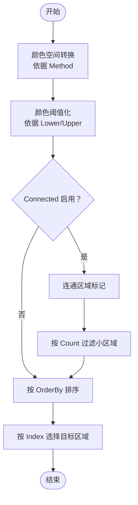

# 颜色匹配

<cite>
**本文引用的文件**
- [pipeline.go](file://pipeline.go)
- [context_test.go](file://context_test.go)
</cite>

## 目录
1. [简介](#简介)
2. [项目结构](#项目结构)
3. [核心组件](#核心组件)
4. [架构总览](#架构总览)
5. [详细组件分析](#详细组件分析)
6. [依赖关系分析](#依赖关系分析)
7. [性能考量](#性能考量)
8. [故障排查指南](#故障排查指南)
9. [结论](#结论)
10. [附录](#附录)

## 简介
本篇文档围绕 NodeColorMatchParam 结构体及其配套的 RecColorMatch 函数，系统阐述颜色匹配识别的参数配置与使用方法。重点包括：
- 颜色空间选择（RGB/HSV/GRAY）
- 颜色上下限（Lower/Upper）的设定方式与通道数量要求
- 像素计数阈值（Count）与连通区域分析（Connected）在去噪与精准识别中的作用
- 如何使用 RecColorMatch 构建高效的颜色匹配规则，实现对特定颜色区域的识别与简单图像分割

## 项目结构
与颜色匹配相关的核心代码位于 pipeline.go 中，包含：
- 颜色空间枚举与排序选项定义
- NodeColorMatchParam 结构体及各字段说明
- 配置选项函数（WithColorMatch*）与工厂函数 RecColorMatch

测试用例 context_test.go 展示了在实际场景中如何将这些参数注入到识别节点中。

图表来源
- [pipeline.go](file://pipeline.go#L756-L882)
- [context_test.go](file://context_test.go#L511-L542)

章节来源
- [pipeline.go](file://pipeline.go#L756-L882)
- [context_test.go](file://context_test.go#L511-L542)

## 核心组件
- NodeColorMatchMethod：颜色空间枚举，支持 RGB（默认）、HSV、GRAY。
- NodeColorMatchOrderBy：结果排序策略，支持按横坐标、纵坐标、匹配分数、区域面积、随机等。
- NodeColorMatchParam：颜色匹配识别的核心参数对象，包含：
  - ROI/ROIOffset：感兴趣区域与偏移
  - Method：颜色空间
  - Lower/Upper：颜色下界与上界，长度需与所选颜色空间通道数一致
  - Count：最小像素计数阈值
  - OrderBy/Index：结果排序与索引选择
  - Connected：是否启用连通区域分析
- RecColorMatch：基于给定 Lower/Upper 的颜色匹配识别工厂函数，支持通过 WithColorMatch* 选项进行配置。

章节来源
- [pipeline.go](file://pipeline.go#L756-L882)

## 架构总览
颜色匹配识别在框架中的位置与调用流程如下：

图表来源
- [pipeline.go](file://pipeline.go#L852-L867)

## 详细组件分析

### NodeColorMatchParam 字段详解
- ROI/ROIOffset：限定识别范围，可配合 ROIOffset 在 ROI 内做微调。
- Method：颜色空间选择，对应通道数分别为：
  - RGB：3通道
  - HSV：3通道
  - GRAY：1通道
- Lower/Upper：颜色范围边界，必须与 Method 对应的通道数一致；例如 RGB/HSV 需要每组边界为 3 元素，GRAY 需要每组边界为 1 元素。
- Count：像素计数阈值，仅当连通区域分析启用时，会以 Count 作为最小区域像素数门槛过滤结果。
- OrderBy/Index：结果排序策略与索引选择，便于从多个匹配区域中挑选目标。
- Connected：启用连通区域分析后，会对二值化后的颜色区域进行连通分量标记，并按阈值与排序策略输出。

章节来源
- [pipeline.go](file://pipeline.go#L776-L796)

### 颜色空间选择与上下限设定
- 颜色空间选择：
  - RGB：适合对三通道颜色直接匹配，常用于明暗变化较小的场景
  - HSV：对光照变化更鲁棒，适合在不同亮度下识别同一颜色
  - GRAY：单通道灰度匹配，适合黑白或灰阶图像
- 上下限设定要点：
  - Lower/Upper 必须是二维数组，外层数组表示多组颜色区间，内层数组元素个数需与所选颜色空间通道数一致
  - 多区间可叠加匹配，最终取并集
  - 区间边界建议结合具体图像数据统计，避免过宽导致误检或过窄导致漏检

章节来源
- [pipeline.go](file://pipeline.go#L776-L796)

### 像素计数阈值（Count）与连通区域分析（Connected）
- Count（像素计数阈值）：
  - 当 Connected 为真时，Count 作为最小连通区域像素数门槛，过滤掉面积过小的噪声区域
  - 合理设置 Count 可有效抑制细小噪点与伪匹配区域
- Connected（连通区域分析）：
  - 启用后会对颜色匹配得到的二值掩码进行连通分量标记
  - 结合 Count 进行区域筛选，再根据 OrderBy/Index 输出最终结果
  - 对于复杂背景或边缘模糊的区域，Connected 能显著提升稳定性

图表来源
- [pipeline.go](file://pipeline.go#L756-L882)

章节来源
- [pipeline.go](file://pipeline.go#L756-L882)

### 使用 RecColorMatch 构建高效颜色匹配规则
- 基本步骤：
  1) 准备 Lower/Upper：确保每组边界长度与颜色空间通道数一致
  2) 选择 Method：根据场景选择 RGB/HSV/GRAY
  3) 可选配置：
     - WithColorMatchROI/WithColorMatchROIOffset：限定识别区域
     - WithColorMatchCount：设置像素计数阈值（通常与 Connected 搭配）
     - WithColorMatchOrderBy：设置排序策略
     - WithColorMatchIndex：指定输出索引
     - WithColorMatchConnected：启用连通区域分析
  4) 调用 RecColorMatch 返回 NodeRecognition，加入流水线执行

- 实战要点：
  - 若背景复杂或存在光照变化，优先选择 HSV 并适当放宽上下限
  - 对于细小噪点较多的图像，务必启用 Connected 并合理设置 Count
  - 使用 OrderBy 按区域面积或分数排序，再用 Index 精确定位目标

章节来源
- [pipeline.go](file://pipeline.go#L852-L867)
- [context_test.go](file://context_test.go#L511-L542)

## 依赖关系分析
- NodeColorMatchParam 实现了识别参数接口（isRecognitionParam），用于统一识别节点参数类型
- RecColorMatch 依赖 WithColorMatch* 选项函数完成参数装配
- 测试用例 context_test.go 展示了将 ColorMatch 参数注入到识别节点的完整流程

图表来源
- [pipeline.go](file://pipeline.go#L776-L867)

章节来源
- [pipeline.go](file://pipeline.go#L776-L867)
- [context_test.go](file://context_test.go#L511-L542)

## 性能考量
- 颜色空间选择：
  - HSV 在光照变化场景更稳定，但计算略增；RGB 计算更快但易受光照影响
- ROI/ROIOffset：
  - 缩小识别区域可显著降低计算量
- Connected：
  - 启用连通分析会增加额外的图像处理开销，但能有效去噪
- Count：
  - 过小的 Count 会保留更多噪声，过大则可能漏检小目标
- OrderBy/Index：
  - 合理的排序与索引可减少后续处理分支，提高整体效率

## 故障排查指南
- 下限/上限长度不匹配：
  - 现象：参数校验失败或识别异常
  - 处理：确保每组 Lower/Upper 的元素个数与 Method 通道数一致
- Connected 未生效：
  - 现象：Count 未起作用
  - 处理：确认已启用 WithColorMatchConnected(true)，并合理设置 Count
- 结果为空或误检：
  - 现象：无匹配或匹配过多
  - 处理：调整 Method、Lower/Upper 区间；必要时启用 Connected 并增大 Count；优化 OrderBy/Index
- ROI 设置不当：
  - 现象：识别范围过大导致耗时或误检
  - 处理：使用 WithColorMatchROI/WithColorMatchROIOffset 精确限定区域

章节来源
- [pipeline.go](file://pipeline.go#L776-L882)
- [context_test.go](file://context_test.go#L511-L542)

## 结论
NodeColorMatchParam 提供了灵活而强大的颜色匹配能力，通过颜色空间选择、上下限设定、像素计数阈值与连通区域分析，能够在复杂背景下实现稳健的颜色识别与简单图像分割。配合 RecColorMatch 与 WithColorMatch* 选项，用户可以快速构建高效的识别规则，并在实践中不断优化参数以获得最佳效果。

## 附录
- 示例参考（测试用例）：
  - ColorMatch 参数注入与断言：见 [context_test.go](file://context_test.go#L511-L542)
- 相关实现参考：
  - 颜色匹配参数与工厂函数：见 [pipeline.go](file://pipeline.go#L756-L882)