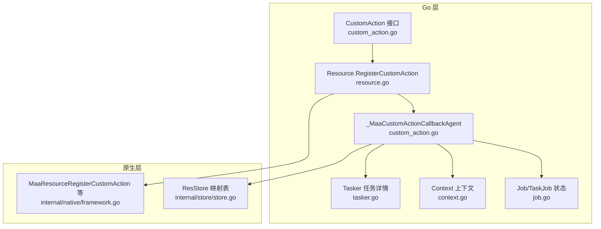
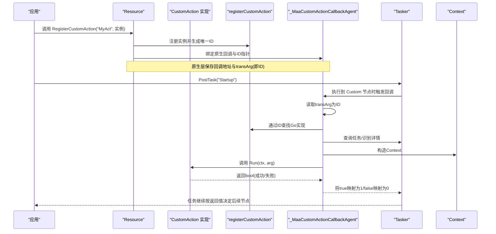
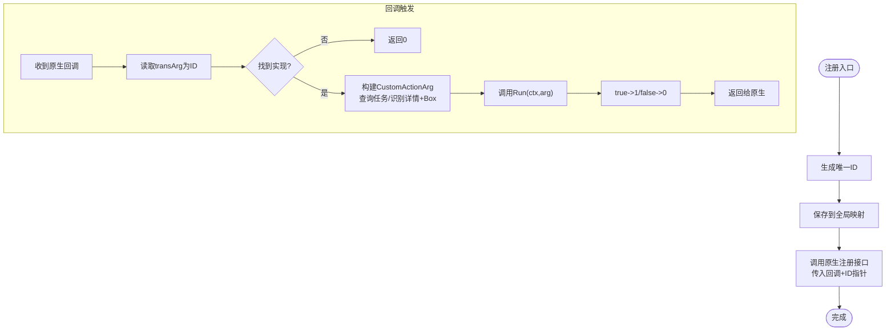
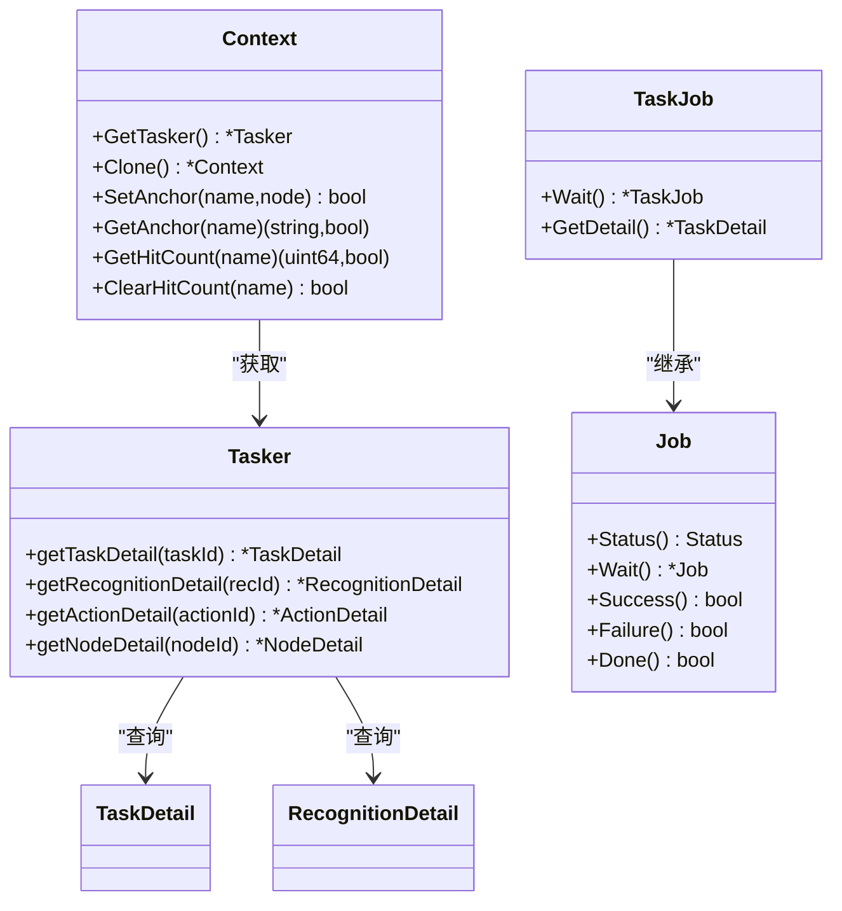
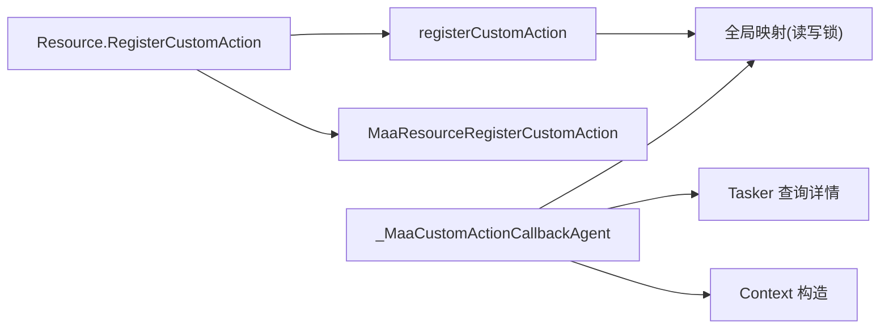

# 自定义动作

<cite>
**本文引用的文件**
- [custom_action.go](file://custom_action.go)
- [resource.go](file://resource.go)
- [tasker.go](file://tasker.go)
- [context.go](file://context.go)
- [job.go](file://job.go)
- [examples/custom-action/main.go](file://examples/custom-action/main.go)
- [examples/custom-action/resource/pipeline/pipeline.json](file://examples/custom-action/resource/pipeline/pipeline.json)
- [internal/native/framework.go](file://internal/native/framework.go)
- [internal/store/store.go](file://internal/store/store.go)
</cite>

## 目录
1. [简介](#简介)
2. [项目结构](#项目结构)
3. [核心组件](#核心组件)
4. [架构总览](#架构总览)
5. [组件详解](#组件详解)
6. [依赖关系分析](#依赖关系分析)
7. [性能与并发特性](#性能与并发特性)
8. [故障排查指南](#故障排查指南)
9. [结论](#结论)
10. [附录](#附录)

## 简介
本篇文档深入解析 maa-framework-go 中“自定义动作”的实现机制，围绕以下目标展开：
- 解释 CustomAction 接口设计与 Run 方法的调用时机、参数含义（CustomActionArg 中的任务详情、识别结果、目标框等）
- 剖析 registerCustomAction 函数与 _MaaCustomActionCallbackAgent 回调的工作原理，展示 Go 实现如何被注入到框架的动作执行流程
- 结合 examples/custom-action 示例，演示如何实现复杂逻辑（条件判断、状态维护、外部服务调用）
- 讨论动作执行成功/失败对任务流的影响
- 提供线程安全、资源管理与错误处理的最佳实践，以及性能优化建议（避免阻塞主线程、合理使用上下文）

## 项目结构
与“自定义动作”直接相关的代码主要分布在如下模块：
- 接口与回调：custom_action.go
- 资源注册与回调绑定：resource.go
- 任务执行与详情查询：tasker.go
- 上下文与任务详情：context.go
- 异步作业与状态：job.go
- 示例程序与流水线配置：examples/custom-action/*

图表来源
- [custom_action.go](file://custom_action.go#L1-L92)
- [resource.go](file://resource.go#L163-L182)
- [tasker.go](file://tasker.go#L285-L344)
- [context.go](file://context.go#L1-L240)
- [job.go](file://job.go#L1-L96)
- [internal/native/framework.go](file://internal/native/framework.go#L194-L206)
- [internal/store/store.go](file://internal/store/store.go#L54-L64)

章节来源
- [custom_action.go](file://custom_action.go#L1-L92)
- [resource.go](file://resource.go#L163-L182)
- [tasker.go](file://tasker.go#L285-L344)
- [context.go](file://context.go#L1-L240)
- [job.go](file://job.go#L1-L96)
- [internal/native/framework.go](file://internal/native/framework.go#L194-L206)
- [internal/store/store.go](file://internal/store/store.go#L54-L64)

## 核心组件
- CustomAction 接口：定义 Run(ctx, arg) bool，用于承载自定义动作逻辑
- CustomActionArg 参数：封装当前任务详情、当前节点名、自定义动作名、自定义参数、识别结果、目标框等
- 注册与回调：
  - registerCustomAction：为每个注册的 CustomAction 分配唯一 ID 并存入全局映射
  - _MaaCustomActionCallbackAgent：原生回调代理，根据传入 ID 查找对应 Go 实现并调用 Run
  - Resource.RegisterCustomAction：将自定义动作注册到资源，并通过原生接口绑定回调
- 任务详情与上下文：
  - Tasker.getTaskDetail/getRecognitionDetail：从原生层查询任务/识别详情
  - Context：提供运行时上下文能力（克隆、锚点、命中计数等）

章节来源
- [custom_action.go](file://custom_action.go#L37-L48)
- [custom_action.go](file://custom_action.go#L16-L24)
- [custom_action.go](file://custom_action.go#L50-L91)
- [resource.go](file://resource.go#L163-L182)
- [tasker.go](file://tasker.go#L285-L344)
- [context.go](file://context.go#L211-L239)

## 架构总览
下面以序列图展示一次“自定义动作”的完整调用链路，从资源注册到原生回调触发再到 Go 动作执行与返回值转换。

图表来源
- [resource.go](file://resource.go#L163-L182)
- [custom_action.go](file://custom_action.go#L16-L24)
- [custom_action.go](file://custom_action.go#L50-L91)
- [tasker.go](file://tasker.go#L285-L344)
- [context.go](file://context.go#L211-L239)

## 组件详解

### CustomAction 接口与参数
- 接口定义：Run(ctx *Context, arg *CustomActionArg) bool
  - ctx：当前执行上下文，可用于克隆、锚点、命中计数等
  - arg：动作参数，包含任务详情、当前节点名、自定义动作名、自定义参数、识别结果、目标框
- 参数字段说明（来自 CustomActionArg 定义）：
  - TaskDetail：当前任务的详细信息（由 Tasker 查询）
  - CurrentTaskName：当前任务名（字符串）
  - CustomActionName：在流水线中声明的自定义动作名（字符串）
  - CustomActionParam：自定义参数（字符串），可由 NodeCustomActionParam.WithCustomActionParam 设置
  - RecognitionDetail：最近一次识别的结果（含命中、框、原始图、绘制图等）
  - Box：目标矩形框（Rect），通常来自识别命中框或显式传入

章节来源
- [custom_action.go](file://custom_action.go#L37-L48)
- [custom_action.go](file://custom_action.go#L50-L91)
- [tasker.go](file://tasker.go#L141-L195)
- [tasker.go](file://tasker.go#L285-L344)

### 注册与回调绑定
- registerCustomAction：
  - 使用原子自增生成唯一 ID
  - 将实现存入全局映射（读写锁保护）
- _MaaCustomActionCallbackAgent：
  - 从 transArg 取出 ID，查找对应实现
  - 通过 Context.GetTasker 获取 Tasker，查询 TaskDetail 和 RecognitionDetail
  - 通过缓冲区读取 Box，构造 CustomActionArg
  - 调用 Run，将返回值映射为 1/0（true/false）
- Resource.RegisterCustomAction：
  - 先调用 registerCustomAction 获取 ID
  - 更新资源存储映射（ResStore），以便后续注销/清理
  - 调用原生 MaaResourceRegisterCustomAction，传入回调与 ID 指针

图表来源
- [custom_action.go](file://custom_action.go#L16-L24)
- [custom_action.go](file://custom_action.go#L50-L91)
- [resource.go](file://resource.go#L163-L182)
- [internal/native/framework.go](file://internal/native/framework.go#L194-L206)
- [internal/store/store.go](file://internal/store/store.go#L54-L64)

章节来源
- [custom_action.go](file://custom_action.go#L16-L24)
- [custom_action.go](file://custom_action.go#L50-L91)
- [resource.go](file://resource.go#L163-L182)
- [internal/native/framework.go](file://internal/native/framework.go#L194-L206)
- [internal/store/store.go](file://internal/store/store.go#L54-L64)

### 运行时数据流与任务详情
- Tasker.getTaskDetail：从原生层查询任务条目、节点列表与状态，组装为 TaskDetail
- Tasker.getRecognitionDetail：查询识别名称、算法、命中、框、原始图、绘制图等
- Context.GetTasker：从当前上下文中获取 Tasker，用于查询详情
- Job/TaskJob：异步作业模型，支持 Wait/Success/Failure/Done 等状态判定

图表来源
- [tasker.go](file://tasker.go#L285-L344)
- [tasker.go](file://tasker.go#L141-L195)
- [context.go](file://context.go#L1-L240)
- [job.go](file://job.go#L1-L96)

章节来源
- [tasker.go](file://tasker.go#L285-L344)
- [tasker.go](file://tasker.go#L141-L195)
- [context.go](file://context.go#L1-L240)
- [job.go](file://job.go#L1-L96)

### 示例：自定义动作的实现与使用
- 示例程序：
  - 在示例中通过 Resource.RegisterCustomAction("MyAct", 实例) 注册自定义动作
  - 流水线配置 Startup 节点设置 action 为 Custom，custom_action 为 "MyAct"
  - 执行任务后打印 TaskDetail，验证动作已执行
- 复杂逻辑建议：
  - 条件判断：基于 RecognitionDetail.Hit 或 CustomActionArg.RecognitionDetail 的内容进行分支
  - 状态维护：利用 Context.SetAnchor/GetAnchor/GetHitCount/ClearHitCount 维护锚点与命中计数
  - 外部服务调用：在 Run 中发起网络请求或本地服务调用，注意避免阻塞主线程（见性能建议）

章节来源
- [examples/custom-action/main.go](file://examples/custom-action/main.go#L1-L49)
- [examples/custom-action/resource/pipeline/pipeline.json](file://examples/custom-action/resource/pipeline/pipeline.json#L1-L6)

## 依赖关系分析
- 耦合与内聚：
  - Resource 与 custom_action 通过 registerCustomAction/_MaaCustomActionCallbackAgent 解耦
  - 回调代理仅依赖全局映射与 Tasker/Context 的只读查询
- 直接与间接依赖：
  - Resource.RegisterCustomAction 依赖 registerCustomAction、ResStore、原生接口
  - _MaaCustomActionCallbackAgent 依赖 Tasker 查询与缓冲区读取
- 外部依赖：
  - 原生接口 MaaResourceRegisterCustomAction 等由 internal/native/framework.go 提供

图表来源
- [resource.go](file://resource.go#L163-L182)
- [custom_action.go](file://custom_action.go#L16-L24)
- [custom_action.go](file://custom_action.go#L50-L91)
- [tasker.go](file://tasker.go#L285-L344)
- [context.go](file://context.go#L211-L239)
- [internal/native/framework.go](file://internal/native/framework.go#L194-L206)

章节来源
- [resource.go](file://resource.go#L163-L182)
- [custom_action.go](file://custom_action.go#L16-L24)
- [custom_action.go](file://custom_action.go#L50-L91)
- [tasker.go](file://tasker.go#L285-L344)
- [context.go](file://context.go#L211-L239)
- [internal/native/framework.go](file://internal/native/framework.go#L194-L206)

## 性能与并发特性
- 线程安全
  - registerCustomAction/unregisterCustomAction 使用原子自增与读写锁保护全局映射
  - ResStore 使用 RWMutex，确保资源/控制器/回调映射的并发安全
- 避免阻塞主线程
  - Run 中尽量避免长时间阻塞操作；如需外部服务调用，应采用异步或超时控制
  - 使用 Context.Clone 创建独立上下文，避免共享状态竞争
- 资源管理
  - 缓冲区（字符串、图像、矩形等）在回调中按需创建并在作用域结束销毁
  - Resource/Tasker/Controller 在使用完毕后及时 Destroy，释放底层资源
- 错误处理
  - Run 返回值直接映射为 1/0，原生层据此决定任务流走向
  - 对于不可恢复错误，建议在 Run 内部记录日志并尽早返回 false，使上层能正确处理失败路径

章节来源
- [custom_action.go](file://custom_action.go#L16-L24)
- [custom_action.go](file://custom_action.go#L50-L91)
- [resource.go](file://resource.go#L1-L54)
- [tasker.go](file://tasker.go#L1-L48)
- [internal/store/store.go](file://internal/store/store.go#L1-L64)

## 故障排查指南
- 动作未生效
  - 检查 Resource.RegisterCustomAction 是否成功返回
  - 确认流水线节点 action 为 Custom，custom_action 名称与注册一致
- 动作执行但任务失败
  - Run 返回 false 会导致任务流走失败分支；检查 Run 内部逻辑与返回值
  - 使用 Tasker.getTaskDetail/TaskJob.GetDetail 获取详细信息定位问题
- 回调未触发
  - 确认资源已加载且已绑定到 Tasker
  - 检查 _MaaCustomActionCallbackAgent 是否被正确注册（ID 指针传递）
- 资源泄漏
  - 确保 Resource/Tasker/Controller 在使用后 Destroy
  - 清理自定义动作：Resource.UnregisterCustomAction 或 Resource.ClearCustomAction

章节来源
- [resource.go](file://resource.go#L184-L210)
- [job.go](file://job.go#L66-L96)
- [tasker.go](file://tasker.go#L285-L344)

## 结论
maa-framework-go 的自定义动作机制通过“接口 + 回调代理 + 资源注册”的方式，将 Go 实现无缝注入到原生任务执行流程中。CustomAction.Run 提供了丰富的上下文与识别信息，使得开发者可以实现复杂的条件判断、状态维护与外部服务集成。配合严格的线程安全与资源管理策略，可在保证稳定性的同时获得良好的性能表现。

## 附录
- 关键流程参考路径
  - 注册回调：[resource.go](file://resource.go#L163-L182)
  - 回调代理：[custom_action.go](file://custom_action.go#L50-L91)
  - 任务详情查询：[tasker.go](file://tasker.go#L285-L344)
  - 上下文能力：[context.go](file://context.go#L211-L239)
  - 示例程序：[examples/custom-action/main.go](file://examples/custom-action/main.go#L1-L49)
  - 示例流水线：[examples/custom-action/resource/pipeline/pipeline.json](file://examples/custom-action/resource/pipeline/pipeline.json#L1-L6)