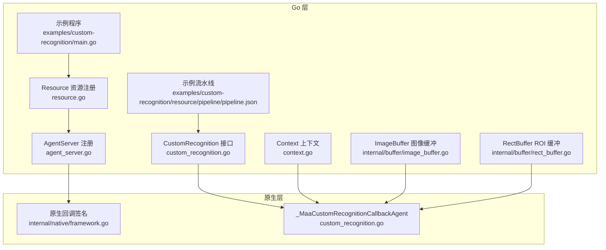
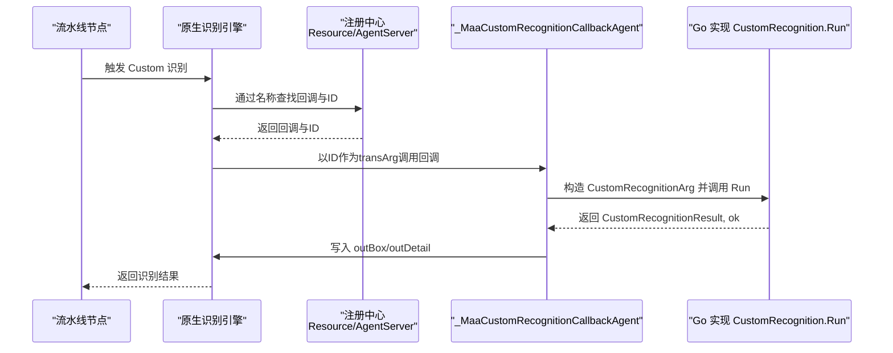
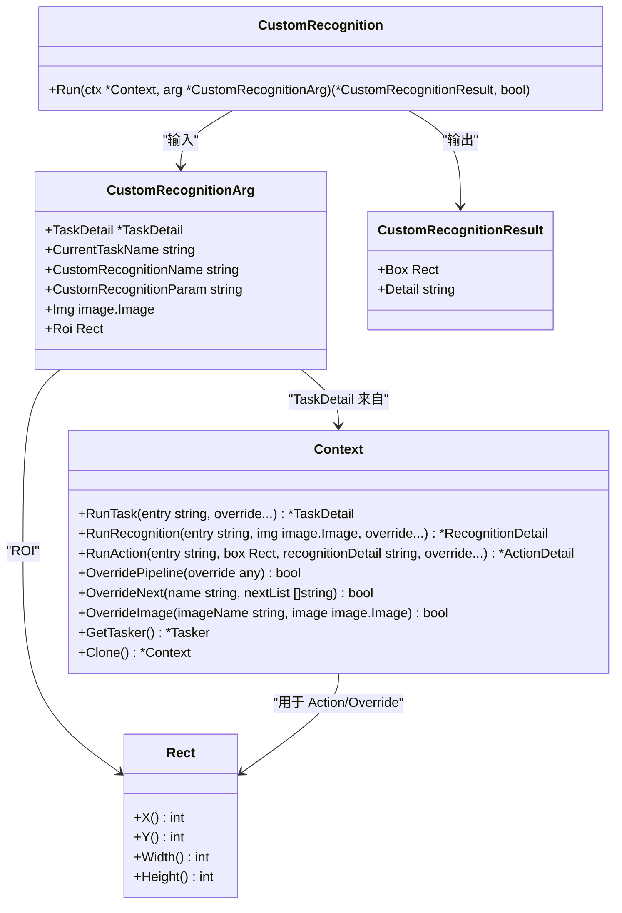
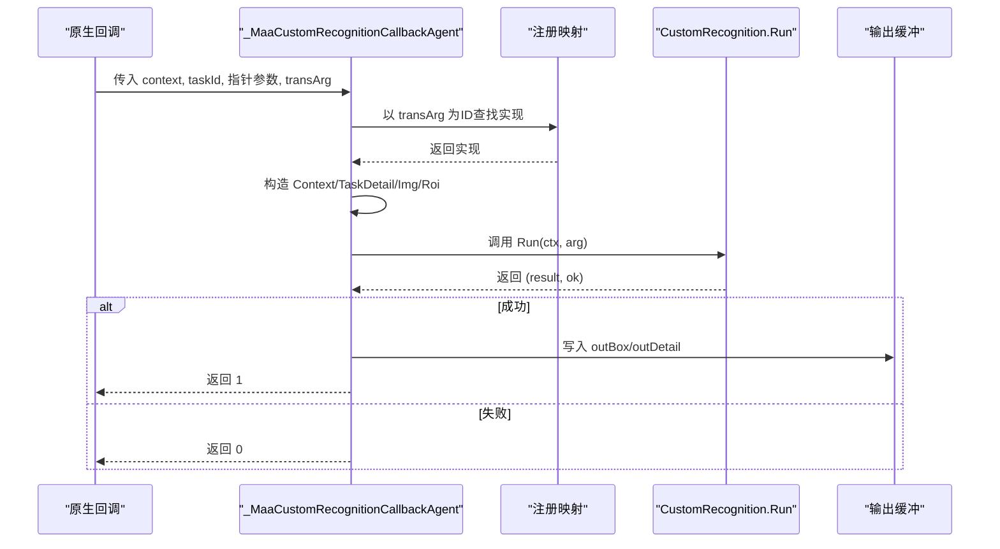
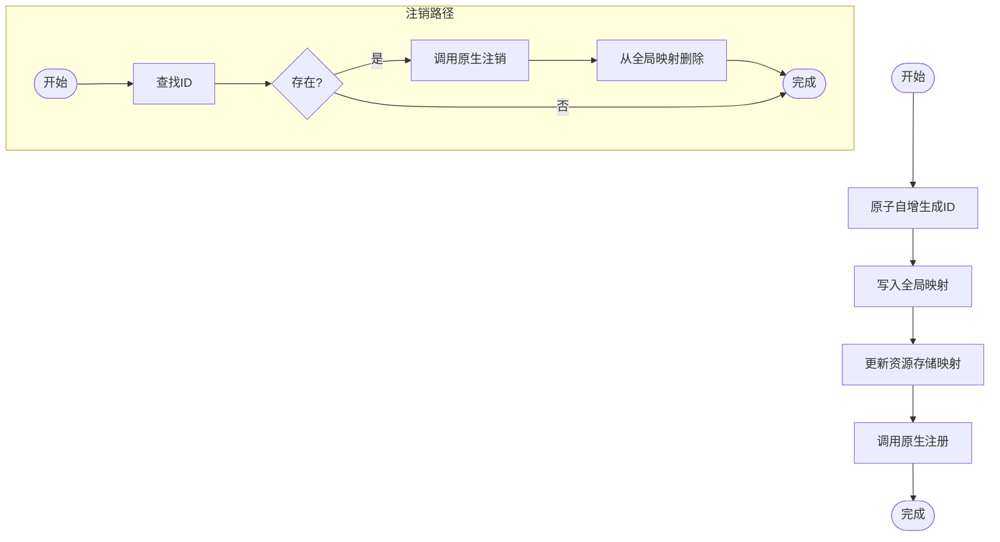
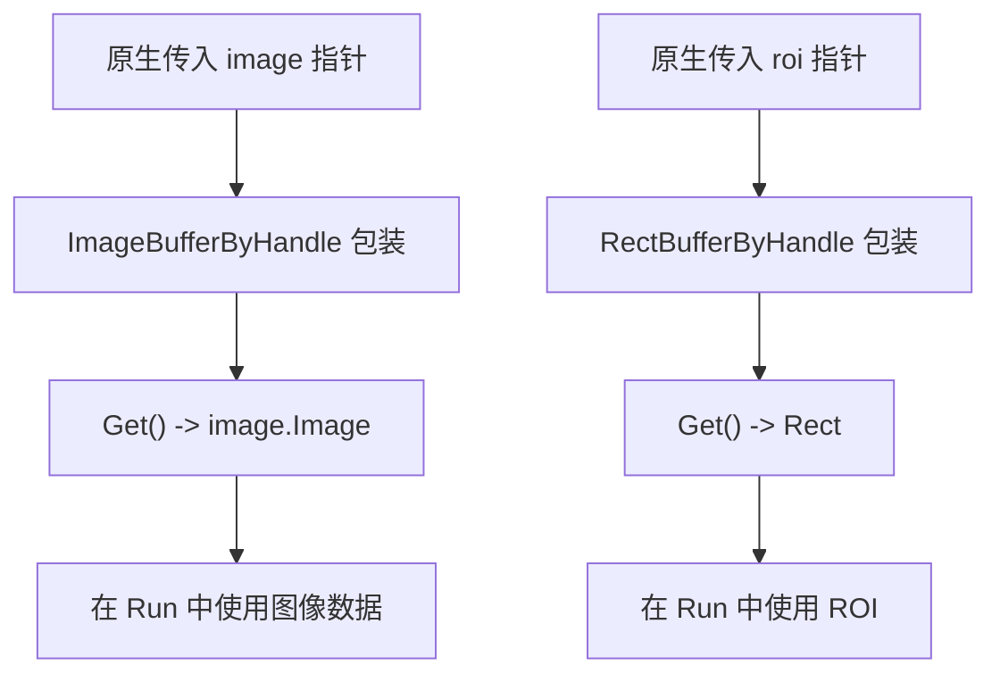
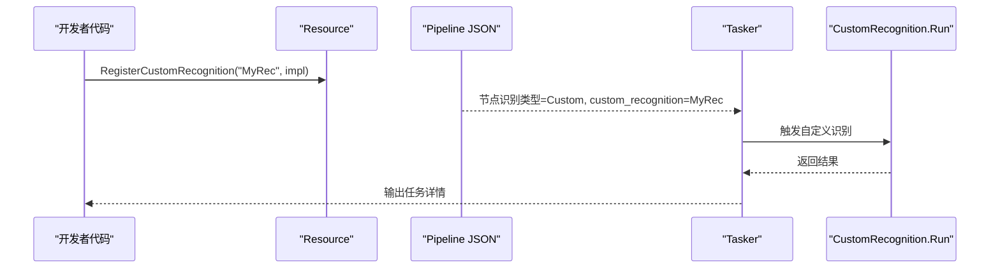
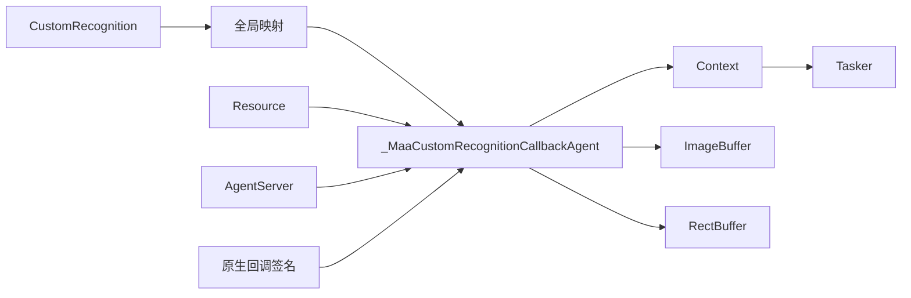

# 自定义识别

<cite>
**本文引用的文件**
- [custom_recognition.go](file://custom_recognition.go)
- [context.go](file://context.go)
- [rect.go](file://rect.go)
- [internal/rect/rect.go](file://internal/rect/rect.go)
- [internal/buffer/image_buffer.go](file://internal/buffer/image_buffer.go)
- [internal/buffer/rect_buffer.go](file://internal/buffer/rect_buffer.go)
- [resource.go](file://resource.go)
- [agent_server.go](file://agent_server.go)
- [examples/custom-recognition/main.go](file://examples/custom-recognition/main.go)
- [examples/custom-recognition/resource/pipeline/pipeline.json](file://examples/custom-recognition/resource/pipeline/pipeline.json)
- [internal/native/framework.go](file://internal/native/framework.go)
- [pipeline.go](file://pipeline.go)
</cite>

## 目录
1. [简介](#简介)
2. [项目结构](#项目结构)
3. [核心组件](#核心组件)
4. [架构总览](#架构总览)
5. [详细组件分析](#详细组件分析)
6. [依赖关系分析](#依赖关系分析)
7. [性能考量](#性能考量)
8. [故障排查指南](#故障排查指南)
9. [结论](#结论)
10. [附录](#附录)

## 简介
本章节面向希望在 maa-framework-go 中实现自定义识别能力的开发者，系统讲解 CustomRecognition 接口的定义、参数与返回值结构、注册与回调桥接机制，以及如何在流水线中引用自定义识别器。文档同时覆盖线程安全的注册/注销流程、上下文传递、图像数据与 ROI 区域处理、性能影响因素与调试策略，帮助读者从零开始构建稳定高效的自定义识别器。

## 项目结构
围绕自定义识别的相关文件组织如下：
- 接口与回调桥接：custom_recognition.go
- 上下文与流水线调用：context.go
- ROI 类型与缓冲区：rect.go、internal/rect/rect.go、internal/buffer/rect_buffer.go
- 图像缓冲区：internal/buffer/image_buffer.go
- 注册入口与资源绑定：resource.go、agent_server.go
- 示例：examples/custom-recognition/main.go、examples/custom-recognition/resource/pipeline/pipeline.json
- 原生接口声明：internal/native/framework.go
- 流水线节点类型：pipeline.go

图表来源
- [custom_recognition.go](file://custom_recognition.go#L1-L102)
- [context.go](file://context.go#L1-L240)
- [internal/buffer/image_buffer.go](file://internal/buffer/image_buffer.go#L1-L130)
- [internal/buffer/rect_buffer.go](file://internal/buffer/rect_buffer.go#L1-L59)
- [resource.go](file://resource.go#L114-L161)
- [agent_server.go](file://agent_server.go#L9-L20)
- [internal/native/framework.go](file://internal/native/framework.go#L51-L51)
- [examples/custom-recognition/main.go](file://examples/custom-recognition/main.go#L1-L77)
- [examples/custom-recognition/resource/pipeline/pipeline.json](file://examples/custom-recognition/resource/pipeline/pipeline.json#L1-L12)

章节来源
- [custom_recognition.go](file://custom_recognition.go#L1-L102)
- [resource.go](file://resource.go#L114-L161)
- [agent_server.go](file://agent_server.go#L9-L20)
- [examples/custom-recognition/main.go](file://examples/custom-recognition/main.go#L1-L77)
- [examples/custom-recognition/resource/pipeline/pipeline.json](file://examples/custom-recognition/resource/pipeline/pipeline.json#L1-L12)

## 核心组件
- CustomRecognition 接口：定义 Run 方法，接收 Context 与 CustomRecognitionArg，返回 CustomRecognitionResult 与布尔标志。
- CustomRecognitionArg：包含任务详情、当前任务名、自定义识别器名称、参数字符串、图像对象与 ROI 区域。
- CustomRecognitionResult：包含识别框与详细信息字符串。
- 回调代理 _MaaCustomRecognitionCallbackAgent：将原生传入的指针参数转换为 Go 对象，调用 Go 实现的 Run 并回写结果。
- 注册与注销：registerCustomRecognition/unregisterCustomRecognition 提供线程安全的映射管理；Resource 与 AgentServer 提供注册入口。

章节来源
- [custom_recognition.go](file://custom_recognition.go#L38-L54)
- [custom_recognition.go](file://custom_recognition.go#L56-L102)
- [resource.go](file://resource.go#L114-L161)
- [agent_server.go](file://agent_server.go#L9-L20)

## 架构总览
自定义识别的调用链路如下：
- 在流水线中配置识别节点为 Custom，并指定自定义识别器名称。
- Resource 或 AgentServer 将 Go 的 CustomRecognition 实例注册到原生层，原生层保存回调代理与唯一 ID。
- 当原生识别触发时，回调代理根据 ID 查找 Go 实现，构造 CustomRecognitionArg，调用 Run，再将结果写回原生缓冲区。

图表来源
- [resource.go](file://resource.go#L114-L161)
- [agent_server.go](file://agent_server.go#L9-L20)
- [custom_recognition.go](file://custom_recognition.go#L56-L102)
- [internal/native/framework.go](file://internal/native/framework.go#L51-L51)

## 详细组件分析

### CustomRecognition 接口与参数结构
- 接口定义
  - Run(ctx *Context, arg *CustomRecognitionArg) (*CustomRecognitionResult, bool)
  - 返回值第二项用于指示是否成功匹配，成功时写入 outBox 与 outDetail。
- 参数结构 CustomRecognitionArg
  - TaskDetail：当前任务的详细信息
  - CurrentTaskName：当前任务名
  - CustomRecognitionName：自定义识别器名称
  - CustomRecognitionParam：自定义识别器参数字符串
  - Img：image.Image，即原生传入的图像数据
  - Roi：Rect，ROI 区域
- 返回结构 CustomRecognitionResult
  - Box：Rect，识别框
  - Detail：string，识别详情

图表来源
- [custom_recognition.go](file://custom_recognition.go#L38-L54)
- [context.go](file://context.go#L1-L240)
- [rect.go](file://rect.go#L1-L6)
- [internal/rect/rect.go](file://internal/rect/rect.go#L1-L21)

章节来源
- [custom_recognition.go](file://custom_recognition.go#L38-L54)
- [context.go](file://context.go#L1-L240)
- [rect.go](file://rect.go#L1-L6)
- [internal/rect/rect.go](file://internal/rect/rect.go#L1-L21)

### 回调桥接与上下文传递
- 回调代理 _MaaCustomRecognitionCallbackAgent
  - 从 transArg 获取 uint64 ID，读取全局映射找到 Go 实现
  - 从原生句柄构造 Context、TaskDetail、image.Image 与 Rect
  - 调用 recognition.Run，成功后将结果写入 outBox 与 outDetail
- 上下文 Context
  - 提供 RunTask、RunRecognition、RunAction、OverridePipeline、OverrideNext、OverrideImage、GetTasker、Clone 等能力
  - 可在 Run 中进一步驱动流水线或执行动作

图表来源
- [custom_recognition.go](file://custom_recognition.go#L56-L102)
- [context.go](file://context.go#L1-L240)
- [internal/buffer/image_buffer.go](file://internal/buffer/image_buffer.go#L48-L69)
- [internal/buffer/rect_buffer.go](file://internal/buffer/rect_buffer.go#L36-L59)

章节来源
- [custom_recognition.go](file://custom_recognition.go#L56-L102)
- [context.go](file://context.go#L1-L240)
- [internal/buffer/image_buffer.go](file://internal/buffer/image_buffer.go#L48-L69)
- [internal/buffer/rect_buffer.go](file://internal/buffer/rect_buffer.go#L36-L59)

### 注册与注销机制（线程安全）
- 全局映射与互斥锁
  - 使用原子自增生成唯一 ID
  - 使用 RWMutex 保护映射，读多写少场景下保证并发安全
- Resource 注册
  - RegisterCustomRecognition：先注册到全局映射，再更新资源存储中的名称到ID映射，最后调用原生注册
  - UnregisterCustomRecognition：从资源存储移除映射，调用原生注销，并从全局映射删除
  - ClearCustomRecognition：清空所有已注册的自定义识别器
- AgentServer 注册
  - AgentServerRegisterCustomRecognition：直接调用原生注册，传入回调与 ID

图表来源
- [custom_recognition.go](file://custom_recognition.go#L17-L36)
- [resource.go](file://resource.go#L114-L161)
- [resource.go](file://resource.go#L136-L161)
- [resource.go](file://resource.go#L151-L161)
- [agent_server.go](file://agent_server.go#L9-L20)

章节来源
- [custom_recognition.go](file://custom_recognition.go#L17-L36)
- [resource.go](file://resource.go#L114-L161)
- [resource.go](file://resource.go#L136-L161)
- [resource.go](file://resource.go#L151-L161)
- [agent_server.go](file://agent_server.go#L9-L20)

### 图像数据获取与 ROI 区域处理
- 图像数据
  - 原生传入 image 指针，通过 ImageBuffer 包装，Get() 返回 image.Image
  - Set() 将 image.Image 转换为原生所需的 RGB 数据格式
- ROI 区域
  - 原生传入 roi 指针，通过 RectBuffer 包装，Get() 返回 Rect
  - Rect 提供 X/Y/Width/Height 访问器
- 在 Run 中可结合 Context 的 OverridePipeline/OverrideNext 等能力进行动态控制

图表来源
- [custom_recognition.go](file://custom_recognition.go#L76-L91)
- [internal/buffer/image_buffer.go](file://internal/buffer/image_buffer.go#L48-L69)
- [internal/buffer/rect_buffer.go](file://internal/buffer/rect_buffer.go#L36-L59)
- [rect.go](file://rect.go#L1-L6)
- [internal/rect/rect.go](file://internal/rect/rect.go#L1-L21)

章节来源
- [custom_recognition.go](file://custom_recognition.go#L76-L91)
- [internal/buffer/image_buffer.go](file://internal/buffer/image_buffer.go#L48-L69)
- [internal/buffer/rect_buffer.go](file://internal/buffer/rect_buffer.go#L36-L59)
- [rect.go](file://rect.go#L1-L6)
- [internal/rect/rect.go](file://internal/rect/rect.go#L1-L21)

### 在流水线中引用自定义识别器
- 示例程序
  - 在示例中通过 Resource.RegisterCustomRecognition("MyRec", &MyRec{}) 注册自定义识别器
  - 通过 tasker.PostTask("Startup") 触发流水线
- 流水线配置
  - pipeline.json 中将节点识别类型设为 "Custom"，并指定 custom_recognition 为 "MyRec"
- 运行效果
  - 启动后会调用自定义识别器的 Run，返回识别框与详情

图表来源
- [examples/custom-recognition/main.go](file://examples/custom-recognition/main.go#L38-L42)
- [examples/custom-recognition/resource/pipeline/pipeline.json](file://examples/custom-recognition/resource/pipeline/pipeline.json#L1-L12)
- [custom_recognition.go](file://custom_recognition.go#L56-L102)

章节来源
- [examples/custom-recognition/main.go](file://examples/custom-recognition/main.go#L1-L77)
- [examples/custom-recognition/resource/pipeline/pipeline.json](file://examples/custom-recognition/resource/pipeline/pipeline.json#L1-L12)

### 原生回调签名与注册入口
- 原生回调签名
  - MaaCustomRecognitionCallback 定义了回调函数原型，包含 context、taskId、字符串指针、图像与 ROI 指针、transArg、outBox/outDetail 指针等
- 注册入口
  - Resource.RegisterCustomRecognition：将 Go 实现注册到资源
  - AgentServerRegisterCustomRecognition：将 Go 实现注册到 AgentServer
  - 两者均通过 _MaaCustomRecognitionCallbackAgent 作为回调，并将 ID 以指针形式传给原生层

章节来源
- [internal/native/framework.go](file://internal/native/framework.go#L51-L51)
- [resource.go](file://resource.go#L114-L161)
- [agent_server.go](file://agent_server.go#L9-L20)

## 依赖关系分析
- 组件耦合
  - CustomRecognition 与 _MaaCustomRecognitionCallbackAgent 强耦合于全局映射
  - Context 与 Tasker 提供上下文能力，被回调代理与 Run 使用
  - ImageBuffer/RectBuffer 将原生指针与 Go 类型桥接
- 外部依赖
  - 原生库通过 purego 动态加载函数
  - image.Image 与 image/draw 用于像素格式转换

图表来源
- [custom_recognition.go](file://custom_recognition.go#L17-L36)
- [custom_recognition.go](file://custom_recognition.go#L56-L102)
- [context.go](file://context.go#L1-L240)
- [internal/buffer/image_buffer.go](file://internal/buffer/image_buffer.go#L1-L130)
- [internal/buffer/rect_buffer.go](file://internal/buffer/rect_buffer.go#L1-L59)
- [resource.go](file://resource.go#L114-L161)
- [agent_server.go](file://agent_server.go#L9-L20)
- [internal/native/framework.go](file://internal/native/framework.go#L51-L51)

章节来源
- [custom_recognition.go](file://custom_recognition.go#L17-L36)
- [custom_recognition.go](file://custom_recognition.go#L56-L102)
- [context.go](file://context.go#L1-L240)
- [internal/buffer/image_buffer.go](file://internal/buffer/image_buffer.go#L1-L130)
- [internal/buffer/rect_buffer.go](file://internal/buffer/rect_buffer.go#L1-L59)
- [resource.go](file://resource.go#L114-L161)
- [agent_server.go](file://agent_server.go#L9-L20)
- [internal/native/framework.go](file://internal/native/framework.go#L51-L51)

## 性能考量
- 识别频率
  - 频繁触发的自定义识别会增加回调开销，建议在 Run 中尽量减少重复计算，必要时缓存中间结果
- 图像大小
  - 大图会显著增加图像转换与识别成本，可在 Run 中对图像进行裁剪或缩放后再处理
- 算法复杂度
  - 复杂算法应避免在回调主线程中长时间阻塞，必要时异步化或分阶段处理
- ROI 限制
  - 合理设置 ROI 可缩小搜索范围，提升性能
- 上下文操作
  - Context 的 OverridePipeline/OverrideNext/RunTask/RunRecognition/RunAction 等操作可能引入额外开销，应按需使用

[本节为通用指导，不直接分析具体文件]

## 故障排查指南
- 回调未命中
  - 检查注册名称与流水线配置是否一致
  - 确认 Resource.RegisterCustomRecognition 或 AgentServerRegisterCustomRecognition 是否成功
- 结果为空
  - 确认 Run 返回的 ok 为真，且 Result.Box/Detail 已正确设置
  - 检查 ROI 是否合理，图像是否为空
- 线程安全问题
  - 确保在注销前不再使用已注销的实现
  - 避免在并发环境下同时注册/注销同一名称
- 日志与验证
  - 利用 Context 的 OverridePipeline/OverrideNext 等能力进行局部验证
  - 在 Run 中打印关键参数（如 CurrentTaskName、CustomRecognitionParam、ROI）辅助定位问题

章节来源
- [custom_recognition.go](file://custom_recognition.go#L56-L102)
- [resource.go](file://resource.go#L114-L161)
- [context.go](file://context.go#L1-L240)

## 结论
通过 CustomRecognition 接口与 _MaaCustomRecognitionCallbackAgent 桥接，maa-framework-go 为自定义识别提供了清晰、可扩展的机制。配合 Resource/AgentServer 的注册入口、Context 的上下文能力、以及 ImageBuffer/RectBuffer 的数据桥接，开发者可以快速实现高性能、可维护的自定义识别器，并在流水线中灵活引用与调试。

[本节为总结性内容，不直接分析具体文件]

## 附录

### API 一览（概念性）
- CustomRecognition.Run(ctx, arg) -> (result, ok)
- Resource.RegisterCustomRecognition(name, impl) -> bool
- AgentServerRegisterCustomRecognition(name, impl) -> bool
- Context.RunTask/RunRecognition/RunAction/OverridePipeline/OverrideNext/Clone
- ImageBuffer.Get/Set
- RectBuffer.Get/Set

[本节为概览性内容，不直接分析具体文件]