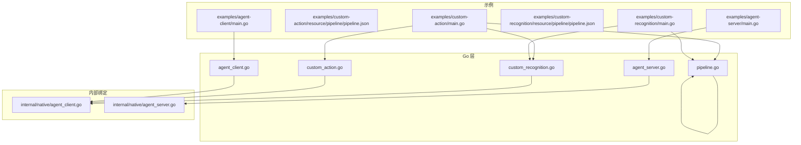
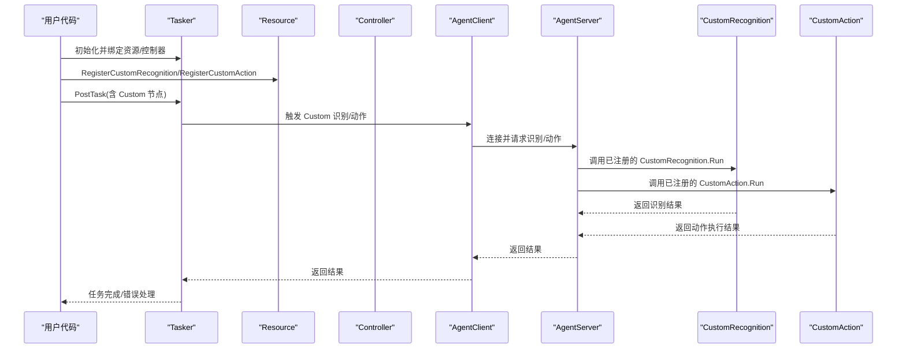
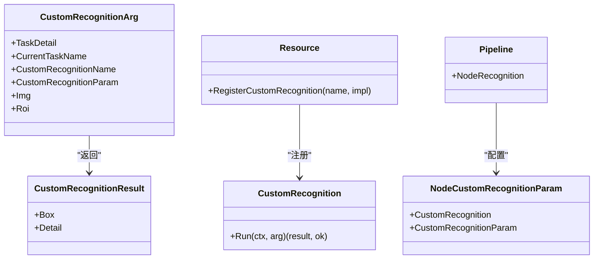
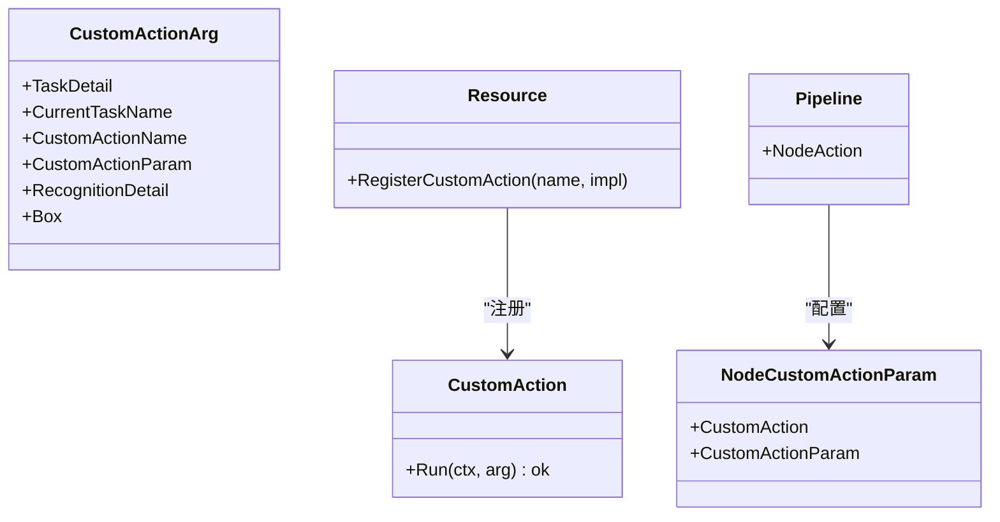
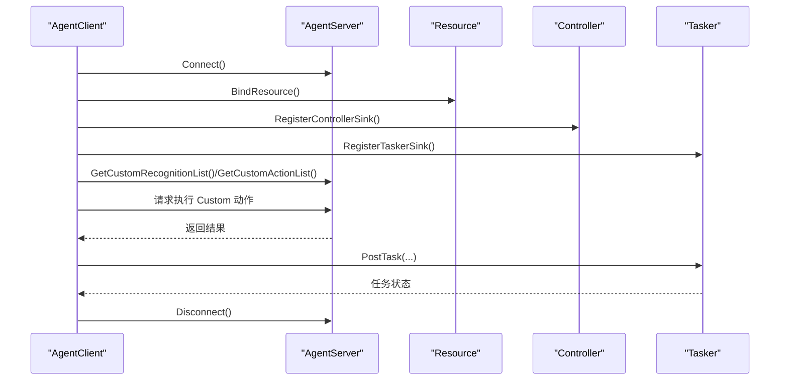
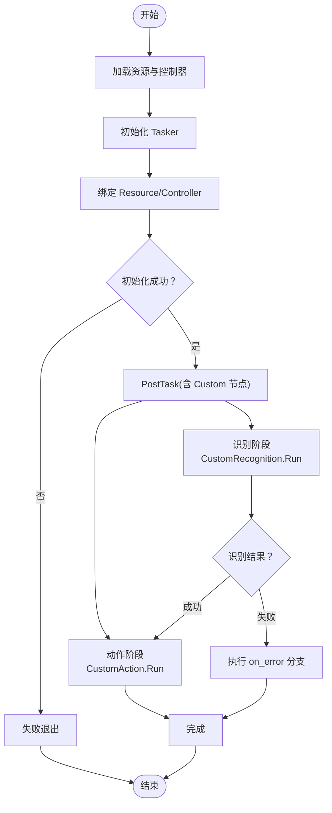
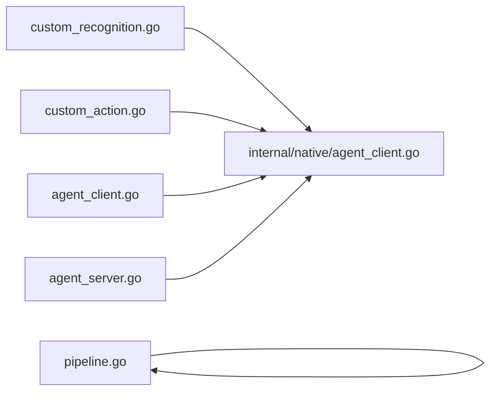

# 高级功能

<cite>
**本文引用的文件**
- [custom_recognition.go](file://custom_recognition.go)
- [custom_action.go](file://custom_action.go)
- [agent_client.go](file://agent_client.go)
- [agent_server.go](file://agent_server.go)
- [pipeline.go](file://pipeline.go)
- [examples/custom-action/main.go](file://examples/custom-action/main.go)
- [examples/custom-action/resource/pipeline/pipeline.json](file://examples/custom-action/resource/pipeline/pipeline.json)
- [examples/custom-recognition/main.go](file://examples/custom-recognition/main.go)
- [examples/custom-recognition/resource/pipeline/pipeline.json](file://examples/custom-recognition/resource/pipeline/pipeline.json)
- [examples/agent-client/main.go](file://examples/agent-client/main.go)
- [examples/agent-server/main.go](file://examples/agent-server/main.go)
- [internal/native/agent_client.go](file://internal/native/agent_client.go)
- [internal/native/agent_server.go](file://internal/native/agent_server.go)
</cite>

## 目录
1. [简介](#简介)
2. [项目结构](#项目结构)
3. [核心组件](#核心组件)
4. [架构总览](#架构总览)
5. [详细组件分析](#详细组件分析)
6. [依赖分析](#依赖分析)
7. [性能考虑](#性能考虑)
8. [故障排查指南](#故障排查指南)
9. [结论](#结论)
10. [附录](#附录)

## 简介
本章节面向需要深度扩展 MaaFramework 的开发者，系统讲解以下高级能力：
- 自定义识别算法：实现 CustomRecognition 接口、注册自定义识别器、在流水线中使用 Custom 类型识别节点。
- 自定义动作逻辑：实现 CustomAction 接口、注册自定义动作、在流水线中使用 Custom 类型动作节点。
- Agent 架构：AgentClient 如何与外部 AgentServer 进程通信；AgentServer 如何暴露自定义动作与识别功能。
- 基于 JSON 的流水线配置协议：节点类型、识别算法配置、动作类型、条件分支与控制流。

通过 examples 目录中的 custom-action、custom-recognition、agent-client/server 示例，给出完整的实现细节、调用关系与最佳实践，并讨论性能影响与调试策略。

## 项目结构
该仓库采用“Go 包 + 内部 native 绑定”的分层设计：
- 上层 Go API：提供用户友好的类型与方法（如 Pipeline、Node、CustomRecognition、CustomAction、AgentClient/AgentServer）。
- 内部 native 层：通过 purego 动态加载平台库（MaaAgentClient、MaaAgentServer），桥接 Go 与底层 C/C++ 实现。
- examples：提供可直接运行的示例，覆盖自定义识别、自定义动作、Agent 客户端/服务端通信。

图表来源
- [custom_recognition.go](file://custom_recognition.go#L1-L103)
- [custom_action.go](file://custom_action.go#L1-L92)
- [agent_client.go](file://agent_client.go#L1-L112)
- [agent_server.go](file://agent_server.go#L1-L102)
- [pipeline.go](file://pipeline.go#L1-L2115)
- [internal/native/agent_client.go](file://internal/native/agent_client.go#L1-L79)
- [internal/native/agent_server.go](file://internal/native/agent_server.go#L1-L72)
- [examples/custom-action/main.go](file://examples/custom-action/main.go#L1-L49)
- [examples/custom-action/resource/pipeline/pipeline.json](file://examples/custom-action/resource/pipeline/pipeline.json#L1-L6)
- [examples/custom-recognition/main.go](file://examples/custom-recognition/main.go#L1-L77)
- [examples/custom-recognition/resource/pipeline/pipeline.json](file://examples/custom-recognition/resource/pipeline/pipeline.json#L1-L12)
- [examples/agent-client/main.go](file://examples/agent-client/main.go#L1-L56)
- [examples/agent-server/main.go](file://examples/agent-server/main.go#L1-L37)

章节来源
- [custom_recognition.go](file://custom_recognition.go#L1-L103)
- [custom_action.go](file://custom_action.go#L1-L92)
- [agent_client.go](file://agent_client.go#L1-L112)
- [agent_server.go](file://agent_server.go#L1-L102)
- [pipeline.go](file://pipeline.go#L1-L2115)
- [internal/native/agent_client.go](file://internal/native/agent_client.go#L1-L79)
- [internal/native/agent_server.go](file://internal/native/agent_server.go#L1-L72)
- [examples/custom-action/main.go](file://examples/custom-action/main.go#L1-L49)
- [examples/custom-action/resource/pipeline/pipeline.json](file://examples/custom-action/resource/pipeline/pipeline.json#L1-L6)
- [examples/custom-recognition/main.go](file://examples/custom-recognition/main.go#L1-L77)
- [examples/custom-recognition/resource/pipeline/pipeline.json](file://examples/custom-recognition/resource/pipeline/pipeline.json#L1-L12)
- [examples/agent-client/main.go](file://examples/agent-client/main.go#L1-L56)
- [examples/agent-server/main.go](file://examples/agent-server/main.go#L1-L37)

## 核心组件
- 自定义识别接口与回调
  - CustomRecognition 接口定义 Run 方法，接收 Context 与 CustomRecognitionArg，返回 CustomRecognitionResult 与布尔结果。
  - 注册机制：通过 registerCustomRecognition 将实现对象映射到唯一 ID；回调代理 _MaaCustomRecognitionCallbackAgent 负责从底层传入的 transArg 中取出 ID 并调用对应实现。
  - 参数与结果：包含任务详情、当前任务名、识别器名称、参数、图像与 ROI 等；结果包含目标框与详情字符串。
- 自定义动作接口与回调
  - CustomAction 接口定义 Run 方法，接收 Context 与 CustomActionArg，返回布尔结果。
  - 注册机制：通过 registerCustomAction 将实现对象映射到唯一 ID；回调代理 _MaaCustomActionCallbackAgent 负责从 transArg 取出 ID 并调用实现。
  - 参数与结果：包含任务详情、当前任务名、动作名、参数、识别详情与目标框。
- Agent 架构
  - AgentClient：封装连接、资源绑定、超时设置、自定义识别/动作列表查询等。
  - AgentServer：提供注册自定义识别/动作、事件回调、启动/停止/等待/分离等。
  - native 层：通过 purego 动态加载平台库函数，完成跨语言桥接。
- 流水线协议
  - Node 结构体支持 anchor、recognition、action、next、on_error、inverse、enabled、max_hit、pre/post delays、wait_freezes、focus、attach 等字段。
  - NodeRecognition 支持 DirectHit、TemplateMatch、FeatureMatch、ColorMatch、OCR、NeuralNetworkClassify、NeuralNetworkDetect、Custom 等类型及其参数。
  - NodeAction 支持 DoNothing、Click、LongPress、Swipe、MultiSwipe、TouchDown/Move/Up、ClickKey/LongPressKey/KeyDown/KeyUp、InputText、StartApp、StopApp、StopTask、Scroll、Command、Custom 等类型及其参数。
  - Custom 类型识别与动作通过 name 与自定义参数字段对接注册的处理器。

章节来源
- [custom_recognition.go](file://custom_recognition.go#L1-L103)
- [custom_action.go](file://custom_action.go#L1-L92)
- [agent_client.go](file://agent_client.go#L1-L112)
- [agent_server.go](file://agent_server.go#L1-L102)
- [pipeline.go](file://pipeline.go#L1-L2115)

## 架构总览
下图展示从 Go 用户代码到 AgentServer 的完整调用链路，以及流水线节点如何触发自定义识别/动作。

图表来源
- [examples/custom-action/main.go](file://examples/custom-action/main.go#L1-L49)
- [examples/custom-recognition/main.go](file://examples/custom-recognition/main.go#L1-L77)
- [examples/agent-client/main.go](file://examples/agent-client/main.go#L1-L56)
- [examples/agent-server/main.go](file://examples/agent-server/main.go#L1-L37)
- [agent_client.go](file://agent_client.go#L1-L112)
- [agent_server.go](file://agent_server.go#L1-L102)
- [custom_recognition.go](file://custom_recognition.go#L1-L103)
- [custom_action.go](file://custom_action.go#L1-L92)

## 详细组件分析

### 自定义识别算法（CustomRecognition）
- 实现步骤
  1) 定义实现类型并实现 Run(ctx, arg) -> (result, ok)。
  2) 在资源上注册识别器：res.RegisterCustomRecognition("MyRec", &MyRec{})。
  3) 在流水线中使用 Custom 识别节点：recognition.type="Custom"，并指定 custom_recognition="MyRec"。
- 关键数据结构
  - CustomRecognitionArg：包含 TaskDetail、CurrentTaskName、CustomRecognitionName、CustomRecognitionParam、Img、Roi。
  - CustomRecognitionResult：包含 Box、Detail。
- 回调与注册
  - registerCustomRecognition：为实现分配唯一 ID 并保存到全局映射。
  - _MaaCustomRecognitionCallbackAgent：根据 transArg 提取 ID，查找实现并调用 Run，再将结果写回输出缓冲。
- 流水线配置要点
  - NodeRecognition.Type="Custom"。
  - NodeCustomRecognitionParam.CustomRecognition 指向已注册名称。
  - 可选 CustomRecognitionParam 传递给回调。
- 示例参考
  - 实现与注册：见 examples/custom-recognition/main.go。
  - 流水线配置：见 examples/custom-recognition/resource/pipeline/pipeline.json。
- 最佳实践
  - 在 Run 中尽量复用 Context 的工具方法（如 OverridePipeline、RunTask、OverrideNext 等）以动态调整后续行为。
  - 合理设置 ROI 与阈值，避免无效匹配导致的性能问题。
  - 使用 Detail 字段记录可诊断信息，便于日志与调试。

图表来源
- [custom_recognition.go](file://custom_recognition.go#L1-L103)
- [examples/custom-recognition/main.go](file://examples/custom-recognition/main.go#L1-L77)
- [examples/custom-recognition/resource/pipeline/pipeline.json](file://examples/custom-recognition/resource/pipeline/pipeline.json#L1-L12)

章节来源
- [custom_recognition.go](file://custom_recognition.go#L1-L103)
- [examples/custom-recognition/main.go](file://examples/custom-recognition/main.go#L1-L77)
- [examples/custom-recognition/resource/pipeline/pipeline.json](file://examples/custom-recognition/resource/pipeline/pipeline.json#L1-L12)

### 自定义动作逻辑（CustomAction）
- 实现步骤
  1) 定义实现类型并实现 Run(ctx, arg) -> ok。
  2) 在资源上注册动作：res.RegisterCustomAction("MyAct", &MyAct{})。
  3) 在流水线中使用 Custom 动作节点：action.type="Custom"，并指定 custom_action="MyAct"。
- 关键数据结构
  - CustomActionArg：包含 TaskDetail、CurrentTaskName、CustomActionName、CustomActionParam、RecognitionDetail、Box。
- 回调与注册
  - registerCustomAction：为实现分配唯一 ID 并保存到全局映射。
  - _MaaCustomActionCallbackAgent：根据 transArg 提取 ID，查找实现并调用 Run。
- 流水线配置要点
  - NodeAction.Type="Custom"。
  - NodeCustomActionParam.CustomAction 指向已注册名称。
  - 可选 CustomActionParam 传递给回调。
- 示例参考
  - 实现与注册：见 examples/custom-action/main.go。
  - 流水线配置：见 examples/custom-action/resource/pipeline/pipeline.json。
- 最佳实践
  - 在 Run 中结合 Context 的任务链控制能力（如 OverrideNext、RunTask 等）实现灵活的流程编排。
  - 注意动作的前置/后置延迟与冻结等待，确保屏幕稳定后再执行。

图表来源
- [custom_action.go](file://custom_action.go#L1-L92)
- [examples/custom-action/main.go](file://examples/custom-action/main.go#L1-L49)
- [examples/custom-action/resource/pipeline/pipeline.json](file://examples/custom-action/resource/pipeline/pipeline.json#L1-L6)

章节来源
- [custom_action.go](file://custom_action.go#L1-L92)
- [examples/custom-action/main.go](file://examples/custom-action/main.go#L1-L49)
- [examples/custom-action/resource/pipeline/pipeline.json](file://examples/custom-action/resource/pipeline/pipeline.json#L1-L6)

### Agent 架构与通信
- AgentClient
  - 创建与销毁：NewAgentClient、Destroy。
  - 资源与事件绑定：BindResource、RegisterResourceSink、RegisterControllerSink、RegisterTaskerSink。
  - 连接管理：Connect、Disconnect、Connected、Alive、SetTimeout。
  - 查询能力：GetCustomRecognitionList、GetCustomActionList。
- AgentServer
  - 注册：AgentServerRegisterCustomRecognition、AgentServerRegisterCustomAction。
  - 事件回调：AgentServerAddResourceSink、AgentServerAddControllerSink、AgentServerAddTaskerSink、AgentServerAddContextSink。
  - 生命周期：AgentServerStartUp、AgentServerJoin、AgentServerShutDown、AgentServerDetach。
- native 层
  - 通过 purego 动态加载平台库（MaaAgentClient、MaaAgentServer），注册对应函数符号。
- 示例
  - 客户端示例：examples/agent-client/main.go。
  - 服务端示例：examples/agent-server/main.go。
- 最佳实践
  - 客户端先绑定资源与控制器，再 Connect。
  - 服务端启动后调用 Join 保持服务线程存活，或 Detach 独立运行。
  - 使用 SetTimeout 控制响应超时，提升鲁棒性。

图表来源
- [agent_client.go](file://agent_client.go#L1-L112)
- [agent_server.go](file://agent_server.go#L1-L102)
- [examples/agent-client/main.go](file://examples/agent-client/main.go#L1-L56)
- [examples/agent-server/main.go](file://examples/agent-server/main.go#L1-L37)
- [internal/native/agent_client.go](file://internal/native/agent_client.go#L1-L79)
- [internal/native/agent_server.go](file://internal/native/agent_server.go#L1-L72)

章节来源
- [agent_client.go](file://agent_client.go#L1-L112)
- [agent_server.go](file://agent_server.go#L1-L102)
- [examples/agent-client/main.go](file://examples/agent-client/main.go#L1-L56)
- [examples/agent-server/main.go](file://examples/agent-server/main.go#L1-L37)
- [internal/native/agent_client.go](file://internal/native/agent_client.go#L1-L79)
- [internal/native/agent_server.go](file://internal/native/agent_server.go#L1-L72)

### 基于 JSON 的流水线配置协议
- 节点类型与字段
  - Node：Name、Anchor、Recognition、Action、Next、RateLimit、Timeout、OnError、Inverse、Enabled、MaxHit、PreDelay、PostDelay、PreWaitFreezes、PostWaitFreezes、Focus、Attach。
  - NodeNextItem：name、jump_back、anchor。
- 识别算法配置
  - NodeRecognition：type、param。
  - 支持类型：DirectHit、TemplateMatch、FeatureMatch、ColorMatch、OCR、NeuralNetworkClassify、NeuralNetworkDetect、Custom。
  - CustomRecognitionParam：CustomRecognition、CustomRecognitionParam、ROI、ROIOffset。
- 动作类型与参数
  - NodeAction：type、param。
  - 支持类型：DoNothing、Click、LongPress、Swipe、MultiSwipe、TouchDown/Move/Up、ClickKey/LongPressKey/KeyDown/KeyUp、InputText、StartApp、StopApp、StopTask、Scroll、Command、Custom。
  - NodeCustomActionParam：CustomAction、CustomActionParam、Target、TargetOffset。
- 条件分支与控制流
  - Next/OnError 列表配合 NodeNextItem 的 jump_back/anchor 实现跳转与锚点引用。
  - Inverse 反转识别结果。
  - Enabled 控制节点是否启用。
  - MaxHit 限制命中次数。
  - Pre/Post delays 与 WaitFreezes 用于稳定与节流。
- 示例
  - custom-action 流水线：Startup 节点使用 Custom 动作 MyAct。
  - custom-recognition 流水线：Startup 节点使用 Custom 识别 MyRec，并通过锚点 TaskA/TaskB 实现分支。

图表来源
- [pipeline.go](file://pipeline.go#L1-L2115)
- [examples/custom-action/resource/pipeline/pipeline.json](file://examples/custom-action/resource/pipeline/pipeline.json#L1-L6)
- [examples/custom-recognition/resource/pipeline/pipeline.json](file://examples/custom-recognition/resource/pipeline/pipeline.json#L1-L12)

章节来源
- [pipeline.go](file://pipeline.go#L1-L2115)
- [examples/custom-action/resource/pipeline/pipeline.json](file://examples/custom-action/resource/pipeline/pipeline.json#L1-L6)
- [examples/custom-recognition/resource/pipeline/pipeline.json](file://examples/custom-recognition/resource/pipeline/pipeline.json#L1-L12)

## 依赖分析
- 组件耦合
  - custom_recognition.go 与 custom_action.go 通过 register* 函数维护全局映射，形成“回调代理 ↔ 实现实例”的弱耦合。
  - agent_client.go 与 agent_server.go 依赖 internal/native/* 提供的动态库函数符号。
  - pipeline.go 通过结构体与选项模式构建节点，JSON 解析在 UnmarshalJSON 中按类型分派参数。
- 外部依赖
  - purego：用于动态加载平台库。
  - 图像/缓冲区：internal/buffer 提供图像、矩形、字符串等缓冲区操作，被回调代理使用。
- 潜在循环依赖
  - 当前结构未发现循环导入；回调代理通过 ID 查找实现，避免了直接循环引用。

图表来源
- [custom_recognition.go](file://custom_recognition.go#L1-L103)
- [custom_action.go](file://custom_action.go#L1-L92)
- [agent_client.go](file://agent_client.go#L1-L112)
- [agent_server.go](file://agent_server.go#L1-L102)
- [internal/native/agent_client.go](file://internal/native/agent_client.go#L1-L79)
- [internal/native/agent_server.go](file://internal/native/agent_server.go#L1-L72)
- [pipeline.go](file://pipeline.go#L1-L2115)

章节来源
- [custom_recognition.go](file://custom_recognition.go#L1-L103)
- [custom_action.go](file://custom_action.go#L1-L92)
- [agent_client.go](file://agent_client.go#L1-L112)
- [agent_server.go](file://agent_server.go#L1-L102)
- [internal/native/agent_client.go](file://internal/native/agent_client.go#L1-L79)
- [internal/native/agent_server.go](file://internal/native/agent_server.go#L1-L72)
- [pipeline.go](file://pipeline.go#L1-L2115)

## 性能考虑
- 识别与动作回调
  - 回调代理通过全局映射查找实现，建议在高频场景下减少不必要的重复注册与查找开销。
  - CustomRecognition.Run 中应避免阻塞操作，必要时使用 Context 的异步能力或在 AgentServer 端并发执行。
- 流水线节流
  - 合理设置 RateLimit、Timeout、Pre/Post delays 与 WaitFreezes，避免频繁截图与无效尝试。
  - 使用 Inverse、Enabled、MaxHit 控制识别频率与命中上限。
- Agent 通信
  - 设置合理的 SetTimeout，避免长时间等待导致任务卡死。
  - 在 AgentServer 端对注册的处理器进行限流与缓存，降低重复计算。
- 资源与图像
  - 对图像 ROI 进行裁剪与缩放，减少计算量。
  - 复用 Context 的 OverridePipeline/RunTask 能力，避免重复构造节点。

## 故障排查指南
- 自定义识别/动作未生效
  - 确认已在 Resource 上正确注册名称与实现。
  - 检查流水线节点的 type 与 name 是否一致。
  - 使用 AgentClient 的 GetCustomRecognitionList/GetCustomActionList 校验服务端可用列表。
- Agent 通信异常
  - 检查 AgentServer 是否已启动（StartUp/Join/Detach）。
  - 确认 AgentClient 已 BindResource 并 Connect 成功。
  - 使用 Alive 检测服务端响应。
- 识别结果不准确
  - 调整 ROI、阈值、Order/Method 等参数。
  - 使用 WaitFreezes 确保屏幕稳定后再识别。
- 动作执行失败
  - 检查 CustomAction.Run 的返回值与上下文控制（如 OverrideNext）。
  - 使用 Context 的日志与诊断能力定位问题。

章节来源
- [agent_client.go](file://agent_client.go#L1-L112)
- [agent_server.go](file://agent_server.go#L1-L102)
- [examples/agent-client/main.go](file://examples/agent-client/main.go#L1-L56)
- [examples/agent-server/main.go](file://examples/agent-server/main.go#L1-L37)

## 结论
通过 CustomRecognition/CustomAction 接口与 Agent 架构，MaaFramework 提供了强大的扩展能力。结合基于 JSON 的流水线协议，开发者可以灵活地定义识别算法与动作逻辑，并通过 AgentClient/AgentServer 实现跨进程协作。合理配置流水线参数、优化识别与动作性能、完善调试与监控，是构建稳定自动化流程的关键。

## 附录
- 快速参考
  - 自定义识别：实现 Run(ctx, arg) -> (result, ok)，在 Resource 上注册，流水线使用 Custom 识别。
  - 自定义动作：实现 Run(ctx, arg) -> ok，在 Resource 上注册，流水线使用 Custom 动作。
  - Agent 通信：客户端绑定资源/控制器，连接服务端；服务端注册处理器并启动生命周期管理。
  - 流水线配置：按 Node/NodeRecognition/NodeAction 的结构编写 JSON，使用 Next/OnError/jump_back/anchor 实现分支与跳转。